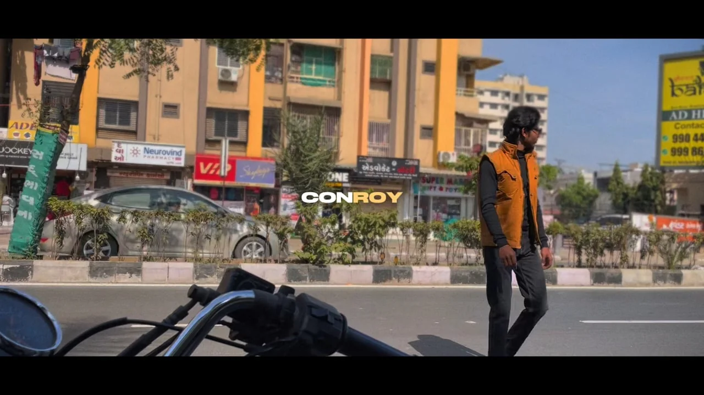

# ABSOLUTE CINEMA — MASTER BLUEPRINT

**Project:** `neel-portfolio` → **Neel Patel — Video Editor & Colourist (2026 Edition)**
**Document type:** Architectural Specification. Implementation contract for a code-generating AI.
**Target:** Awwwards Site-of-the-Day-grade cinematic portfolio. Lighthouse Performance ≥ 90 on mobile.
**Source of truth scanned:** `D:\CLAUDE\neel-portfolio\` — `index.html` (479 lines), `css/main.css` (2,335 lines), `js/app.js` (1,117 lines), `js/data.js` (726 lines, generated), `build-assets.py` (223 lines), `build-data.py` (285 lines), `assets/` (52 WebP posters, 4 portrait variants, 9 font files), `README.md`, `REDESIGN-PROMPT.md`.
**Runtime verification:** the current build was served on `localhost:5173` and interrogated live via DOM evaluation at 556 px and 641 px viewport widths. Every defect in **Part VIII** carries either a live measurement or a `file:line` citation. Nothing in this document is inferred where it could be measured.

---

## 0. HOW TO EXECUTE THIS DOCUMENT

### 0.1 Reading order for the implementing AI

1. Read **Part VI (Content Map)** first and in full. It is the immutable payload. Everything else is a delivery mechanism for it.
2. Read **Part VIII (Bug Resolution Protocol)**. These are the failure modes of the previous build. Re-introducing any of them is a failed implementation.
3. Read **Part IX (Video Protocol)**. It contains the single hardest architectural constraint in the project and its resolution.
4. Then build in the order given by **Part XV (Build Order)**. Do not build components in the order they appear in the document.
5. Validate against **Part XVI (Acceptance Checklist)** before declaring completion. Every line is binary.

### 0.2 The Five Prime Directives

**PRIME DIRECTIVE I — CONTENT IS IMMUTABLE.**
Every string, video ID, project name, category name, skill description, service description, blurb, email, phone number and handle inventoried in **Part VI** transfers to the new build character-for-character. Not paraphrased. Not "improved". Not tightened. Not re-cased. If a string in Part VI is marked `VERBATIM`, a diff between the old and new rendered text for that string must be empty. You may add new copy only where Part VI explicitly marks a slot `NEW COPY PERMITTED`, and even there the addition must be flagged in your final report so it can be approved or rejected.

**PRIME DIRECTIVE II — NO OVERLAP, NO OVERFLOW, NO SHIFT.**
Three classes of bug are categorically prohibited by architecture, not by patching: (a) elements overlapping unintentionally, (b) horizontal scrolling at any viewport from 320 px to 2560 px, (c) layout shift when media loads. **Part VIII.B** gives the eleven structural laws that make these impossible rather than merely absent. Every law is enforceable by inspection.

**PRIME DIRECTIVE III — CINEMA, NOT DECORATION.**
This is a colourist's portfolio. The interface is a grading suite: near-black, warm, restrained, with colour used as information. Motion exists to reveal, weight and pace — never to entertain itself. If an effect cannot be defended as "a film editor would recognise this gesture", cut it. The reference sites in **Part II** are mined for *technique*, not for *look*; do not clone any of them.

**PRIME DIRECTIVE IV — PERFORMANCE IS A FEATURE, NOT A TRADE.**
A video portfolio that stutters disqualifies its author. The budgets in **Part XIII** are hard ceilings, not aspirations. Where an aesthetic mandate in this document collides with a performance budget, the budget wins and you report the collision. There is exactly one such collision anticipated (WebGL on low-end mobile) and it is pre-resolved in **Part III.6**.

**PRIME DIRECTIVE V — STRUCTURE IS YOURS.**
You have unrestricted authority to create, rename, move and delete files and folders; to tear down any container and rebuild it in modern Grid/Flexbox; to add any dependency in **Part III**; to run any terminal command needed to fetch fonts, icons, shaders or generate derived media. The *only* thing you may not touch is the content in Part VI. Objective trumps convention — but objective never trumps content.

### 0.3 Relationship to `REDESIGN-PROMPT.md`

`REDESIGN-PROMPT.md` (937 lines) is the *previous* specification and it has already been fully implemented in the current static build. **This document is a superset of it, not a replacement.** Every content decision it made is now settled fact and carries forward unchanged:

| Settled decision | Status in current build | Carries forward |
|---|---|---|
| DaVinci Resolve removed from all copy | Done — `index.html:162` reads `Premiere Pro · After Effects · CapCut` | Yes, permanently. DaVinci must never reappear. |
| Warm palette replacing "cyberpunk green" | Done — `#13100c` / `#faf4e8` / `#f67c29` / `#d6a76c` | Yes. **Part VII** locks the shipped hexes, not the older draft values. |
| Contact form reduced to 3 fields | Done — Name / Email / Message + honeypot | Yes. Brief, Company, Select One, Fees stay deleted. |
| Named discipline sections replaced by a gallery | Done — `#gallery` renders all 52 | Yes, and **Part V** promotes it to its own route. |
| Collage portrait integrated into hero | Done — `.collage-wrap` | Yes, upgraded in **Part XII.1**. |
| Scroll-driven curtain intro | Done — `#curtainSplit` | Yes, upgraded in **Part XII.0**. |
| Ambient tone matching the playing reel | Built but **DEAD** — see **VIII.A-1** | Yes, and it must actually work. |
| Cursive + display font pairing | Done — Fraunces / Instrument Serif / Ephesis / Manrope / JetBrains Mono | Yes. **Part VII.2**. |

**Action:** `REDESIGN-PROMPT.md` currently sits in the deployable web root, where it would be publicly fetchable. Move it to `docs/archive/REDESIGN-PROMPT-v3.md`. This document goes to `docs/ABSOLUTE-CINEMA-BLUEPRINT.md`. Neither ships to `/public`.

### 0.4 What changes, in one paragraph

The site moves from a dependency-free single-page static build (hand-rolled 1,117-line IIFE engine, `window.DATA` global, works from `file://`) to a **Next.js 15 static export**: component-based, typed content, GSAP + ScrollTrigger + Lenis as the single motion authority, five real routes including 52 individually-addressable per-project pages with real per-page metadata, a proper video-loading protocol that replaces raw Vimeo iframes with facades and hover-preview micro-clips, and an interaction layer built on a magnetic context-aware cursor. The visual language stays exactly where it is — warm, near-black, editorial — and gets sharper, not louder.

---

# PART I — PROJECT VISION & AESTHETIC SYNTHESIS

## I.1 The one-sentence thesis

> **A colourist's portfolio should look like it was graded, and behave like it was cut.**

Every decision in this document resolves back to that sentence. "Graded" governs colour, contrast, grain, halation, vignette, and the fact that the interface takes its ambient hue from whatever footage is currently playing. "Cut" governs pacing — the site has an opening title card, chapters, a rhythm section, a slow section, and an end card, in that order, because that is how a film is assembled.

## I.2 Positioning

Neel Patel is a video editor and colourist in Ahmedabad, India, four-plus years on the timeline, 52 finished edits across 16 disciplines, from a ten-deliverable brand campaign to anime grading studies. The audience is split:

- **Primary — hiring clients** (brands, event organisers, agencies, creators). They need to answer "can this person deliver my format at this quality" in under sixty seconds. They will not click through modals. They scroll and they judge.
- **Secondary — collaborators and studios.** They want depth: the toolkit, the range, the technical vocabulary.
- **Tertiary — the algorithm.** 52 shareable, individually-indexable project pages with real titles and real posters.

The architecture serves all three: the home route answers the primary audience in one scroll, `/projects` serves the secondary audience's appetite for range, and `/project/[slug]` serves the tertiary.

## I.3 The aesthetic — "Absolute Cinema"

Named after the portfolio's own first discipline (`absolute-cinema`, "Pure colour and composition"). The register is **warm editorial darkroom**, not sci-fi, not brutalist, not Swiss-white.

**Six pillars:**

1. **Near-black ground, never pure black.** `#13100c` — a black with brown in it. Pure `#000` reads as "unstyled" and kills the illusion of a graded frame. Every surface above the ground steps warmer: `#1b1611`, `#241d16`.
2. **Cream, not white.** `#faf4e8` for type. White-on-black is a terminal; cream-on-warm-black is projected film.
3. **Colour as data, not decoration.** The terracotta `#f67c29` marks exactly one thing at a time: the current action. The kraft `#d6a76c` carries structure — rules, labels, meta. Wine and indigo appear only as fills behind cream, never as text. And the ambient glow behind everything takes its hue from the dominant colour of the video currently on screen — a real, per-clip value already computed and stored in the data layer (`tone`).
4. **Type as performance.** A variable serif with its `WONK` axis engaged for the huge display type, a script for the human moments, a geometric sans for body, and a mono for machine-readouts (timecodes, counters, labels). Four registers, each with one job. **Part VII.2.**
5. **Texture, subtly.** Film grain at low opacity, a fixed hairline grid, vignette, and torn-paper clip-paths on the collage. This is what stops a dark site looking like a void. All of it is static or GPU-composited — none of it animates on the CPU.
6. **Weight over flourish.** Big type, generous negative space, hard left alignment, numbered sections. Restraint is the flex. `casadisolare.com` is right about this and the current build already understands it.

## I.4 The narrative arc

The site is a cut, and it has a structure. Home route, in order:

| Beat | Section | Emotional job | Runtime feel |
|---|---|---|---|
| **Title card** | Curtain (`00`) | Establish authority before a single word of pitch | 1 scroll-length |
| **Cold open** | Hero / About (`01`) | Who, where, what, and the thesis line | 1.5 viewports |
| **Act I** | Selected Works (`02`) | The lead film, then five chaptered disciplines | 5–6 viewports |
| **Interlude** | Timeline selections rail (`02b`) | Lateral browse — range without commitment | 1 viewport |
| **Set piece** | Conroy Campaign deck (`02c`) | Proof of scale: one shoot, ten deliverables | 1.5 viewports |
| **Act II** | Gallery snapshot (`03`) | "There are 49 more" — density as evidence | 2 viewports |
| **Act III** | Toolkit (`04`) | Technical credibility | 1.5 viewports |
| **Act IV** | Services (`05`) | Commercial clarity | 1.5 viewports |
| **Resolution** | Contact (`06`) | The ask | 1 viewport |
| **End card** | Thank You (`07`) | Human close | 0.75 viewport |

The numbered-section device (`01`–`07`) already exists in the build and is retained. It is the single strongest structural signal on the page: it tells a visitor how much is left, which is the same job a scrubber bar does.

## I.5 What "extraordinary" means here, concretely

The previous brief asked, in Hindi, for *"layers ke andar layers"* — layers within layers — and *"koi scroll kare to bahut saari cheezein happen honi chahiye"*: when someone scrolls, many things should happen. That is honoured as a **depth budget**, not as chaos:

- **Three parallax planes minimum in the hero** — giant name behind the portrait (0.15), the collage card (0.42), the editorial copy (0.80). Already built; retained and extended with a fourth WebGL plane behind everything.
- **Every section entry is a multi-element staggered reveal**, never a single fade. Minimum three staggered children, 60 ms apart, each on `transform` + `opacity` only.
- **Two independent scroll velocities per section** — content at 1.0, decorative/background at 0.4–0.6.
- **One "impossible" moment per act.** Curtain bisection, reel-driven ambient colour shift, deck fan-out, marquee band inversion, service sheet stack, contact type-scale collapse. Six moments, one per act. Not sixty.

That is the ceiling. Beyond it, effects stop reading as craft and start reading as a template.

## I.6 Anti-goals — explicitly forbidden

| Forbidden | Why |
|---|---|
| Pure `#000000` backgrounds | Reads unstyled; destroys the graded-frame illusion |
| Neon cyan/lime/electric-green accents | The client rejected this explicitly: *"The current green looks a bit cyberpunk"* |
| Modal/lightbox video players | The client rejected click-to-open flows explicitly. Video plays in place, or on its own route. |
| Any element requiring a click to *discover* content | *"a normal person won't see that; they'll only see the repeating items"* |
| Infinite scroll or lazy pagination on the gallery | All 52 must be reachable by scrolling. Filters narrow; they never hide the total. |
| Text over unmasked moving video | Illegible. Every text-over-video instance requires a gradient scrim — **Part VIII.B.9**. |
| Autoplaying audio of any kind | Sound is opt-in, always, with persisted preference. |
| Scroll-jacking that breaks native scroll velocity | Lenis smooths; it must never fight or hijack. Keyboard, trackpad, wheel and touch all keep working. |
| Splitting the contact form internally across a grid | Explicit client instruction. **Part VIII.B.7.** |
| Marquees, glitches or shaders that run on the main thread every frame | **Part XIII.** |

---

# PART II — REFERENCE SITE FORENSICS

Eight sites were fetched and analysed. **A stated limitation, up front:** the fetch layer returns rendered text and document structure only — it does not return stylesheets or scripts. Therefore **no colour value, `@font-face` declaration, or library name in this document is claimed to be scraped from any reference site.** What follows is structural and behavioural intelligence — which *is* recoverable from markup and content — plus my own synthesis of technique. Palette, type and library choices in **Part III** and **Part VII** are my architectural decisions, owned as such.

## II.1 `casadisolare.com` — Elegant typography, smooth scrolling, premium spacing

**Recovered structure.** Extremely low text density per viewport. Content arrives as short, self-contained editorial blocks with enormous vertical separation. Navigation is a small fixed set of nouns, no verbs, no calls to action competing with content. Section headings are set as standalone lines with nothing beside them.

**What to take:**
- **The spacing ratio.** Section padding-block should be 1.4–2.0× the largest type size in that section, not a fixed `rem`. Implement as `padding-block: clamp(6rem, 14vh, 12rem)`. The current build's `--pad: clamp(1.25rem, 4vw, 3.5rem)` governs inline padding correctly; block spacing needs its own, larger token — add `--pad-block`.
- **Optical, not metric, alignment.** Display type gets negative letter-spacing (`-0.03em` at mega scale) and a hanging-punctuation-style negative left offset (`margin-left: -0.05em`) so the glyph edge, not the glyph box, aligns to the grid.
- **One idea per viewport.** Applied to the About and Services sections: never two competing headlines in one screenful.
- **Restraint in accent usage.** A single accent occurrence per viewport maximum.

**What to reject:** its near-static motion vocabulary. This is a video portfolio; it needs more kinetic energy than a hospitality brand.

**Applied to:** `Part XII.4` (About deep-dive), `Part XII.6` (Services), `Part VII.3` (spacing scale).

## II.2 `tlb.betteroff.studio` — Grid structures, modern layout reveals, portfolio framing

**Recovered structure.** Project entries are indexed with explicit two-digit numerals and framed with visible metadata (role, year, category) sitting *outside* the media frame rather than overlaid on it. Image transform parameters in the markup expose a deliberate, repeating set of crop geometries rather than one uniform aspect — the grid is intentionally heterogeneous.

**What to take:**
- **Metadata outside the frame.** Gallery captions sit *below* the tile, in mono, as `— DISCIPLINE · MM:SS`. Never overlay a title on a poster. This also eliminates an entire class of contrast bug.
- **Two-digit indices on every project.** `01`–`52` in the gallery, `01`–`07` on sections. Cheap, and it makes a 52-item grid feel curated rather than dumped.
- **Heterogeneous, honest aspect ratios.** The portfolio contains 33 landscape, 14 vertical (9:16), 3 four-thirds and 2 three-fourths items. **Do not normalise them.** A masonry grid that shows a 9:16 as a 9:16 tells the client "he delivers vertical" without a word of copy. Aspect diversity is a selling point; forcing 16:9 throws it away.
- **Reveal on a diagonal.** Grid children reveal in a staggered diagonal wavefront (stagger derived from `row + col`), not row-by-row. Costs one line of index arithmetic; reads dramatically better.

**Applied to:** `Part XII.5` (CinematicGrid), `Part VI.4` (aspect table).

## II.3 `findworkhappiness.com` — Interactive storytelling, state transitions

**Recovered structure.** The experience is chaptered and state-driven: distinct named stages that the visitor advances through, with the interface reporting which stage is active. Content is gated behind progression rather than presented all at once.

**What to take:**
- **The chapter state machine.** `Selected Works` becomes five explicit chapters, each with a persistent state indicator. As a chapter scrolls into dominance, a fixed side readout updates: `02 · CHAPTER 3 / 5 — RHYTHM & MONTAGE`. This is the single highest-value borrow in this entire section: it converts a long scroll from "list" into "progression".
- **Transitions as narrative punctuation.** Between chapters, the ambient glow shifts to the incoming chapter's tone over 800 ms. The visitor *feels* the chapter change before reading it.
- **Progress is always legible.** Combined with the numbered sections and the existing `#progressRail`, the visitor is never lost.

**What to reject:** gating. Nothing on this site may require a click to reveal content — Prime Directive III's corollary and an explicit client instruction.

**Applied to:** `Part XII.3` (ChapterStack), `Part X.4` (tone transitions).

## II.4 `dogelonmars.com` — Bold graphical integrations, unique asset placements

**Recovered structure.** Graphical elements are placed with deliberate disregard for the content grid — assets break out of, bleed past and rotate against the text column. Elements sit at angles. Composition is collage-first.

**What to take:**
- **The break-out rule.** Decorative assets may exceed their container on the inline axis, *provided* the clipping is handled at the root (`overflow-x: clip` on `html`, `body` and `main` — already present in the build at both) and the element is `aria-hidden` and `pointer-events: none`. This is exactly how the existing `.collage-shape-wine`, `.collage-fern`, `.collage-tape-1/2` work. Extend the technique: rotated kraft tape on the Conroy deck, an oversized rotated `52` numeral bleeding off the gallery banner, torn-paper edges on the services stack.
- **Rotation as signature.** Small consistent rotations (`-4deg` to `+6deg`) on decorative cards and tape. Never on text that must be read.
- **Asset placement as composition.** The hero is a *collage*, not a photo with a caption. Already true; push it further with a second offset backing card and a hand-drawn arrow SVG.

**What to reject:** its chromatic loudness and meme register wholesale. Take the placement grammar, leave the palette and tone.

**Applied to:** `Part XII.1` (hero collage), `Part XII.5` (gallery banner), `Part VIII.B.3` (break-out safety law).

## II.5 `gilhuybrecht.com` — Ultra-sleek minimalist UX, custom cursor & hover

**Recovered structure.** Interaction is carried almost entirely by pointer state rather than by visible chrome. Hover targets swap or duplicate their label text (the classic doubled-text mask-and-slide). Navigation is minimal to the point of near-absence; the cursor does the explaining.

**What to take:**
- **The cursor is the UI.** This is the mandated centrepiece of **Part XI**. Default state a 6 px cream dot. Over any interactive element it expands to a 64 px ring and reveals a contextual label. Over any playable video it becomes a filled 88 px `PLAY` disc. The build already stores the label per element as `data-cursor` (`"Watch"`, `"Enquire"`, `"Copy"`, `"Call"`, `"Open"`, `"Top"`, `"Send"`, `"Play"`, `"Sound"`) — that vocabulary transfers exactly.
- **The doubled-label hover swap.** Every nav link and every `.contact-row` renders its text twice inside an `overflow: hidden` mask; on hover, both translate `-100%` in Y. Zero layout cost, pure transform, reads as expensive.
- **Chrome that earns its space.** Header collapses to mark + burger + a mono "now" readout past the first viewport.

**Applied to:** `Part XI` in full, `Part XII.8` (chrome).

## II.6 `discoverylandco.com` — High-end cinematic video integration, immersive hero

**Recovered structure.** The hero is video-first and full-bleed, with type overlaid via a scrim. Video is treated as a background *material* — full-bleed, cropped by the viewport, with the composition designed around the crop rather than fighting it.

**What to take:**
- **Poster-first, full-bleed, chromeless hero.** The lead film (`1220554546` "Mumbai", 16:9, 30 s, tone `#66584c`) occupies `100svh`, plays muted and looped, and its poster is painted at first byte so there is *never* a black box. **Part IX.2.**
- **The scrim law.** All hero type sits on a two-stop `linear-gradient` scrim (`rgba(19,16,12,0.75)` → `transparent` at 60%). No exceptions — this is what makes overlaid type legible over unpredictable footage.
- **Composition designed for the crop.** The hero's type block anchors bottom-left with `padding-inline: var(--pad)` and never centres, so any viewport crop keeps the type in the safe zone.
- **Sound as a deliberate affordance.** A single persistent mono `SOUND ON / OFF` control, bottom-right, that remembers its state.

**Applied to:** `Part XII.2` (HeroVideo / lead reel), `Part IX.2`, `Part VIII.B.9` (scrim law).

## II.7 `griflan.com` — Creative scroll-jacking, dynamic typography, fluid transitions

**Recovered structure.** Type scale is aggressively responsive — headline sizes swing enormously between breakpoints. Wordmarks are split into individual character spans for per-glyph animation. Marquee tracks are duplicated in the markup, which is the standard technique for a seamless CSS-transform loop with no JS.

**What to take:**
- **Per-character split for display type.** The build already has `splitAll()` and `[data-split]`. Retain the technique; move it to a build-time-safe React component so there is no post-hydration DOM rewrite. Reveal is per-character `translateY(110%)` → `0` with a 22 ms stagger inside a `overflow: hidden` line mask.
- **Duplicated marquee tracks.** The existing `.skills__band` becomes a two-copy track translated `-50%` on an infinite `transform` animation — pure CSS, GPU-composited, zero JS per frame. This deletes one of the five per-frame JS callbacks. **Part VIII.A.5.**
- **Scale swing as drama.** `--t-mega: clamp(3.2rem, 13vw, 11.5rem)` already delivers a 3.6× swing. Retain exactly. Add one deliberately extreme moment: the contact headline compresses its scale as it pins, so `WATCHING` grows while the line around it tightens.
- **Fluid, never abrupt, transitions.** Single easing authority: `--e-out: cubic-bezier(.16,1,.3,1)` for entrances, `--e-io: cubic-bezier(.65,.05,.36,1)` for state changes. Already in the token set. No new curves.

**What to reject:** true scroll-jacking. Lenis smooths native scroll; it must never take control of it.

**Applied to:** `Part X.3` (text reveals), `Part XII.5` (HighlightBand), `Part XII.7` (contact).

## II.8 `nrly.co` — Modern UI components, slick navigation, glitch / motion-graphic aesthetics

**Recovered structure.** Componentised, chip- and pill-based UI. Navigation is overlay-driven with numbered entries. Loader surfaces a numeric readout during boot.

**What to take:**
- **The numeric pre-loader.** `000` → `100` in mono, bottom-right, with a hairline progress rule. Gated on real asset progress (font `document.fonts.ready` + hero poster `decode()`), not on a fake timer, and hard-capped at 1,800 ms so it can never become the bottleneck. **Part X.1.**
- **Chip components as filters.** The gallery's five kicker chips are exactly this pattern. Keep the pill geometry; **fix the counts** (**Part VIII.A.2**) and add FLIP transitions (**Part VIII.A.9**).
- **Numbered full-screen overlay menu.** Already built (`01`–`07`). Upgrade: entries stagger in on a per-character mask, and each entry previews its section's tone as a small swatch on hover.
- **Glitch, used once.** A CRT/RGB-split shader is high-risk kitsch. Permitted in exactly one place: a 240 ms RGB-channel-offset + scanline pass on the curtain's `NEEL PATEL` wordmark at the instant the curtain splits. One occurrence, on one element, at one moment. Anywhere else: rejected.

**Applied to:** `Part X.1` (preloader), `Part XII.5` (chips), `Part XII.8` (menu), `Part X.7` (the single glitch).

## II.9 Synthesis matrix — every borrow, mapped

| # | Source | Technique | Lands in |
|---|---|---|---|
| 1 | casadisolare | Block-spacing ratio tied to type scale | `--pad-block` token, VII.3 |
| 2 | casadisolare | Optical alignment / negative tracking on display | VII.2 |
| 3 | casadisolare | One idea per viewport | XII.4, XII.6 |
| 4 | betteroff | Metadata below frame, never overlaid | XII.5 |
| 5 | betteroff | Two-digit indices everywhere | XII.5, XII.8 |
| 6 | betteroff | Honest heterogeneous aspect ratios | VI.4, XII.5 |
| 7 | betteroff | Diagonal wavefront grid reveal | X.2 |
| 8 | findworkhappiness | Chapter state machine + live readout | XII.3 |
| 9 | findworkhappiness | Tone transition as chapter punctuation | X.4 |
| 10 | dogelonmars | Container break-out with root clipping | VIII.B.3 |
| 11 | dogelonmars | Consistent small rotations on decor | XII.1, XII.5 |
| 12 | dogelonmars | Collage-first hero composition | XII.1 |
| 13 | gilhuybrecht | Context-aware magnetic cursor | XI (all) |
| 14 | gilhuybrecht | Doubled-label hover swap | XII.8, XII.7 |
| 15 | gilhuybrecht | Collapsing minimal chrome | XII.8 |
| 16 | discoverylandco | Poster-first full-bleed chromeless hero video | XII.2, IX.2 |
| 17 | discoverylandco | The scrim law | VIII.B.9 |
| 18 | discoverylandco | Persistent remembered sound toggle | IX.6 |
| 19 | griflan | Per-character split display reveals | X.3 |
| 20 | griflan | Duplicated CSS marquee track | XII.5 |
| 21 | griflan | Extreme type-scale swing, one pinned moment | XII.7 |
| 22 | nrly | Numeric preloader on real progress | X.1 |
| 23 | nrly | Chip filter components | XII.5 |
| 24 | nrly | Numbered overlay menu with tone swatches | XII.8 |
| 25 | nrly | Glitch — exactly one occurrence | X.7 |

---

# PART III — TECH STACK & ASSET ARSENAL

## III.1 Framework decision — and why

**Mandated: Next.js 15, App Router, `output: 'export'`.**

The deciding requirement is `/project/[slug]` — 52 dynamic pages that need **real, crawlable, per-page `<title>`, `<meta name="description">` and `og:image`**. Options assessed:

| Option | Per-page real meta | Static deploy anywhere | Verdict |
|---|---|---|---|
| React + Vite SPA | ✗ — client-injected meta; crawlers and link unfurlers get the shell | ✓ | **Rejected.** Fails the stated SEO requirement. |
| Astro | ✓ | ✓ | Viable. Rejected only because the interaction layer is heavily stateful React and Astro's islands add ceremony for no gain here. |
| Next.js 15 + `output: 'export'` | ✓ — `generateStaticParams` + `generateMetadata` emit 52 real HTML files with real `<head>`s | ✓ — pure static `out/` folder | **Selected.** |
| Next.js with SSR/ISR | ✓ | ✗ — needs a Node host | **Rejected.** Loses deploy-anywhere. |

`output: 'export'` keeps everything the current build is good at — a folder of static files that runs on any host — while adding the routing, metadata and code-splitting the brief demands.

**Node ≥ 20.11. Package manager: pnpm.** (npm equivalents given in III.3.)

## III.2 `package.json` — exact

```json
{
  "name": "neel-patel-portfolio",
  "version": "4.0.0",
  "private": true,
  "type": "module",
  "engines": { "node": ">=20.11.0" },
  "scripts": {
    "dev": "next dev",
    "build": "next build",
    "start": "npx serve out",
    "lint": "next lint",
    "typecheck": "tsc --noEmit",
    "posters": "node scripts/build-posters.mjs",
    "previews": "node scripts/build-previews.mjs",
    "analyze": "ANALYZE=true next build",
    "lh": "lhci autorun --collect.staticDistDir=./out"
  },
  "dependencies": {
    "next": "15.1.6",
    "react": "19.0.0",
    "react-dom": "19.0.0",
    "gsap": "3.12.5",
    "lenis": "1.1.18",
    "ogl": "1.0.11",
    "zustand": "5.0.2",
    "lucide-react": "0.469.0",
    "clsx": "2.1.1",
    "tailwind-merge": "2.6.0"
  },
  "devDependencies": {
    "typescript": "5.7.2",
    "@types/node": "22.10.5",
    "@types/react": "19.0.7",
    "@types/react-dom": "19.0.3",
    "tailwindcss": "3.4.17",
    "postcss": "8.4.49",
    "autoprefixer": "10.4.20",
    "sharp": "0.33.5",
    "eslint": "9.18.0",
    "eslint-config-next": "15.1.6",
    "@next/bundle-analyzer": "15.1.6",
    "@lhci/cli": "0.14.0",
    "prettier": "3.4.2",
    "prettier-plugin-tailwindcss": "0.6.9"
  }
}
```

**Deliberate omissions, with reasons — do not add these back without reporting it:**

| Omitted | Why |
|---|---|
| `three` / `@react-three/fiber` / `drei` | ~150 KB gzipped for **one** full-screen shader plane. `ogl` does the same job in ~10 KB. See III.6. Authorised *only* if a genuinely 3D scene (real geometry, camera, lights) is later specified. |
| `framer-motion` | Triple-counts with GSAP + Lenis. Route transitions are handled by GSAP + Next's `template.tsx`. ~35 KB saved and one less easing vocabulary. |
| `howler` | ~20 KB for at most four one-shot UI sounds. A 15-line `AudioContext` wrapper (III.7) does it in ~0.5 KB. |
| `lite-youtube-embed` | The portfolio contains **zero** YouTube videos. All 52 are Vimeo. See IX.4 for the correct Vimeo facade. |
| `@studio-freight/lenis` | Deprecated scope. The package is now plain `lenis`. |
| `locomotive-scroll` | Superseded by Lenis; heavier and fights native scroll. |
| `swiper` | The rail is a `scroll-snap` container. Native, free, better on touch. |
| Any animation library beyond GSAP | Single motion authority. Non-negotiable. |

## III.3 Install commands

```bash
pnpm create next-app@15.1.6 neel-portfolio-v4 --ts --tailwind --eslint --app --src-dir --import-alias "@/*" --no-turbopack
```

```bash
pnpm add gsap@3.12.5 lenis@1.1.18 ogl@1.0.11 zustand@5.0.2 lucide-react@0.469.0 clsx@2.1.1 tailwind-merge@2.6.0
```

```bash
pnpm add -D sharp@0.33.5 @next/bundle-analyzer@15.1.6 @lhci/cli@0.14.0 prettier@3.4.2 prettier-plugin-tailwindcss@0.6.9
```

npm equivalents:

```bash
npm create next-app@15.1.6 neel-portfolio-v4 -- --ts --tailwind --eslint --app --src-dir --import-alias "@/*"
```

```bash
npm i gsap@3.12.5 lenis@1.1.18 ogl@1.0.11 zustand@5.0.2 lucide-react@0.469.0 clsx@2.1.1 tailwind-merge@2.6.0
```

```bash
npm i -D sharp@0.33.5 @next/bundle-analyzer@15.1.6 @lhci/cli@0.14.0 prettier@3.4.2 prettier-plugin-tailwindcss@0.6.9
```

**ffmpeg** is required for the hover-preview pipeline (**Part IX.3**) and is a system dependency, not an npm one:

```bash
winget install --id Gyan.FFmpeg -e
```

## III.4 `next.config.mjs`

```js
import bundleAnalyzer from '@next/bundle-analyzer'

const withAnalyzer = bundleAnalyzer({ enabled: process.env.ANALYZE === 'true' })

/** @type {import('next').NextConfig} */
const nextConfig = {
  output: 'export',           // static HTML for all 52 project pages + 4 static routes
  trailingSlash: true,        // emits /project/mumbai/index.html — works on any static host
  reactStrictMode: true,
  images: { unoptimized: true }, // required by `output: export`; we pre-optimise with sharp instead
  eslint: { ignoreDuringBuilds: false },
  typescript: { ignoreBuildErrors: false },
  experimental: { optimizePackageImports: ['lucide-react'] },
}

export default withAnalyzer(nextConfig)
```

> **Note for the implementer:** because `images.unoptimized` is required under `output: 'export'`, the `next/image` optimiser is unavailable. All raster assets are therefore pre-derived at build time by `scripts/build-posters.mjs` using `sharp`, which emits AVIF + WebP at three widths each. `next/image` is still used as the component (for `sizes`, `srcSet` and intrinsic-dimension CLS prevention) but points at the pre-derived files. **Part IX.1.**

## III.5 `tailwind.config.ts` — full, with the shipped palette

```ts
import type { Config } from 'tailwindcss'

export default {
  content: ['./src/**/*.{ts,tsx,mdx}'],
  darkMode: 'class',
  theme: {
    extend: {
      colors: {
        ground:   { DEFAULT: '#13100c', 2: '#1b1611', 3: '#241d16' },
        cream:    { DEFAULT: '#faf4e8', 2: '#e2d7c0' },
        muted:    '#948a7b',
        terracotta: '#f67c29',
        kraft:      '#d6a76c',
        wine:       '#852b36',   // FILLS ONLY — never as text colour
        indigo:     '#2c3ea0',   // FILLS ONLY — never as text colour
        on: {
          terracotta: '#13100c',
          wine:       '#faf4e8',
          indigo:     '#faf4e8',
        },
        line:  { DEFAULT: 'rgb(214 167 108 / 0.22)', 2: 'rgb(214 167 108 / 0.11)', 3: 'rgb(214 167 108 / 0.45)' },
        tone:  'var(--tone)',            // live per-video ambient hue
      },
      fontFamily: {
        display: ['var(--font-fraunces)', 'Georgia', 'serif'],
        serif:   ['var(--font-instrument)', 'Georgia', 'serif'],
        script:  ['var(--font-ephesis)', 'cursive'],
        sans:    ['var(--font-manrope)', 'system-ui', '-apple-system', 'sans-serif'],
        mono:    ['var(--font-jetbrains)', 'ui-monospace', 'monospace'],
      },
      fontSize: {
        mega:  ['clamp(3.2rem, 13vw, 11.5rem)',  { lineHeight: '0.86', letterSpacing: '-0.03em' }],
        huge:  ['clamp(2.2rem, 6.5vw, 5.5rem)',  { lineHeight: '0.94', letterSpacing: '-0.02em' }],
        big:   ['clamp(1.65rem, 4.2vw, 3.2rem)', { lineHeight: '1.05', letterSpacing: '-0.01em' }],
        lead:  ['clamp(1.02rem, 1.6vw, 1.4rem)', { lineHeight: '1.55' }],
        body:  ['clamp(0.92rem, 1.05vw, 1.05rem)', { lineHeight: '1.68' }],
        label: ['clamp(0.64rem, 0.75vw, 0.76rem)', { lineHeight: '1.2', letterSpacing: '0.22em' }],
      },
      spacing: {
        pad:   'clamp(1.25rem, 4vw, 3.5rem)',
        block: 'clamp(6rem, 14vh, 12rem)',   // casadisolare borrow — II.1
        hdr:   'clamp(3.75rem, 6.5vh, 5rem)',
      },
      maxWidth: { shell: '92rem', prose: '46rem' },
      transitionTimingFunction: {
        out:  'cubic-bezier(.16,1,.3,1)',
        io:   'cubic-bezier(.65,.05,.36,1)',
        soft: 'cubic-bezier(.4,0,.2,1)',
      },
      keyframes: {
        marquee:   { '0%': { transform: 'translate3d(0,0,0)' }, '100%': { transform: 'translate3d(-50%,0,0)' } },
        spinSlow:  { '0%': { transform: 'rotate(0deg)' }, '100%': { transform: 'rotate(360deg)' } },
        grain:     { '0%,100%': { transform: 'translate3d(0,0,0)' }, '25%': { transform: 'translate3d(-2%,1%,0)' }, '50%': { transform: 'translate3d(1%,-2%,0)' }, '75%': { transform: 'translate3d(-1%,-1%,0)' } },
        scanline:  { '0%': { transform: 'translate3d(0,-100%,0)' }, '100%': { transform: 'translate3d(0,100%,0)' } },
        rgbSplit:  { '0%,100%': { transform: 'translate3d(0,0,0)' }, '20%': { transform: 'translate3d(-3px,1px,0)' }, '40%': { transform: 'translate3d(2px,-2px,0)' }, '60%': { transform: 'translate3d(-1px,2px,0)' }, '80%': { transform: 'translate3d(3px,0,0)' } },
        pulseDot:  { '0%,100%': { opacity: '1', transform: 'scale(1)' }, '50%': { opacity: '.45', transform: 'scale(.82)' } },
      },
      animation: {
        marquee:  'marquee 34s linear infinite',
        spinSlow: 'spinSlow 18s linear infinite',
        grain:    'grain 8s steps(6) infinite',
        scanline: 'scanline 240ms linear 1',
        rgbSplit: 'rgbSplit 240ms steps(5) 1',
        pulseDot: 'pulseDot 2.4s ease-in-out infinite',
      },
      backgroundImage: {
        'scrim-b': 'linear-gradient(to top, rgb(19 16 12 / .82) 0%, rgb(19 16 12 / .45) 34%, transparent 62%)',
        'scrim-t': 'linear-gradient(to bottom, rgb(19 16 12 / .70) 0%, transparent 46%)',
        'tone-glow': 'radial-gradient(ellipse at 50% 35%, var(--tone-blend) 0%, transparent 68%)',
      },
    },
  },
  plugins: [],
} satisfies Config
```

**Two hard rules that the config encodes and the implementer must honour:**
1. `wine` and `indigo` are registered as `colors` but are **fills only**. Their contrast against `ground` is below WCAG AA for text. Use them as `bg-wine text-on-wine`, never as `text-wine`. Any `text-wine` or `text-indigo` in the final source is a defect.
2. Every keyframe above animates `transform` or `opacity` **only**. No keyframe may animate `clip-path`, `width`, `height`, `top`, `left`, `filter` or `box-shadow`. This is Prime Directive IV in config form.

## III.6 The WebGL decision — `ogl`, not `three`

**The requirement:** a cinematic WebGL layer — animated noise, subtle distortion, film-grain-as-shader — behind the hero, with a mandated Lighthouse mobile score ≥ 90.

**The conflict:** `three` is ~150 KB gzipped and, on a mid-range Android, parsing and compiling it costs 300–600 ms of main-thread time. That is a direct TBT hit against the 90+ target for a decorative background.

**The resolution — mandated:**

- Use **`ogl`** (~10 KB gzipped). For one full-screen plane with one fragment shader it is functionally equivalent to `three` and 15× smaller.
- The component is `src/components/webgl/ToneField.tsx`, loaded **only** via `next/dynamic` with `{ ssr: false }`, so it is in its own chunk and never in the initial bundle.
- It mounts only when **all** of these are true:
  - `matchMedia('(min-width: 64rem)').matches` — desktop layout
  - `matchMedia('(hover: hover) and (pointer: fine)').matches` — real pointer
  - `!matchMedia('(prefers-reduced-motion: reduce)').matches`
  - `navigator.hardwareConcurrency >= 4`
  - `navigator.connection?.saveData !== true` and `effectiveType` is not `2g`/`3g`
  - a successful `canvas.getContext('webgl2')` probe
- Renders at `dpr = Math.min(devicePixelRatio, 1.5)`, capped at 1.5 — the plane is a soft gradient field; nobody can see the difference and it halves fragment work.
- **Pauses on `IntersectionObserver` exit and on `document.visibilitychange`.** A shader running behind a scrolled-past hero is pure waste.
- Uniforms: `uTime`, `uTone` (the live per-video hue as vec3), `uMouse` (smoothed), `uScroll` (normalised hero progress). The fragment shader is simplex-noise-driven flow with a chromatic-aberration term at the edges and a `mix()` toward `uTone`.
- **The plane is never load-bearing.** The hero must be complete, beautiful and fully legible with the canvas absent. Verify by force-disabling the mount.
- **Total added weight ceiling: 14 KB gzipped** including the component and shaders.

If a future spec calls for real 3D geometry, `three` + `@react-three/fiber` is authorised at that point and this decision is revisited. Not before.

## III.7 Audio arsenal — no library

Mandated: UI sound on hover/click/page-transition. `howler` (~20 KB) is overkill for four one-shots. Implement `src/lib/audio.ts`:

- A single lazily-created `AudioContext`, constructed **on the first real user gesture** (never at load — browsers block it and it costs main-thread time).
- Four assets in `/public/audio/`, each mono, 32 kbps Opus in `.webm`, **≤ 6 KB each**, total ≤ 24 KB: `hover.webm` (18 ms tick), `click.webm` (40 ms), `transition.webm` (220 ms whoosh), `reveal.webm` (140 ms, curtain split only).
- Decoded once into `AudioBuffer`s on first unmute; played via short-lived `AudioBufferSourceNode`s through a shared `GainNode`.
- **Default state: MUTED.** Persisted to `localStorage` under `np:sound`. Rendered as the same control that governs video sound (**Part IX.6**) — one toggle, one mental model.
- Master gain `0.18`. Hover ticks additionally rate-limited to one per 90 ms so a fast pointer sweep across the gallery cannot machine-gun.
- Never called when `prefers-reduced-motion: reduce` — that query correlates strongly with sensory-sensitivity preferences.

## III.8 Icons

`lucide-react`, tree-shaken via `experimental.optimizePackageImports`. **Permitted set, exhaustive** — the whole point of naming them is that no others get pulled in:

`Play`, `Pause`, `Volume2`, `VolumeX`, `Maximize2`, `Minimize2`, `ArrowUpRight`, `ArrowDown`, `ArrowUp`, `X`, `Menu`, `Copy`, `Check`, `Mail`, `Phone`, `Instagram`, `Loader2`.

Seventeen icons, ~1.2 KB gzipped. The existing hand-rolled SVGs that should be **kept as inline SVG, not replaced with icons** — because they are brand marks, not UI affordances: the four-point star (`.label__star`), the fern (`.collage-fern`), the torn-paper `clipPath` (`#tornPaper`), the two `textPath` circles (`#badgeCirclePath`, `#scrollCirclePath`).

## III.9 Font arsenal — self-hosted, budgeted

Five families, all already downloaded and subset in `assets/fonts/`. **Move as-is to `/public/fonts/` — do not re-download, do not switch to Google's CDN.** Self-hosting eliminates a third-party connection, a DNS lookup and a privacy exposure, and these files are already correctly subset.

| Family | File | Size | Role |
|---|---|---|---|
| Fraunces (variable, `WONK 1`, `SOFT 0`) | `fraunces-var-latin.woff2` | 34 KB | `--font-display` — mega/huge headlines |
| Instrument Serif | `instrument-serif-latin.woff2` | 11.6 KB | `--font-serif` — section titles |
| Instrument Serif Italic | `instrument-serif-italic-latin.woff2` | 12 KB | emphasis inside lead paragraphs |
| Ephesis | `ephesis-subset.woff2` | 18 KB | `--font-script` — "Neel Patel", "something", "felt" |
| Manrope (2 files) | existing | ~28 KB | `--font-sans` — body |
| JetBrains Mono (4 files) | existing | ~34 KB | `--font-mono` — labels, timecodes, counters |

**Total ≈ 138 KB across 10 files.** Budget: **≤ 145 KB**. Loading rules:

- Wire all five through `next/font/local` with `display: 'swap'`, exposing the CSS variables named in III.5.
- **Preload exactly two**: `fraunces-var-latin.woff2` (hero LCP text) and the primary Manrope weight. Preloading more than two competes with the hero poster for early bandwidth and measurably delays LCP.
- Ephesis, Instrument Serif Italic and the mono variants load on demand via `swap`.
- Every family declares `size-adjust`, `ascent-override` and `descent-override` so the fallback metrics match and font swap causes **zero** CLS.
- `subset` to Latin + the specific punctuation the copy uses: `— · ↗ ↑ © & ' ’`. Verify `Café` (in "Tech Café") and the em-dash render — an over-aggressive subset will drop them.

## III.10 Asset arsenal — complete manifest

**Carried over unchanged from the current build:**
- `assets/thumbs/*.webp` — 52 posters, one per Vimeo ID → `/public/posters/`
- `assets/neel-collage.webp` (462 KB), `neel.jpg` (490 KB), `neel.webp` (426 KB), `neel-sm.webp` (144 KB) → `/public/portrait/`, then re-derived by `scripts/build-posters.mjs` (III.11)
- `assets/manifest.json` (11.8 KB) → `src/data/manifest.json`, build-time only, never shipped
- All 10 font files → `/public/fonts/`

**To be generated (all by scripts, none by hand):**
- `/public/posters/{id}.avif` + `.webp` at widths 480, 960, 1440 — 52 IDs × 2 formats × 3 widths = 312 files. AVIF quality 52, WebP quality 74. Expected ≈ 18–34 KB for the 960 AVIF.
- `/public/posters/{id}-lqip.txt` — 24 px-wide base64 AVIF, **≤ 380 bytes**, inlined as the `blurDataURL`. This is the "never show a blank black box" guarantee at the byte level.
- `/public/previews/{id}.webm` + `.mp4` — 2.6 s silent hover-preview micro-clips, **≤ 150 KB each**. **Part IX.3.**
- `/public/audio/*.webm` — four UI one-shots, ≤ 24 KB total. **III.7.**
- `/public/og/{slug}.jpg` — 1200×630 social cards per project: the poster, letterboxed onto `#13100c`, with the title set in Fraunces and a kraft hairline. Generated by `sharp` + an SVG text overlay.
- `/public/grain.avif` — 256×256 tiling monochrome film grain, ≤ 6 KB. Replaces any JS-driven noise.
- `/public/favicon.svg`, `/public/icon-192.png`, `/public/icon-512.png`, `/public/apple-touch-icon.png` — the `NEEL PATEL` mark, kraft on ground.
- `/public/site.webmanifest` — `theme_color: '#13100c'`, `background_color: '#13100c'`.

**Explicitly not needed:** no Lottie (every animation here is better as CSS transform or GSAP), no icon font, no sprite sheet, no CSS framework beyond Tailwind, no jQuery, no polyfills (baseline is Chrome/Edge/Firefox/Safari ≥ 2023).

## III.11 Build scripts

**`scripts/build-posters.mjs`** — `sharp`-based. Reads `src/data/portfolio.ts`, walks all 52 IDs, and for each: emits AVIF + WebP at 3 widths, emits the LQIP base64, emits the OG card. Idempotent — skips any output newer than its input. Also re-derives the four portrait variants. Run: `pnpm posters`.

**`scripts/build-previews.mjs`** — `ffmpeg`-based, see **Part IX.3** for the exact command. Run: `pnpm previews`.

**`scripts/verify-content.mjs`** — **the Prime Directive I enforcement gate.** Imports `src/data/content.ts` and `src/data/portfolio.ts`, and asserts against a checked-in fixture (`tests/content.lock.json`) that:
- exactly 52 unique video IDs exist, and the ID set matches the lock exactly;
- exactly 16 sections, with the exact slugs, titles, kickers and blurbs;
- exactly 15 skills and 6 services, names and descriptions byte-identical;
- every `VERBATIM` string in **Part VI.6** is present, byte-identical;
- the five kicker counts equal `{Client work: 16, Craft: 10, Rhythm: 15, Long form: 2, Study: 9}` and sum to 52.

`pnpm build` runs this first and **fails the build** on any mismatch. This is how content preservation stops being a promise and becomes a test.

## III.12 Python pipeline — retained

`build-assets.py` (Vimeo oEmbed → posters + Pillow dominant-colour `tone` extraction) and `build-data.py` (→ `js/data.js`) move to `tools/` and are **retained, not deleted**. They are the upstream source of the `tone` values and the poster set; when Neel adds a video, the pipeline is still how it enters the project. Their output target changes from `js/data.js` to `src/data/portfolio.generated.ts`.

**The generated-file rule survives the migration verbatim:** `src/data/portfolio.generated.ts` carries a header comment identical in spirit to the current one — *"Auto-generated. Edit the copy in `tools/build-data.py`, then re-run. Not here."* — and no agent may hand-edit it.

---

# PART IV — FILE SYSTEM ARCHITECTURE

Authority to restructure is granted by Prime Directive V. This is the target tree. Deviations are permitted but must be reported.

## IV.1 Target tree

```
neel-portfolio/
├── docs/
│   ├── ABSOLUTE-CINEMA-BLUEPRINT.md        ← this document
│   └── archive/
│       ├── REDESIGN-PROMPT-v3.md           ← MOVED out of web root
│       └── v3-static/                      ← the entire old build, archived intact
│           ├── index.html
│           ├── css/main.css
│           └── js/{app.js,data.js}
├── tools/
│   ├── build-assets.py                     ← MOVED, retained
│   └── build-data.py                       ← MOVED, retained
├── scripts/
│   ├── build-posters.mjs
│   ├── build-previews.mjs
│   └── verify-content.mjs                  ← content gate, blocks the build
├── tests/
│   └── content.lock.json                   ← the immutable-content fixture
├── public/
│   ├── fonts/          (10 × woff2)
│   ├── posters/        (52 × {avif,webp} × 3 widths + 52 × lqip.txt)
│   ├── previews/       (52 × {webm,mp4}, ≤150 KB each)
│   ├── portrait/       (collage + 3 portrait derivatives)
│   ├── og/             (52 × 1200×630 jpg)
│   ├── audio/          (4 × webm, ≤24 KB total)
│   ├── grain.avif
│   ├── favicon.svg, icon-192.png, icon-512.png, apple-touch-icon.png
│   ├── site.webmanifest
│   └── robots.txt
├── src/
│   ├── app/
│   │   ├── layout.tsx                  ← fonts, providers, chrome, texture stack
│   │   ├── template.tsx                ← GSAP route transition wrapper
│   │   ├── page.tsx                    ← / (home, the cinematic single scroll)
│   │   ├── not-found.tsx
│   │   ├── sitemap.ts                  ← 57 URLs, generated
│   │   ├── globals.css                 ← @layer base/components/utilities only
│   │   ├── projects/
│   │   │   └── page.tsx                ← /projects (all 52, filterable)
│   │   ├── project/
│   │   │   └── [slug]/
│   │   │       ├── page.tsx            ← generateStaticParams → 52 pages
│   │   │       └── opengraph-image.tsx (optional; static /og/ preferred)
│   │   ├── about/page.tsx              ← /about (the deep dive)
│   │   └── contact/page.tsx            ← /contact
│   ├── components/
│   │   ├── chrome/
│   │   │   ├── Header.tsx
│   │   │   ├── OverlayMenu.tsx
│   │   │   ├── SocialRail.tsx
│   │   │   ├── ContactFab.tsx
│   │   │   ├── ProgressRail.tsx
│   │   │   └── SoundToggle.tsx
│   │   ├── motion/
│   │   │   ├── SmoothScroller.tsx       ← Lenis ↔ GSAP ScrollTrigger bridge
│   │   │   ├── MagneticCursor.tsx       ← Part XI
│   │   │   ├── PreloaderCurtain.tsx     ← Part X.1 + XII.0
│   │   │   ├── SplitText.tsx            ← SSR-safe per-character split
│   │   │   ├── Reveal.tsx               ← the single reveal primitive
│   │   │   └── Magnetic.tsx             ← wraps any element in magnetic pull
│   │   ├── video/
│   │   │   ├── VideoFrame.tsx           ← the ONE video component (Part IX.7)
│   │   │   ├── VimeoFacade.tsx          ← lite Vimeo embed (Part IX.4)
│   │   │   ├── HoverPreview.tsx         ← micro-clip layer (Part IX.3)
│   │   │   ├── PlayerChrome.tsx         ← headless controls (Part IX.5)
│   │   │   └── HeroVideo.tsx            ← the one preload="auto" case
│   │   ├── sections/
│   │   │   ├── HeroCollage.tsx          ← XII.1
│   │   │   ├── LeadReel.tsx             ← XII.2
│   │   │   ├── ChapterStack.tsx         ← XII.3
│   │   │   ├── TimelineRail.tsx         ← XII.3b
│   │   │   ├── ConroyDeck.tsx           ← XII.3c
│   │   │   ├── CinematicGrid.tsx        ← XII.5
│   │   │   ├── HighlightBand.tsx        ← XII.5 marquee
│   │   │   ├── Toolkit.tsx              ← XII.6
│   │   │   ├── ServiceSheets.tsx        ← XII.6b
│   │   │   ├── ContactBlock.tsx         ← XII.7
│   │   │   └── EndCard.tsx              ← XII.7b
│   │   ├── ui/
│   │   │   ├── Button.tsx, Chip.tsx, Label.tsx, SectionHead.tsx
│   │   │   ├── RotBadge.tsx, SpecList.tsx, StatList.tsx
│   │   │   └── Scrim.tsx
│   │   └── webgl/
│   │       └── ToneField.tsx            ← ogl, dynamic, desktop-gated (III.6)
│   ├── data/
│   │   ├── portfolio.generated.ts       ← from tools/build-data.py. NEVER hand-edit.
│   │   ├── content.ts                   ← all VERBATIM prose (Part VI.6)
│   │   ├── slugs.ts                     ← id ↔ slug map (Part VI.5)
│   │   └── manifest.json                ← build-time only
│   ├── store/
│   │   ├── useSound.ts                  ← zustand, persisted
│   │   ├── useTone.ts                   ← zustand, the ambient hue (Part X.4)
│   │   ├── useVideoRegistry.ts          ← bounded concurrency (Part IX.8)
│   │   └── useMenu.ts
│   ├── hooks/
│   │   ├── useIsomorphicLayoutEffect.ts
│   │   ├── useMediaQuery.ts
│   │   ├── useReducedMotion.ts
│   │   ├── useSaveData.ts
│   │   ├── useInView.ts                 ← shared IntersectionObserver pool
│   │   └── useScrollSpy.ts
│   ├── lib/
│   │   ├── gsap.ts                      ← single registerPlugin site
│   │   ├── audio.ts                      ← III.7
│   │   ├── slug.ts                      ← the slugify algorithm (VI.5)
│   │   ├── format.ts                    ← duration → M:SS, aspect → ratio
│   │   ├── cn.ts                        ← clsx + tailwind-merge
│   │   └── env.ts                       ← FORMSPREE_ENDPOINT, CONTACT_EMAIL
│   └── styles/
│       ├── tokens.css                   ← :root custom properties
│       └── texture.css                  ← grain / grid / vignette / glow layers
├── next.config.mjs
├── tailwind.config.ts
├── postcss.config.mjs
├── tsconfig.json
├── .env.example
├── lighthouserc.json
└── README.md                            ← REWRITTEN for the new stack
```

## IV.2 Migration map — every existing file accounted for

| Current path | Action | Destination / note |
|---|---|---|
| `index.html` | Archive, then delete from root | `docs/archive/v3-static/index.html`. **Delete only after `verify-content.mjs` passes** — it is the authoritative copy source. |
| `css/main.css` | Archive, then delete | `docs/archive/v3-static/css/main.css`. Its `:root` block is transcribed into `tailwind.config.ts` + `src/styles/tokens.css` first. |
| `js/app.js` | Archive, then delete | `docs/archive/v3-static/js/app.js`. Its 12 modules become the components in IV.1; its bugs are catalogued in Part VIII. |
| `js/data.js` | Archive, then **regenerate** | Content → `src/data/portfolio.generated.ts` via the retargeted `tools/build-data.py`. Verify field-by-field against Part VI. |
| `assets/thumbs/*.webp` (52) | Move + re-derive | `/public/posters/` then `pnpm posters` |
| `assets/neel-collage.webp` | Move + re-derive | `/public/portrait/` |
| `assets/neel.jpg`, `neel.webp`, `neel-sm.webp` | Move + re-derive | `/public/portrait/` |
| `assets/fonts/*` (10 files + `fonts.css`) | Move fonts; discard `fonts.css` | `/public/fonts/`; `next/font/local` replaces the stylesheet |
| `assets/manifest.json` | Move | `src/data/manifest.json`, build-time only |
| `build-assets.py` | Move | `tools/build-assets.py` |
| `build-data.py` | Move + retarget output | `tools/build-data.py` |
| `README.md` | Rewrite | New stack, new commands, the never-hand-edit rule |
| `REDESIGN-PROMPT.md` | **Move out of web root** | `docs/archive/REDESIGN-PROMPT-v3.md` |

**Deletion gate.** No original file is deleted until `pnpm verify-content` passes green *and* a manual side-by-side of the rendered home route against `docs/archive/v3-static/index.html` confirms every string in Part VI.6 is present. Archive first, verify, then delete. Never the other way round.

## IV.3 Terminal commands the implementer is authorised to run

```bash
mkdir -p docs/archive/v3-static tools scripts tests public/{fonts,posters,previews,portrait,og,audio}
```

```bash
node scripts/build-posters.mjs && node scripts/build-previews.mjs
```

```bash
pnpm verify-content && pnpm build && pnpm lh
```

---

# PART V — ROUTE ARCHITECTURE

## V.1 The five routes

| Route | Emits | Purpose | JS budget (gzip, route chunk) |
|---|---|---|---|
| `/` | `out/index.html` | The cinematic single scroll. Curtain → hero → lead film → 5 chapters → rail → Conroy deck → **gallery snapshot (12 tiles)** → toolkit → services → contact → end card. | ≤ 62 KB |
| `/projects` | `out/projects/index.html` | All 52, filterable by the five kickers, sortable by discipline or duration. The density payoff. | ≤ 34 KB |
| `/project/[slug]` | 52 × `out/project/{slug}/index.html` | One page per edit: full-width player, title, discipline, duration, aspect, the parent section's blurb, prev/next within discipline, and 6 related tiles. Real per-page metadata. | ≤ 30 KB |
| `/about` | `out/about/index.html` | The deep dive: full collage treatment, all four body paragraphs, the six-row spec list, all 15 skills expanded with descriptions, the stats. | ≤ 26 KB |
| `/contact` | `out/contact/index.html` | The 3-field form as the page's whole subject, plus the three contact rows and the rotating badge. | ≤ 22 KB |

**Total static output: 57 HTML files.** `sitemap.ts` generates all 57 URLs.

## V.2 The home-route question, resolved

The brief asks for `/` to be a "cinematic intro + portfolio grid snapshot" and for `/projects` to be the full gallery. The current build's home route contains *everything*. Resolution:

**`/` keeps its full narrative arc — including the About and Toolkit and Services content — but the gallery section on `/` renders only 12 tiles**, chosen as a curated spread (see V.6), ending in a full-width `VIEW ALL 52 EDITS ↗` band linking to `/projects`.

Rationale: the primary audience judges in one scroll and must not be asked to navigate to find out whether Neel can do the job. Deleting About/Services from `/` to "keep it clean" would cost conversions. But rendering 52 video tiles on the landing route costs 52 posters and a very long scroll. Twelve is the compromise: enough to prove density, cheap enough to hit the LCP budget.

`/about` is therefore **not** a duplicate — it is the expansion: `/` gets the four hero paragraphs and the six tags; `/about` gets those plus all 15 skill descriptions, the full spec list, and a longer treatment of the collage.

## V.3 Slug rules

The slug algorithm lives in `src/lib/slug.ts` and is applied **once at build time**, its output frozen into `src/data/slugs.ts` and asserted by `verify-content.mjs`. Slugs are permanent URLs; they must never drift when a title is re-cased or the data regenerated.

```
slugify(title):
  1. NFKD-normalise, strip combining marks   → "Tech Café" → "Tech Cafe"
  2. lowercase
  3. replace &  → " and "  ... then continue          (→ "drunk and nasty")
  4. remove ' and ’                                    (→ "shes-running-out-the-door")
  5. replace every run of non [a-z0-9] with "-"
  6. collapse repeated "-", trim leading/trailing "-"
  7. on collision, append "-2", "-3", … in data order
```

Applied to the em-dash titles: `—` is non-alphanumeric, so `"Conroy — Reel 01"` → `conroy-reel-01`. The `&` rule matters for exactly one title (`Drunk & Nasty` → `drunk-and-nasty`) and the apostrophe rule for two (`She's Running Out the Door`, `Bioscope — Dev's Podcast`). **The full 52-slug table is Part VI.4** — use it literally rather than re-deriving.

## V.4 Per-page metadata contract for `/project/[slug]`

```
title:       "{title} — Neel Patel"
description: "{title} — {sectionTitle}. {first 130 chars of the section blurb, cut on a word boundary}…"
openGraph:   { title, description, images: [`/og/{slug}.jpg` 1200×630], type: 'video.other' }
twitter:     { card: 'summary_large_image' }
alternates:  { canonical: `/project/{slug}/` }
JSON-LD:     VideoObject — name, description, thumbnailUrl, duration (ISO-8601, e.g. PT30S),
             uploadDate, embedUrl, creator: { @type: Person, name: 'Neel Patel' }
```

`generateMetadata` is `async` and reads from `src/data/portfolio.generated.ts`. **No metadata may be invented** — description is composed mechanically from the existing title + existing blurb. That composition is the one place new user-visible text is produced, and it is derivative rather than authored, so it does not violate Prime Directive I. It is nevertheless flagged in Part XVII.

## V.5 Code splitting — mandated boundaries

| Chunk | Contents | Load trigger |
|---|---|---|
| shared | React, Next runtime, Lenis, GSAP core, ScrollTrigger, tokens | initial, every route |
| `webgl` | `ogl` + `ToneField` | `next/dynamic`, `{ssr:false}`, after hero mount, desktop gates pass |
| `vimeo-facade` | `VimeoFacade` + player message bridge | first real play intent (click on any tile / hero sound toggle) |
| `player-chrome` | `PlayerChrome` + its 8 lucide icons | with `vimeo-facade` |
| `form` | contact form validation + submit | `IntersectionObserver` on the contact section, or route `/contact` |
| `grid-filter` | FLIP filter logic | first chip interaction |
| `audio` | `lib/audio` + buffer decode | first unmute |

Nothing in the `webgl`, `vimeo-facade`, `player-chrome`, `form`, `grid-filter` or `audio` chunks may appear in the initial bundle. Verify with `pnpm analyze`.

## V.6 Route transitions

`src/app/template.tsx` wraps every route in a GSAP transition (Framer Motion explicitly not used — III.2):

- **Out:** `opacity 1→0` over 240 ms `--e-io`, plus `y: 0 → -14px`. A full-bleed `bg-ground` sheet wipes up from the bottom on `scaleY` from `transform-origin: bottom`.
- **In:** sheet wipes off on `scaleY` to 0 from `transform-origin: top` over 420 ms `--e-out`; content `opacity 0→1`, `y: 14px → 0`.
- Lenis is `stop()`ped on out, `scrollTo(0, {immediate:true})` at the swap, `start()`ed on in.
- `ScrollTrigger.refresh()` fires after the in-transition completes, never during.
- One `transition.webm` one-shot plays if sound is on.
- Under `prefers-reduced-motion`, the sheet is skipped entirely; a 120 ms opacity cross-fade only.
- **Total blocking time added: 0.** The transition is purely visual; the incoming route's HTML is already static.

**The 12 curated home-gallery tiles** (V.2) — chosen to span all five kickers and all four aspect ratios, so the snapshot honestly represents the whole body of work:

`1220554546` Mumbai (Craft, 16:9) · `1220556151` Conroy — Cinematic Reel (Craft, 16:9) · `1219763361` Ankit Tiwari — Live at Nirma (Client work, 16:9) · `1220552857` Conroy — Reel 01 (Client work, 9:16) · `1219767934` Halaji Tara Hath Vakhanu (Client work, 16:9) · `1220556182` Pyaar Kya Hai (Client work, 9:16) · `1220554808` Ahmedabad BRTS (Rhythm, 16:9) · `1220413187` Enola Holmes (Rhythm, 4:3) · `1219758002` Hackathon — The Full Film (Client work, 16:9) · `1219766024` Bioscope — Dev's Podcast (Long form, 16:9) · `1219779517` Douma (Study, 16:9) · `1219758000` Drunk & Nasty (Study, 3:4)

---

# PART VI — DOM & CONTENT MAPPING: THE "DO NOT TOUCH" LIST

> **This is the payload. Everything else in this document is packaging.**
> Every item below is marked `VERBATIM` unless stated otherwise. `VERBATIM` means the rendered text node in the new build is byte-identical to the source, including the em-dashes (`—`), the middots (`·`), the British spellings (`colourist`, `specialised`, `optimisation`, `visualisation`), the curly apostrophes, and the capitalisation. `verify-content.mjs` (III.11) asserts this mechanically.

## VI.1 Content inventory summary

| Asset class | Count | Source of truth |
|---|---|---|
| Unique Vimeo uploads | **52** | `js/data.js` — verified live |
| Placements (a work may appear in two sections) | **53** | one duplicate: `1220556151` |
| Disciplines / sections | **16** | each with slug, title, kicker, blurb, accent |
| Kicker groups | **5** | Client work, Craft, Rhythm, Long form, Study |
| Skills (name + description) | **15** | `SKILLS[]` |
| Services (name + description) | **6** | `SERVICES[]` |
| Section blurbs | **16** | one per section, 1–3 sentences each |
| Standalone prose blocks | **19** | Part VI.6 |
| Wide-tracked labels | **11** | Part VI.7 |
| Contact endpoints | **3** | email, phone, Instagram |
| Aggregate total runtime | 1,460 s ≈ 24 m 20 s | derived; display optional, see XVII |

## VI.2 The duplicate placement — architectural consequence

`1220556151` **"Conroy — Cinematic Reel"** appears in **two** sections: `absolute-cinema` (as its 4th work) and `brand-films` (as its 1st). This is intentional editorial — it is both a colour-grading showcase and the campaign's hero film.

Consequences the implementer must handle:

1. **Counts must dedupe by first occurrence.** 53 placements → 52 unique. The current build's chip counts get this wrong (**VIII.A.2**).
2. **Discipline attribution is first-occurrence.** `1220556151` belongs to `absolute-cinema`, kicker `Craft`, for the purposes of the gallery, `/projects` filters and its own `/project/conroy-cinematic-reel` page. It still *renders* inside the Conroy deck as the hero film.
3. **One slug, one page.** `/project/conroy-cinematic-reel` is a single page. No duplicate route, no `-2` suffix.
4. **React keys must be composite.** Any list that iterates placements rather than uniques must key on `` `${sectionSlug}:${id}` ``, never on `id` alone, or React will collide and the deck or the chapters will silently drop a tile.

## VI.3 The 16 sections — slug, title, kicker, accent, blurb `VERBATIM`

Accent hexes are **per-discipline chip colours only** — used for the small category tag on a card. They are **not** page accents and are **not** to be used as text on `ground` (several fail contrast). Text on an accent chip is chosen at runtime by comparing the real contrast ratio of `#13100c` and `#faf4e8` against the accent and taking the winner — the existing `readableInk()` logic, which must port across.

| # | slug | Title `VERBATIM` | Kicker | Accent | Uniques |
|---|---|---|---|---|---|
| 01 | `absolute-cinema` | Absolute Cinema | Craft | `#CCBA8E` | 4 |
| 02 | `concert-edits` | Concert Edits | Client work | `#E0407A` | 1 |
| 03 | `masking` | Masking & Compositing | Craft | `#F27DB5` | 1 |
| 04 | `motion-graphics` | Motion Graphics | Craft | `#66FFDE` | 3 |
| 05 | `fast-montage` | Fast-Paced Montage | Rhythm | `#FE3448` | 7 |
| 06 | `brand-films` | Brand Films | Client work | `#E8B04B` | 9 (+1 dupe) |
| 07 | `event-edits` | Event Edits | Client work | `#FF6F64` | 6 |
| 08 | `event-gfx` | Event GFX Animation | Craft | `#7AB9E0` | 1 |
| 09 | `3d-visualization` | 3D Visualization | Craft | `#A78BFA` | 1 |
| 10 | `smooth-movie` | Smooth Movie Edits | Rhythm | `#9BB8A8` | 1 |
| 11 | `podcast` | Podcast Edits | Long form | `#F0A868` | 1 |
| 12 | `vlog` | Vlog Montage | Long form | `#6FD08C` | 1 |
| 13 | `nostalgic` | Nostalgic Edits | Rhythm | `#C08457` | 7 |
| 14 | `anime-grade` | Anime Colour Grading | Study | `#3D6681` | 3 |
| 15 | `anime-fast` | Fast-Paced Anime | Study | `#FF9E3D` | 4 |
| 16 | `personal` | Personal Edits | Study | `#B9966E` | 2 |

> Note: `3D Visualization` and `Anime Colour Grading` use different spelling conventions (`-ization` vs `Colour`). **Both are `VERBATIM`. Do not harmonise them.** Consistency-editing the client's copy is exactly what Prime Directive I forbids.

**The 16 blurbs — `VERBATIM`, in full:**

1. **absolute-cinema** — "Pure colour and composition. Film-grade looks built from scratch — highlight roll-off, split-toned shadows, restrained contrast — on footage that has to carry a mood before a single word is spoken."
2. **concert-edits** — "Ankit Tiwari live at Nirma. Stage lighting is the hardest grade there is — blown highlights, coloured wash, no second take. Cut to the performance, graded to keep skin tones intact under moving colour."
3. **masking** — "Frame-by-frame masking and compositing: subjects lifted from their plates, type threaded behind moving bodies, elements placed inside the scene so the graphic reads as part of the shot."
4. **motion-graphics** — "After Effects motion work: velocity-driven type, kinetic layout and title systems that move with the cut rather than sitting on top of it. Horizontal and vertical builds."
5. **fast-montage** — "Seven montages cut to the beat. Frame-accurate sync, speed-ramped transitions and a build that keeps escalating — the format that holds a scrolling viewer past the three-second mark."
6. **brand-films** — "A full campaign for Conroy — one cinematic hero film cut for the brand's landing page, then nine vertical reels carved out of the same shoot for Instagram and YouTube Shorts. One grade, one rhythm, ten deliverables."
7. **event-edits** — "Live folk concerts, campus activations and hackathons. Multi-cam coverage cut to the energy of the room, delivered in both horizontal recap and vertical reel formats so the client can post everywhere from one shoot."
8. **event-gfx** — "Broadcast-style graphics package for a hackathon — animated title sequence, lower thirds and stingers built to hold up on a projector and on a phone."
9. **3d-visualization** — "Product visualisation built in 3D — a card rendered, lit and animated for a vertical spot, then graded to match the rest of the brand's footage."
10. **smooth-movie** — "The opposite discipline. Long, unhurried cuts that let a performance breathe, with transitions you feel rather than notice."
11. **podcast** — "Multi-cam podcast editing — clean speaker cuts, dead-air tightening, dialogue levelling and a consistent grade across cameras that never quite match."
12. **vlog** — "Travel and lifestyle montage cut for retention: strong cold open, momentum through the middle, a landing that earns the last frame."
13. **nostalgic** — "Seven quieter edits built on warmth and restraint — grain, gentle halation, typography used as punctuation. Made to feel remembered rather than watched."
14. **anime-grade** — "Grading animation is a different problem to grading footage — flat cel colour, hard line art, no film response to lean on. These rebuild depth and atmosphere into already-finished frames."
15. **anime-fast** — "High-intensity anime edits: rotation and shake rigs, impact frames, transitions timed to the frame. Technical exercises in how hard a cut can hit."
16. **personal** — "Edits made for no client and no brief — where the transitions and grades that later end up in commercial work get tried out first."

## VI.4 THE 52 — complete master table

All fields `VERBATIM` / verbatim-derived. `tone` is the pre-computed dominant colour driving the ambient system. `Slug` is frozen per V.3. `Disc.` is first-occurrence discipline. Duration in seconds, as stored.

| # | Vimeo ID | Title `VERBATIM` | Slug (frozen) | Aspect | Dur | Tone | Discipline | Kicker |
|---|---|---|---|---|---|---|---|---|
| 01 | `1220554546` | Mumbai | `mumbai` | 16:9 | 30 | `#66584c` | absolute-cinema | Craft |
| 02 | `1220555808` | Jackie Chan — Cinematic | `jackie-chan-cinematic` | 4:3 | 16 | `#22281b` | absolute-cinema | Craft |
| 03 | `1220555284` | She's Running Out the Door | `shes-running-out-the-door` | 16:9 | 37 | `#6f6050` | absolute-cinema | Craft |
| 04 | `1220556151` | Conroy — Cinematic Reel | `conroy-cinematic-reel` | 16:9 | 22 | `#564b41` | absolute-cinema | Craft |
| 05 | `1219763361` | Ankit Tiwari — Live at Nirma | `ankit-tiwari-live-at-nirma` | 16:9 | 42 | `#1d110d` | concert-edits | Client work |
| 06 | `1219757810` | LJ — Masked Edit | `lj-masked-edit` | 4:3 | 20 | `#23201b` | masking | Craft |
| 07 | `1219763331` | Stranger Things | `stranger-things` | 16:9 | 47 | `#b11a09` | motion-graphics | Craft |
| 08 | `1219763230` | LJ — Velocity / Poster Boy | `lj-velocity-poster-boy` | 16:9 | 18 | `#9f8874` | motion-graphics | Craft |
| 09 | `1219758725` | House of Hobos | `house-of-hobos` | 9:16 | 12 | `#24170a` | motion-graphics | Craft |
| 10 | `1220413186` | Rock Your Body | `rock-your-body` | 16:9 | 24 | `#b76f62` | fast-montage | Rhythm |
| 11 | `1220553507` | Ruthless — LJ | `ruthless-lj` | 16:9 | 18 | `#54392e` | fast-montage | Rhythm |
| 12 | `1220548695` | Riverfront Montage | `riverfront-montage` | 16:9 | 14 | `#72100b` | fast-montage | Rhythm |
| 13 | `1220554808` | Ahmedabad BRTS | `ahmedabad-brts` | 16:9 | 24 | `#fc5519` | fast-montage | Rhythm |
| 14 | `1220559375` | Abhivyakti | `abhivyakti` | 16:9 | 20 | `#453117` | fast-montage | Rhythm |
| 15 | `1220557252` | Radiohead | `radiohead` | 16:9 | 36 | `#892737` | fast-montage | Rhythm |
| 16 | `1220559007` | Auditorium Jamming | `auditorium-jamming` | 16:9 | 81 | `#210808` | fast-montage | Rhythm |
| 17 | `1220552857` | Conroy — Reel 01 | `conroy-reel-01` | 9:16 | 22 | `#6e5b55` | brand-films | Client work |
| 18 | `1220550982` | Conroy — Reel 02 | `conroy-reel-02` | 9:16 | 19 | `#664f48` | brand-films | Client work |
| 19 | `1220550831` | Conroy — Reel 03 | `conroy-reel-03` | 9:16 | 17 | `#dfd3d1` | brand-films | Client work |
| 20 | `1220550347` | Conroy — Reel 04 | `conroy-reel-04` | 9:16 | 34 | `#d4caae` | brand-films | Client work |
| 21 | `1220549555` | Conroy — Reel 05 | `conroy-reel-05` | 9:16 | 24 | `#8b6e66` | brand-films | Client work |
| 22 | `1220549430` | Conroy — Reel 06 | `conroy-reel-06` | 9:16 | 14 | `#cac6c7` | brand-films | Client work |
| 23 | `1220549151` | Conroy — Reel 07 | `conroy-reel-07` | 9:16 | 19 | `#73614b` | brand-films | Client work |
| 24 | `1220548698` | Conroy — Reel 08 | `conroy-reel-08` | 9:16 | 20 | `#d0baac` | brand-films | Client work |
| 25 | `1220548696` | Conroy — Reel 09 | `conroy-reel-09` | 9:16 | 12 | `#3c4a4c` | brand-films | Client work |
| 26 | `1219767934` | Halaji Tara Hath Vakhanu — Rushabh Ahir Live | `halaji-tara-hath-vakhanu-rushabh-ahir-live` | 16:9 | 47 | `#1b1910` | event-edits | Client work |
| 27 | `1219766019` | Nirma Activity Reel | `nirma-activity-reel` | 16:9 | 32 | `#241c1d` | event-edits | Client work |
| 28 | `1219758002` | Hackathon — The Full Film | `hackathon-the-full-film` | 16:9 | 128 | `#5b7075` | event-edits | Client work |
| 29 | `1220556772` | Rushabh Ahir — Vertical Cut | `rushabh-ahir-vertical-cut` | 9:16 | 42 | `#4b3a30` | event-edits | Client work |
| 30 | `1220556182` | Pyaar Kya Hai | `pyaar-kya-hai` | 9:16 | 38 | `#c8866b` | event-edits | Client work |
| 31 | `1220556261` | Tech Café | `tech-cafe` | 9:16 | 24 | `#938571` | event-edits | Client work |
| 32 | `1219757999` | Hackathon — Title Sequence | `hackathon-title-sequence` | 16:9 | 7 | `#01003d` | event-gfx | Craft |
| 33 | `1219760653` | Card — 3D Visual | `card-3d-visual` | 9:16 | 13 | `#6e4e62` | 3d-visualization | Craft |
| 34 | `1220413187` | Enola Holmes | `enola-holmes` | 4:3 | 24 | `#1d1514` | smooth-movie | Rhythm |
| 35 | `1219766024` | Bioscope — Dev's Podcast | `bioscope-devs-podcast` | 16:9 | 127 | `#676767` | podcast | Long form |
| 36 | `1219777661` | Vlog Montage | `vlog-montage` | 16:9 | 20 | `#908363` | vlog | Long form |
| 37 | `1220553072` | Riverfront Storyline | `riverfront-storyline` | 16:9 | 21 | `#2b210f` | nostalgic | Rhythm |
| 38 | `1219776317` | Love Me Not | `love-me-not` | 16:9 | 34 | `#6681f2` | nostalgic | Rhythm |
| 39 | `1220552662` | Uttarayan | `uttarayan` | 16:9 | 14 | `#793506` | nostalgic | Rhythm |
| 40 | `1220557262` | Typography Study | `typography-study` | 16:9 | 9 | `#837a5f` | nostalgic | Rhythm |
| 41 | `1220553768` | Mumbai Montage | `mumbai-montage` | 16:9 | 12 | `#1c1f13` | nostalgic | Rhythm |
| 42 | `1220548697` | Chalo Chale | `chalo-chale` | 16:9 | 26 | `#171412` | nostalgic | Rhythm |
| 43 | `1219766021` | City on Fire | `city-on-fire` | 16:9 | 34 | `#6e5950` | nostalgic | Rhythm |
| 44 | `1219779416` | Tengen — Edgy | `tengen-edgy` | 16:9 | 10 | `#ea4227` | anime-grade | Study |
| 45 | `1219778853` | Tengen — Shake | `tengen-shake` | 16:9 | 13 | `#223046` | anime-grade | Study |
| 46 | `1219779517` | Douma | `douma` | 16:9 | 15 | `#c7844e` | anime-grade | Study |
| 47 | `1220745541` | Giyu — Edgy Rotation | `giyu-edgy-rotation` | 16:9 | 10 | `#32575c` | anime-fast | Study |
| 48 | `1220411975` | Naruto | `naruto` | 16:9 | 28 | `#8f8a7f` | anime-fast | Study |
| 49 | `1220411973` | Havana GFX | `havana-gfx` | 16:9 | 18 | `#254243` | anime-fast | Study |
| 50 | `1220411974` | Demon Slayer | `demon-slayer` | 16:9 | 46 | `#010501` | anime-fast | Study |
| 51 | `1219758000` | Drunk & Nasty | `drunk-and-nasty` | 3:4 | 10 | `#252423` | personal | Study |
| 52 | `1220554545` | Concert — Personal Cut | `concert-personal-cut` | 3:4 | 16 | `#a275b6` | personal | Study |

### VI.4.1 Derived distributions — the numbers that must appear in the UI

**Kicker counts (dedupe by first occurrence). These are the correct chip labels:**

| Kicker | Correct count | Currently shipped (WRONG) | Δ |
|---|---|---|---|
| All | **52** | 52 | ✓ |
| Client work | **16** | 17 | −1 |
| Craft | **10** | 7 | +3 |
| Rhythm | **15** | 15 | ✓ |
| Long form | **2** | 3 | −1 |
| Study | **9** | 10 | −1 |

Sum: 16 + 10 + 15 + 2 + 9 = **52** ✓ — verified live in-browser against the shipped data. **Mandate: these counts are computed at build time from the data, never hardcoded.** See **VIII.A.2**.

**Aspect-ratio distribution — the grid must honour all four:**

| Aspect | Numeric | Count | Grid behaviour |
|---|---|---|---|
| 16:9 | 1.7778 | **33** | spans 2 columns on ≥ 3-col layouts |
| 9:16 | 0.5625 | **14** | spans 1 column, 2 rows |
| 4:3 | 1.3333 | **3** | spans 1 column |
| 3:4 | 0.75 | **2** | spans 1 column, tall |

Verified live: 26 of the 81 rendered `.vid` nodes in the current build have a numeric aspect < 1; deduped to uniques that is 16 portrait items (14 × 9:16 + 2 × 3:4). Every one of these currently receives a **16:9 iframe height** — see **VIII.A.3**.

## VI.5 Skills — 15 items, name + description `VERBATIM`

Order is meaningful: *"Ordered by what actually moves the needle on a cut — not by what's easiest to list."* **Do not re-sort. Do not re-alphabetise. Do not truncate any description.**

1. **Colour Grading** — "The reason most edits either feel cinematic or feel flat. Primary balance, secondary isolation, split-toned shadows and highlight roll-off — building a look that carries the mood of the story instead of sitting on a LUT."
2. **After Effects — VFX & Compositing** — "Where the hard problems get solved. Multi-layer compositing, clean-up, screen replacement, light wrap and integration work that makes added elements read as though they were shot in camera."
3. **Video Rescue** — "Underexposed, noisy, wrongly white-balanced, shot on the wrong settings — I can take footage a client has written off and pull a usable, good-looking cut out of it. Denoise, recover, regrade, stabilise, resharpen."
4. **Masking & Rotoscoping** — "Frame-by-frame subject isolation. Type that passes behind a moving person, objects removed from a plate, selective grades that follow a face through a shot."
5. **Motion Tracking** — "2D and camera tracking to pin graphics, text and replacements into moving footage so they hold their place through handheld, whip pans and speed ramps."
6. **Logo & Brand Animation** — "Identity in motion — logo builds, stingers and end cards with easing and weight that match how the brand is supposed to feel."
7. **Kinetic Typography** — "Type treated as a performer. Layout, timing and velocity worked so the words land on the beat and carry meaning rather than just filling frame."
8. **Cinematography** — "Full working knowledge of the camera — exposure triangle, shutter angle, picture profiles, log capture, lens choice and movement. I can shoot the footage I'd want to be handed as an editor."
9. **Lighting** — "Shaping with key, fill and separation, colour temperature control and practical sources — so the grade starts from something worth grading."
10. **Premiere Pro** — "The assembly room. Multi-cam sync, proxy workflows, nested sequence structures and delivery-ready exports for every platform spec."
11. **CapCut — Advanced** — "Pushed well past template territory. Used deliberately for speed on short-form turnarounds where a same-day deliverable matters more than a round trip."
12. **Live Stream Banner Animation** — "Looping overlays, animated lower thirds, scoreboards and transition stingers built to run live without dropping frames."
13. **Sound Engineering** — "Dialogue cleanup, levelling and de-noising, music bedding, ducking and sound design hits. Half of how 'cinematic' an edit feels is what you're hearing."
14. **Creative Direction** — "Turning a loose brief into a treatment — reference, structure, pacing and look decided before the timeline opens."
15. **Content Creation** — "Understanding the platform as well as the craft: hooks, retention curves, aspect ratios and what actually makes someone stop scrolling."

> **DaVinci Resolve appears nowhere in this list and must never be added.** The client stated: *"I don't know DaVinci, so if it's mentioned, remove it."* The stack line is `Premiere Pro · After Effects · CapCut`. A code-generating AI's instinct will be to add DaVinci to a colourist's toolkit. **Do not.**

## VI.6 Services — 6 items, name + description `VERBATIM`

1. **Cinematic Colour Grading** — "Mood-driven grading that gives footage a premium, film-like look. Shot matching across cameras, skin tones protected, a bespoke look built per project — not a preset dropped on a timeline."
2. **Motion Graphics & Typography** — "Text animation, title systems and animated graphics that make content stand out and hold a viewer's eye exactly where you need it."
3. **Reels & Short-Form** — "Fast-paced, trend-driven vertical edits built for reach — engineered around the hook, the beat and the loop."
4. **Long-Form & After-Movies** — "YouTube episodes, event after-movies and documentary-style cuts structured for retention from cold open to end card."
5. **High-Impact Action Edits** — "Heavy-editing builds — speed ramps, impact frames, camera shake rigs, compositing and effects work for edits that need to hit hard."
6. **Trending Effects & Transitions** — "Viral editing styles and transitions applied with judgement, to lift engagement without making the work look disposable."

> **No prices, no packages, no tiers, no "Select One", no "Fees" field.** All explicitly removed at the client's instruction and must stay removed. The framing line is: *"Scoped, priced and delivered per project — from a single reel to a full campaign package."*

## VI.7 Standalone prose — all 19 blocks, `VERBATIM`

Source line references are to `docs/archive/v3-static/index.html` after the migration.

**§ Head / metadata**

| Key | Value `VERBATIM` |
|---|---|
| `<title>` | `Neel Patel — Video Editor & Colourist` |
| `meta description` | `Award-grade portfolio of Neel Patel — video editor & colourist specialised in colour grading, story-driven edits, motion graphics and high-impact short-form.` |
| `og:description` | `Colour grading and story-driven edits. Raw footage turned into visuals that don't just get watched — they get felt.` |
| `theme-color` | `#13100c` |
| `author` | `Neel Patel` |

**§ 01 Hero / About** — `index.html:116–221`

- **B1 · Kicker** — "Ahmedabad, India — open for work" *(preceded by the pulsing availability dot)*
- **B2 · Signature** — "Neel Patel" *(script face)*
- **B3 · Role** — "Video Editor · Colourist" *(the `·` is a `<b>` and must keep its own colour treatment)*
- **B4 · Lead** — "I'm a video editor specialised in *colour grading* and *story-driven edits* — turning raw footage into visuals that don't just get watched, they get **felt**."
  *Emphasis map, mandatory: `colour grading` = `<em>`; `story-driven edits` = `<em>`; `felt` = script face. This is the site's thesis sentence — the emphasis is the copy.*
- **B5 · Body ¶1** — "Every frame is crafted with precision to build a real connection and hold a viewer's attention right through to the last frame."
- **B6 · Body ¶2** — "My work sits where technical craft meets audience retention: a strong focus on *colour grading*, *GFX animation*, *pacing* and *mood*, backed by a real read on social-media analytics — what makes someone stop scrolling, and what makes them stay."
  *`colour grading`, `GFX animation`, `pacing`, `mood` all `<em>`.*
- **B7 · Body ¶3** — "I create content built to keep the viewer hooked. Every project I take on is driven by one goal — making visuals that don't just get *seen*, but *felt*."
  *`seen` and `felt` both `<em>`.*
- **B8 · Tags — six, exact order:** `Colour Grading` · `GFX Animation` · `Pacing & Mood` · `Social Analytics` · `Storytelling` · `Cinematography`
- **B9 · Specs `<dl>` — six rows, exact order and exact values:**

  | `<dt>` | `<dd>` |
  |---|---|
  | Role | Editor · Colourist · Motion |
  | Based in | Ahmedabad, India |
  | Availability | Open for work *(preceded by `<i class="dot">`)* |
  | Reply within | 24 hours |
  | Primary stack | Premiere Pro · After Effects · CapCut |
  | Delivers | 16:9 · 9:16 · 4:3 · 1:1 |

- **B10 · Stats `<dl>` — three, exact order:** `Edits in this reel` → **52** · `Disciplines` → **16** · `Years on timeline` → **4+**
  *52 and 16 are computed from data (`STATS`), not hardcoded. `4+` is authored copy.*
- **B11 · CTAs:** primary `Watch the reel` (→ `#works`, cursor `Watch`) · secondary `Start a project` (→ `#contact`, cursor `Enquire`)
- **B12 · Portrait alt text** — "Portrait collage of Neel Patel"
- **B13 · Collage figcaption** — "NEEL PATEL ✦ EDITOR · COLOURIST" *(star is the inline four-point SVG)*

**§ 00 Curtain** — `index.html:228–269`

- **B14 · Wordmark** — "NEEL PATEL" *(rendered twice — top half and bottom half of the bisected title — as a single `<h1>` per band)*
- **B15 · Top-bar labels** — "P O R T F O L I O   2 0 2 6" *(+ star)* · "AHMEDABAD, INDIA"
- **B16 · Script** — "Neel Patel"
- **B17 · Role label** — "VIDEO EDITOR & COLOURIST"
- **B18 · Sub-tagline** — "Story-driven edits · Precision color · Social rhythm"
  *Note: this line uses American `color` while the rest of the site uses `colour`. **`VERBATIM` — do not fix.***
- **B19 · Scroll badge** — rotating `textPath`: "SCROLL · SCROLL · SCROLL · " · static: "SCROLL TO REVEAL" · corner: "2026 EDITION"

**§ 02 Selected Works** — `index.html:275–313`

- **B20 · Section label** — `02` / "Selected Works"
- **B21 · Title** — "Selected works"
- **B22 · Intro** — "The lead film plays on its own. Everything below streams only as it reaches your viewport — zero video requests at first paint."
  *This is a **performance promise made in the copy**. Part IX must make it literally true — zero video network requests before first paint. It is the one place the site's text can be falsified by its own network panel.*
- **B23 · Rail heading** — "Timeline selections"
- **B24 · Conroy heading** — "Conroy Campaign"
- **B25 · Conroy intro** — "One shoot, one grade, ten deliverables — 1 horizontal film + 9 vertical cuts."
- **B26 · Conroy hint** — "CONROY CAMPAIGN — 1 FILM + 9 CUTS · TAP TO FAN"

**§ 03 Gallery** — `index.html:316–341`

- **B27 · Section label** — `03` / "Gallery"
- **B28 · Title** — script "Selected Works" over display "GALLERY"
- **B29 · Intro** — "All 52 edits in one direct scroll. No modals, no clicks required. Tap any tile for sound."
  *A second copy-level promise: **no modals**. Any lightbox implementation contradicts the visible text.*

**§ 04 Toolkit** — `index.html:345–366`

- **B30 · Section label** — `04` / "My Skills"
  *Note the deliberate asymmetry: the nav label is "Toolkit", the section label is "My Skills". **Both `VERBATIM`.** See VIII.A.11 for how to reconcile without changing either.*
- **B31 · Title** — "The toolkit"
- **B32 · Intro** — "Ordered by what actually moves the needle on a cut — not by what's easiest to list."
- **B33 · Meta `<dl>`** — `Disciplines listed` → **15** *(computed)* · `Core` → "Grade · VFX · Motion · Sound"

**§ 05 Services** — `index.html:370–381`

- **B34 · Section label** — `05` / "Services"
- **B35 · Title** — "What I deliver"
- **B36 · Intro** — "Scoped, priced and delivered per project — from a single reel to a full campaign package."

**§ 06 Contact** — `index.html:384–447`

- **B37 · Section label** — `06` / "Contact"
- **B38 · Headline** — "Let's cut *something* worth **WATCHING**"
  *Mandatory three-register composition: "Let's cut" and "worth" = display; "something" = script; "WATCHING" = display, caps, largest. Losing the mixed rendering loses the joke.*
- **B39 · Contact rows — three, exact order, exact strings:**

  | Text | `href` | Cursor |
  |---|---|---|
  | `neelpatel00235@gmail.com` | `mailto:neelpatel00235@gmail.com` | `Copy` *(+ `data-copy`)* |
  | `+91 91067 30866` | `tel:+919106730866` | `Call` |
  | `@neelvt` | `https://instagram.com/neelvt` *(`target="_blank" rel="noopener"`)* | `Open` |

  *The displayed phone number is spaced `+91 91067 30866`; the `tel:` href is unspaced `+919106730866`. **Both forms are `VERBATIM`.***
- **B40 · Rotating badge** — "OPEN TO WORK · CONTACT ME · "
- **B41 · Form labels — exactly three:** `Name`, `Email`, `Message`. Plus the hidden honeypot labelled "Leave this empty" (`name="_gotcha"`).
- **B42 · Submit** — "Send message"

**§ 07 Thank You** — `index.html:450–472`

- **B43 · Labels** — "T H A N K   Y O U" *(+ star)* · script "Neel Patel" · display "THANK YOU"
- **B44 · Lead** — "You made it to the last frame — which, if I've done my job, is the whole point. If something in here felt like it belonged to your project, the reel ends and the conversation starts."
- **B45 · Footer** — "Neel Patel — Video Editor & Colourist · Ahmedabad, India"
- **B46 · Back link** — "Back to top" *(cursor `Top`)*
- **B47 · Copyright** — "© 2026" *(year computed)*

**§ Overlay menu** — `index.html:78–93` — seven numbered entries, `VERBATIM`:
`01 About Me` · `02 Selected Works` · `03 Gallery` · `04 Toolkit` · `05 Services` · `06 Contact` · `07 Thank You`
Foot: the three contact endpoints again, same strings as B39.

**§ Social rail** — `index.html:96–100` — `Instagram` (cursor `Open`) · `Email` (cursor `Copy`) · `Phone` (cursor `Call`)

**§ Header** — mark `NEEL` / `PATEL` (two spans, cursor `Top`) · nav `About` `Work` `Gallery` `Toolkit` `Services` `Contact` · menu button `Index`

## VI.8 The 11 wide-tracked labels — `VERBATIM` including the spaces

These are set with literal spaces between characters *in the markup*, not with `letter-spacing`. That is a deliberate typographic choice with an accessibility consequence: a screen reader will spell them out.

**Mandate:** keep the visual result, fix the accessibility. Render each as `<span aria-hidden="true">S E L E C T&nbsp; W O R K</span><span class="sr-only">Select work</span>`. The visible glyph sequence stays byte-identical; assistive tech gets clean text.

| # | Visible `VERBATIM` | `sr-only` equivalent |
|---|---|---|
| 1 | `S E L E C T   W O R K` | Select work |
| 2 | `E X P L O R A T I O N S` | Explorations |
| 3 | `C A M P A I G N   D E C K` | Campaign deck |
| 4 | `A L L   E D I T S` | All edits |
| 5 | `T O O L K I T` | Toolkit |
| 6 | `W H A T   I   D O` | What I do |
| 7 | `C O N N E C T` | Connect |
| 8 | `T H A N K   Y O U` | Thank you |
| 9 | `P O R T F O L I O   2 0 2 6` | Portfolio 2026 |
| 10 | `L E A D   F I L M` | Lead film |
| 11 | `D E L I V E R A B L E` | Deliverable |

*(10 and 11 are generated by `js/app.js` into the reel and deck respectively; they are not literal in `index.html` but are shipped strings and are `VERBATIM`.)*

## VI.9 Cursor label vocabulary — `VERBATIM`

The `data-cursor` values already in the build. This is the complete permitted set; **Part XI** consumes it:

`Top` · `Watch` · `Enquire` · `Copy` · `Call` · `Open` · `Send` · `Play` · `Sound`

## VI.10 Content-preservation acceptance test

The implementation is content-complete when **all** of the following hold:

- [ ] `pnpm verify-content` exits 0.
- [ ] All 52 Vimeo IDs render somewhere reachable by scrolling and clicking, with no ID appearing on zero routes.
- [ ] All 52 titles render as visible text, byte-identical to VI.4.
- [ ] All 16 blurbs render as visible text, byte-identical to VI.3, each reachable on at least one route.
- [ ] All 15 skill names **and** all 15 descriptions render (descriptions may be progressively disclosed but must be in the static HTML, not fetched).
- [ ] All 6 service names and descriptions render.
- [ ] All 47 prose blocks B1–B47 render, byte-identical.
- [ ] All 11 wide-tracked labels render with their literal spacing, each paired with an `sr-only` equivalent.
- [ ] The three contact endpoints appear in all three of their locations (rail, menu foot, contact section) with identical strings.
- [ ] `Premiere Pro · After Effects · CapCut` appears; the string `DaVinci` appears **zero** times in `src/` and in `out/`.
- [ ] The form has exactly three visible fields; the strings `Brief`, `Your Company`, `Select One`, `Fees`, `Tell me about the project` appear zero times.
- [ ] The em-dash `—` count in the rendered gallery titles is ≥ 14 (the em-dash titles survived), and `Tech Café` renders with its acute accent.

---

# PART VII — DESIGN SYSTEM

## VII.1 Colour — the shipped palette, locked

These are the values **currently in production** at `css/main.css:1–40`, not the earlier draft values from `REDESIGN-PROMPT.md`. The shipped terracotta (`#f67c29`) is more saturated than the drafted one (`#c4633c`); the shipped version is correct and is what carries forward.

```css
/* src/styles/tokens.css */
:root {
  /* ground plane — warm near-black, never #000 */
  --ground:   #13100c;
  --ground-2: #1b1611;
  --ground-3: #241d16;

  /* ink */
  --cream:   #faf4e8;
  --cream-2: #e2d7c0;
  --muted:   #948a7b;

  /* accents */
  --terracotta: #f67c29;   /* the single "current action" colour */
  --kraft:      #d6a76c;   /* structure: rules, labels, meta */
  --wine:       #852b36;   /* FILLS ONLY */
  --indigo:     #2c3ea0;   /* FILLS ONLY */

  /* ink-on-fill pairs */
  --on-terracotta: #13100c;
  --on-wine:       #faf4e8;
  --on-indigo:     #faf4e8;

  /* rules */
  --line:   rgba(214,167,108,.22);
  --line-2: rgba(214,167,108,.11);
  --line-3: rgba(214,167,108,.45);

  /* live ambient tone — driven by the playing video (Part X.4) */
  --tone:       #d6a76c;
  --tone-blend: rgba(214,167,108,.14);
}
```

**Contrast ledger — measured against `--ground: #13100c`:**

| Foreground | Ratio | Verdict |
|---|---|---|
| `--cream #faf4e8` | ≈ 15.6:1 | AAA — body, headings, everything |
| `--cream-2 #e2d7c0` | ≈ 12.4:1 | AAA — secondary prose |
| `--kraft #d6a76c` | ≈ 8.6:1 | AAA — labels, meta, rules |
| `--terracotta #f67c29` | ≈ 7.4:1 | AAA — safe as text at any size |
| `--muted #948a7b` | ≈ 4.9:1 | AA for normal text — **floor**. Never go dimmer for text. |
| `--wine #852b36` | ≈ 2.4:1 | **FAIL — fills only** |
| `--indigo #2c3ea0` | ≈ 1.9:1 | **FAIL — fills only** |

**Enforcement:** `text-wine`, `text-indigo`, `color: var(--wine)` and `color: var(--indigo)` are prohibited. Grep `src/` for them as a CI check. Cream on wine ≈ 6.5:1 (AA) and cream on indigo ≈ 8.2:1 (AAA), so `bg-wine text-on-wine` and `bg-indigo text-on-indigo` are both compliant and are the *only* sanctioned uses.

**Accent-chip ink selection.** Per-discipline accents (VI.3) span from `#01003d` to `#66FFDE` — no single ink works for all. Port the existing runtime function:

```
readableInk(accentHex):
  rGround = contrastRatio(accentHex, '#13100c')
  rCream  = contrastRatio(accentHex, '#faf4e8')
  return rGround >= rCream ? '#13100c' : '#faf4e8'
```

This compares **both real ratios** rather than thresholding luminance, which is what makes it correct at the extremes. It already ships and works; do not "simplify" it to a luminance test.

## VII.2 Typography — five registers, one job each

| Register | Family | Where | Treatment |
|---|---|---|---|
| **Display** | Fraunces variable, `WONK 1`, `SOFT 0`, wght 700–900 | `NEEL PATEL`, `GALLERY`, `THANK YOU`, `WATCHING`, section titles | `text-mega` / `text-huge`. `letter-spacing: -0.03em` at mega. `-0.05em` optical left offset. `line-height: 0.86`. |
| **Serif** | Instrument Serif (+ Italic) | `Selected works`, `The toolkit`, `What I deliver`, `Conroy Campaign` | `text-big`, `line-height: 1.05`. Italic for `<em>` inside leads. |
| **Script** | Ephesis | `Neel Patel` signature, `something`, `felt`, `Selected Works` overline | Never below 1.6 rem — illegible smaller. Never for more than 3 words. Never for anything load-bearing. |
| **Sans** | Manrope | all body prose, form fields, buttons | `text-body`, `line-height: 1.68`, `max-width: 46rem` (`max-w-prose`) |
| **Mono** | JetBrains Mono | labels, timecodes, counters, chip counts, chapter readout, `01`–`52` indices, preloader | `text-label`, `letter-spacing: 0.22em`, uppercase. This is the "machine voice". |

**The `WONK` axis is the signature.** Fraunces' `WONK` at 1 gives the swashed, slightly unhinged serif forms that make the display type memorable rather than generic. It must be explicitly set — the variable font defaults to 0 and looks like any other serif. Declare `font-variation-settings: 'SOFT' 0, 'WONK' 1;` on `.font-display`.

**Type-scale rules:**
- Never more than **two** type registers in one line of copy — except B38 (the contact headline), which uses three deliberately and is the exception that proves the rule.
- Never mix script and mono in the same visual block.
- Body copy is capped at `46rem`. Long measure is the fastest way to make an editorial site look amateur.
- The mega scale (`clamp(3.2rem, 13vw, 11.5rem)`) uses `13vw`, so at 320 px it resolves to 41.6 px, under the 51.2 px floor — the `clamp` minimum wins and holds it at 3.2 rem. Verify at 320 px that `NEEL PATEL` still fits on one line; if not, the curtain wordmark drops to two lines by design, **never** with `overflow` visible.

## VII.3 Spacing & layout scale

```
--pad:       clamp(1.25rem, 4vw, 3.5rem)   /* inline gutter, every section */
--pad-block: clamp(6rem, 14vh, 12rem)      /* block rhythm — casadisolare borrow */
--maxw:      92rem                          /* shell */
--maxw-prose: 46rem
--hdr-h:     clamp(3.75rem, 6.5vh, 5rem)
--stagger:   60ms                            /* the ONE stagger value site-wide */
--gap-grid:  clamp(0.75rem, 1.6vw, 1.5rem)
```

**One stagger value.** Every staggered reveal on the site uses 60 ms per child (22 ms for per-character text). Two different stagger rhythms in one page reads as two different sites.

## VII.4 Motion tokens

```
--e-out:  cubic-bezier(.16,1,.3,1)   /* entrances, reveals — decelerating, generous */
--e-io:   cubic-bezier(.65,.05,.36,1) /* state changes, toggles — symmetric */
--e-soft: cubic-bezier(.4,0,.2,1)     /* micro-interactions, hovers */

--d-fast:   180ms   /* hover, focus, chip toggle */
--d-base:   420ms   /* reveals, card entrances */
--d-slow:   800ms   /* tone transitions, curtain, route sheets */
--d-glacial: 1400ms /* hero parallax settle, WebGL uniform lerp */
```

Three curves. Four durations. Nothing else. Every new animation picks from this set or justifies itself in the final report.

## VII.5 Elevation & surface

No `box-shadow` on anything that animates — shadows are the most expensive paint property in common use. Depth comes from:
1. **Surface stepping** — `--ground` → `--ground-2` → `--ground-3`
2. **Hairline rules** — `1px solid var(--line)`
3. **The vignette** — a fixed radial darkening at the viewport edges
4. **The grain** — a fixed tiling `grain.avif` at `opacity: .045`, `mix-blend-mode: overlay`

Static shadows are permitted on genuinely elevated, non-animating objects: the collage cards, the Conroy deck cards at rest, the overlay menu panel. `0 24px 60px -20px rgb(0 0 0 / .55)`.

## VII.6 The texture stack — z-index contract

The current build has five fixed full-viewport layers. They are correct and carry forward, with an explicit stacking contract so nothing can ever overlap wrongly:

| Layer | `z-index` | `pointer-events` | Notes |
|---|---|---|---|
| `ToneField` WebGL canvas | `-4` | none | desktop-gated, dynamic (III.6) |
| `.liquid-mesh` | `-3` | none | CSS gradient mesh, static |
| `.grid-bg` | `-2` | none | hairline grid, static |
| `#ambientGlow` | `-1` | none | **the only consumer of `--tone-blend`** |
| `main` content | `0`–`40` | auto | sections claim 0–40 |
| `.grain` | `60` | **none** | `mix-blend-mode: overlay` |
| `.vignette` | `61` | **none** | radial edge darkening |
| `.progress-rail` | `70` | none | |
| `.rail-social`, `.btn-contact-fixed` | `80` | auto | |
| `.hdr` | `90` | auto | |
| `.menu` overlay | `95` | auto when open | |
| `PreloaderCurtain` | `98` | auto until dismissed | |
| `.cursor` | `100` | **none, always** | must never intercept a click |

**Law:** every decorative layer declares `pointer-events: none` **and** `aria-hidden="true"`. A decorative layer that swallows clicks is the single most common cause of "the button doesn't work" on sites of this kind. **Part VIII.B.11** makes this enforceable.

---

# PART VIII — BUG ANNIHILATION: THE RESOLUTION PROTOCOL

This part has two halves. **VIII.A** is the defect register — sixteen specific bugs found in the current build, each with a citation or a live measurement, each with a mandated fix. **VIII.B** is the eleven structural laws that make the three prohibited bug classes (overlap, horizontal scroll, layout shift) architecturally impossible rather than merely absent.

> **Verification note.** The current build was served and interrogated in a live browser at 556 px and 641 px widths. Defects marked **[MEASURED]** carry a real measurement. Defects marked **[STATIC]** rest on unambiguous source evidence. Two things I initially suspected turned out **not** to be bugs and are recorded in VIII.C so the implementer does not "fix" correct code.

## VIII.A — The defect register

### A-1 · The ambient tone system is completely dead **[MEASURED]**

**Severity: critical.** This is the flagship feature — the client asked for it explicitly: *"Try to match the color of the reel playing in the 'Work' section."* It does not work at all.

**Evidence.** `js/app.js:1090–1105` initialises in this order:

```js
splitAll(document);
buildNav();
Video.init();
ToneManager.init();   // ← line 1093: observes qsa('.vid[data-video]')
Works.build();        // ← line 1094: CREATES the reel, chapters, rail, deck videos
Gallery.init();       // ← line 1095: CREATES the 52 gallery videos
```

`ToneManager.init()` queries `.vid[data-video]` **one line before any of them exist**. Live measurement confirms 81 such nodes exist after build completes — so the observer registers zero targets against a population of 81.

Measured consequence, in-browser: `getComputedStyle(documentElement).getPropertyValue('--tone')` returns `#d6a76c` (the static default) at page top, after scrolling the gallery into view, and **even while a video is actively playing**. Meanwhile the individual `.vid` nodes correctly carry their own per-clip values inline (`--tone:#66584c` on Mumbai, `--tone:#24170a` on House of Hobos, `--tone:#564b41` on Conroy). The data is there. It never reaches the root.

Compounding this, `--tone` has exactly **one** consumer in 2,335 lines of CSS — `css/main.css:233`, the `#ambientGlow` radial. So even if the root variable updated, the visual payoff would be a single soft gradient.

**Mandated fix.**
1. Ownership moves to `src/store/useTone.ts` (zustand). Root `--tone` and `--tone-blend` are written by a single subscriber effect in `layout.tsx`, not by ad-hoc DOM writes.
2. Registration is **declarative**: `VideoFrame` registers its tone on mount and unregisters on unmount. No global query, no init-order dependency, no possibility of an empty observer. React lifecycle makes the bug unexpressible.
3. The active tone is whichever registered video has the greatest intersection ratio, recomputed on IO callback only.
4. Transition over `--d-slow` (800 ms). Because CSS custom properties do not interpolate by default, either register `--tone` with `@property { syntax: '<color>'; inherits: true; initial-value: #d6a76c }` — which makes it animatable — or lerp in the rAF loop. **Prefer `@property`**: it moves the interpolation off the main thread entirely.
5. **Widen consumption to five sites**, so the feature is actually visible: `#ambientGlow` radial (existing); section hairline rules (`--line` mixed 12% toward tone); the scroll progress rail fill; the active chapter's index numeral; the WebGL `uTone` uniform. Five surfaces breathing with the footage is the effect the client asked for. One invisible gradient is not.
6. Under `prefers-reduced-motion`, snap instead of transition — do not disable. The colour information is content, not decoration.

### A-2 · Gallery filter chip counts are wrong on four of five categories **[MEASURED]**

**Severity: high** — visibly incorrect numbers on a portfolio's front page.

**Evidence.** `index.html:332–337` hardcodes them. Live browser comparison against the actual deduped data:

| Chip | Shipped | Actual | |
|---|---|---|---|
| All | 52 | 52 | ✓ |
| Client work | **17** | 16 | ✗ |
| Craft | **7** | 10 | ✗ |
| Rhythm | 15 | 15 | ✓ |
| Long form | **3** | 2 | ✗ |
| Study | **10** | 9 | ✗ |

Only `All` and `Rhythm` are right. The shipped numbers sum to 52 by coincidence, which is why nobody caught it: `17+7+15+3+10 = 52`. Two independent errors — the `1220556151` double-placement (VI.2) and an apparent mis-tally of Craft — cancel out in the total while being wrong in every part.

**Mandated fix.** Chips are generated from data at build time:

```
counts = uniqueWorks.reduce((m, w) => (m[w.kicker]++, m), {})
```

where `uniqueWorks` dedupes by first occurrence. Assert `sum(counts) === 52` in `verify-content.mjs`. **A hardcoded numeral in a filter label is a defect by definition**, regardless of whether it currently happens to be right.

### A-3 · Every vertical video gets a 16:9 iframe **[MEASURED]**

**Severity: high** — affects 16 of 52 uniques (14 × 9:16, 2 × 3:4).

**Evidence.** `js/app.js:259`:

```js
var devHeight = Math.round(devWidth / arNum(el.style.getPropertyValue('--ar')));
```

`--ar` is written as a **decimal string** (`"0.5625"`, `"1.7778"`). `arNum()` expects a `W:H` form and splits on `':'`. With no colon present it returns its fallback, `1.7778`, for **every video on the site**.

Live measurement on `House of Hobos` (9:16, `--ar: 0.5625`):

```
container bounding box : 278 × 494   ← correct 9:16
iframe width/height attrs: 278 × 156   ← 278 / 1.7778 — wrong by 3.2×
iframe rendered box     : 278 × 494   ← CSS rescues the visual
```

CSS saves the *appearance*, so this looks fine and is easy to miss. It is not fine: the `width`/`height` attributes are what Vimeo's player reads to choose its internal layout and stream. A 9:16 clip told it is in a 278×156 frame will pillarbox or letterbox internally, and may select a lower rendition than the display warrants. On a portfolio whose *entire pitch is image quality*, silently degrading 16 of 52 clips is a serious defect.

**Mandated fix.** Delete `arNum()` and the string round-trip entirely. The aspect is already a first-class field in the data (`aspect: "9:16"`, plus `w` and `h`). Pass the numeric ratio as a prop:

```
const ratio = w / h                    // from data, never re-parsed from CSS
const frameH = Math.round(frameW / ratio)
```

**Never derive layout numbers by reading back a CSS custom property you just wrote.** That round-trip is the bug's root cause, not the parser. Enforce with `aspect-ratio: var(--ar)` in CSS for presentation and the numeric prop for attributes — two independent paths from one source of truth in the data.

### A-4 · Layout thrashing in the per-frame loop **[STATIC]**

**Severity: high** — directly contradicts the file's own header claim of "0 forced reflows", and is the primary jank source on mobile.

**Evidence.** `js/app.js:1108–1115` runs five callbacks every frame:

```js
(function loop() {
  Cursor.frame(); Curtain.frame(); Works.frame(); Skills.frame(); Services.frame();
  requestAnimationFrame(loop);
})();
```

`Skills.frame()` (`js/app.js:701–730`) is the worst offender: it interleaves **15 `getBoundingClientRect()` reads with 15 `style.clipPath` writes**, then makes a second pass writing 15 `style.opacity`. Every read after a write in the same frame forces a synchronous layout — so a single frame can trigger up to 15 forced reflows. `Works.frame()` and `Services.frame()` follow the same read-write-read pattern, and `Services.frame()` writes unconditionally every frame with no change guard.

Compounding: those 15 writes are to `clip-path`, which is **not** a compositor-only property in this usage — each change triggers paint. `css/main.css:1434` and `:1885` also declare `will-change: clip-path`, which does not make it cheap.

**Mandated fix — four rules:**
1. **GSAP ScrollTrigger owns all scroll-linked animation.** It batches reads and writes internally across all triggers. The hand-rolled rAF loop is deleted.
2. **Where a manual loop is unavoidable** (only the cursor — Part XI), enforce strict phase separation: one read pass into a plain object, then one write pass. Never a read after a write within a frame.
3. **`clip-path` is replaced by transform.** The Skills marquee-inversion effect is re-implemented as two stacked copies of the text — base and inverted — with the inverted copy in an `overflow: hidden` wrapper whose *wrapper* is animated on `transform: translate3d()` / `scaleX()`. Identical visual, compositor-only, zero paint.
4. **Every per-frame write is change-guarded**: cache the last written value, compare, skip if the delta is under a threshold (0.001 for normalised progress, 0.5 px for pixel values).

**Target: zero forced synchronous layouts in a scroll profile.** Verify in DevTools Performance — the purple "Layout" bars during a scroll must be absent, not merely short.

### A-5 · 32 permanent `will-change` declarations **[STATIC]**

**Severity: medium-high** — a memory and compositor-budget leak, and on mobile a cause of dropped frames.

**Evidence.** `css/main.css` contains **32** `will-change` declarations, two of them `will-change: clip-path` (lines 1434, 1885). None is scoped to an interaction window; they are all permanent.

`will-change` promotes an element to its own compositor layer *for as long as it is set*. Thirty-two permanent layers, several of them full-viewport, is tens of megabytes of GPU texture on a phone, and it makes the compositor's job harder rather than easier. `will-change` is a hint for an *imminent* change, not a performance decoration.

**Mandated fix.**
1. Reduce to a hard ceiling of **six** simultaneous `will-change` declarations site-wide.
2. Apply on interaction start, remove on completion — `transitionend` / `animationend` with `{ once: true }`, or GSAP's own `willChange` handling in `onStart`/`onComplete`.
3. Prefer `transform: translate3d(0,0,0)` on genuinely always-animating elements (the marquee track, the grain layer) over `will-change` — it promotes without the open-ended hint.
4. **Zero** `will-change: clip-path` — resolved by A-4 rule 3.
5. Never `will-change: auto` as a "reset"; remove the declaration entirely.

### A-6 · Hero content is invisible whenever the stage is not taller than the viewport **[MEASURED, conditionally]**

**Severity: high when triggered** — a blank hero is a total failure.

**Evidence.** Two independent mechanisms leave `.hero__mid` and `.hero__front` stuck at their `data-anim` resting state of `opacity: 0`:

1. `observeAnims()` at `js/app.js:131` explicitly skips them:
   `if (el.closest('#loader') || el.closest('#about')) return;`
   So the generic reveal observer never reveals hero children — by design, because the curtain was supposed to do it.
2. `Curtain.frame()` at `js/app.js:1052` returns early:
   `if (scrollDist <= 0) return;`
   So if `.hero-stage` is not taller than the viewport, `scrollDist` is `≤ 0`, the curtain progress never advances, and the hero children are never revealed by anything.

Live measurement at 556 px width found `.hero__mid` computed `opacity: 0` at scroll position 0, recovering to `1` after a 600 px scroll — i.e. the mechanism works *when* `scrollDist > 0`. But `.hero-stage` is `160vh` only at `≤ 48rem` (`css/main.css:862`); at intermediate widths and short-but-wide viewports (landscape phone, a 1280×600 laptop, a browser with devtools docked) the margin can collapse. **The reveal has a single point of failure with no fallback.**

**Mandated fix.**
1. `.hero-stage` gets a guaranteed minimum overscroll: `min-height: calc(100svh + 40vh)`. `scrollDist` can then never be `≤ 0`.
2. **A safety net independent of scroll**, which is the real fix: hero children reveal on `document.fonts.ready` **or** a 1,200 ms timeout, whichever fires first — regardless of scroll state. Scroll-driven reveal becomes an enhancement, not a prerequisite.
3. **CSS-first resting state.** Hero children are `opacity: 1` in CSS and are set to `0` only by JS *after* it has confirmed it can animate them. If JS fails, throws, or is blocked, the hero is visible. This inverts the current failure mode from "blank page" to "no animation" — the correct direction for every progressive-enhancement decision on the site.
4. Same inversion applied to every `[data-anim]` element site-wide via a `.js-ready` class on `<html>`: reveal styles apply only under `html.js-ready`.

### A-7 · Gallery filtering reflows the grid with no FLIP **[STATIC + MEASURED]**

**Severity: medium** — the filter feels broken rather than animated, on the site's densest section.

**Evidence.** `js/app.js`'s `Gallery.applyFilter()` only toggles `.is-hidden`. That class (`css/main.css:1748`) is:

```css
.gallery-card.is-hidden { opacity:0; transform:scale(.95); pointer-events:none; position:absolute; visibility:hidden }
```

`position: absolute` removes the card from flow, so every surviving card jumps to a new grid position **instantly** while its own opacity/scale transition plays — the classic mismatch where the animation and the layout disagree. `js/app.js`'s own module header claims "FLIP filter transitions"; no FLIP implementation exists.

**Mandated fix — real FLIP, in `src/components/sections/CinematicGrid.tsx`:**

1. **First** — before mutating state, one read pass: `getBoundingClientRect()` for every currently-visible card into a `Map<id, rect>`.
2. **Last** — commit the filter state, let the browser lay out. In React this is the `useLayoutEffect` after the state change.
3. **Invert** — one read pass for the new rects; for each surviving card set `transform: translate3d(dx, dy, 0) scale(sx)` from the delta, with `transition: none`.
4. **Play** — one write pass on the next frame: clear the transforms with `transition: transform var(--d-base) var(--e-out)`.
5. Exiting cards animate `opacity` + `scale(.94)` over `--d-fast` and are removed after; entering cards animate in from `opacity: 0, scale(.96)` with the diagonal-wavefront stagger (II.2 borrow).
6. **Reserve the container height** during the transition (`min-height` from the pre-transition measurement, released on completion) so the page below does not jump.
7. `GSAP Flip` is available and does all of this in ~6 lines; using it is preferred over hand-rolling.
8. **`position: absolute` is prohibited** as a hiding mechanism in a grid. Hidden cards are unmounted (with FLIP handling the reflow) or, if kept mounted for a11y reasons, use `display: none` — which does not pretend to animate.

### A-8 · Chapter selection invents labels and omits an entire kicker **[STATIC]**

**Severity: medium** — a content-integrity problem, which makes it a Prime Directive I concern.

**Evidence.** `buildChapters()` in `js/app.js` picks five sections — `concert-edits`, `masking`, `fast-montage`, `motion-graphics`, `anime-grade` — and labels them with strings **that exist nowhere in the data**: `'Concert & Live'`, `'Masking & VFX'`, `'Rhythm & Montage'`, `'Motion Graphics'`, `'Anime Grading'`.

Two problems. First, three of those five labels are invented copy — `Concert & Live` is not the section's title (`Concert Edits`) nor its kicker (`Client work`). Under Prime Directive I, inventing display copy is prohibited. Second, the selection maps to kickers `Client work, Craft, Rhythm, Craft, Study` — **Craft appears twice and `Long form` never appears at all.** The section presents itself as a survey of the work and silently omits a fifth of the taxonomy.

**Mandated fix.**
1. Chapters are **one per kicker, five kickers, five chapters** — `Client work`, `Craft`, `Rhythm`, `Long form`, `Study`. Every kicker represented exactly once.
2. The chapter's display label is the **kicker string itself**, `VERBATIM`. Its sub-label is the represented section's `title`, `VERBATIM`. No invented strings.
3. The representative work per kicker is chosen by an explicit, checked-in list (not "first in data order", which yields weak picks):

   | Chapter | Kicker | Representative work | Section shown |
   |---|---|---|---|
   | 01 | Client work | `1219763361` Ankit Tiwari — Live at Nirma | Concert Edits |
   | 02 | Craft | `1219757810` LJ — Masked Edit | Masking & Compositing |
   | 03 | Rhythm | `1220554808` Ahmedabad BRTS | Fast-Paced Montage |
   | 04 | Long form | `1219766024` Bioscope — Dev's Podcast | Podcast Edits |
   | 05 | Study | `1219779517` Douma | Anime Colour Grading |

4. Each chapter displays its **kicker count** from A-2's computed values (`16`, `10`, `15`, `2`, `9`) and links to `/projects?filter=<kicker>`.
5. `verify-content.mjs` asserts the five chapter kickers are exactly the five distinct kickers.

### A-9 · Conflicting gestures on the Conroy deck **[STATIC]**

**Severity: medium** — on touch, the primary interaction is ambiguous.

**Evidence.** The deck's hint reads `TAP TO FAN` (B26), while every card inside it is a `role="button"` video with `data-cursor="Play"` and a tap handler that mounts and plays. A tap on a card therefore means both "fan the deck" and "play this video", and which wins depends on event ordering.

**Mandated fix.** Separate the gestures by target, and say so in the affordance:
- **Tap/click the deck's backing area or the hint** → fan/unfan. The hint stays `VERBATIM` (`CONROY CAMPAIGN — 1 FILM + 9 CUTS · TAP TO FAN`); the *target* is the deck chrome, not a card.
- **Tap/click a card** → that card only: it lifts to front, plays, and the deck stays fanned.
- **Desktop hover on the deck** → fans automatically (no click needed); hover on a card → hover-preview (Part IX.3).
- Cards are `tabindex="-1"` while the deck is collapsed and `tabindex="0"` when fanned, so keyboard order matches what is visible.
- `Escape` collapses the deck. `ArrowLeft`/`ArrowRight` move between fanned cards.

### A-10 · Hardcoded `1280×720` poster dimensions **[MEASURED]**

**Severity: medium** — a real CLS risk on the 16 portrait items.

**Evidence.** `js/app.js:407` writes `width="1280" height="720"` onto every poster ``. Confirmed live in the rendered markup of a `9:16` card:

```html

```

The data already carries correct per-item dimensions (`w: 1280, h: 2276` for 9:16; `h: 1707` for 3:4; `h: 960/961` for 4:3). The declared intrinsic aspect is wrong for 19 of 52 items, and before CSS applies, the browser reserves a 16:9 box for a 9:16 image.

**Mandated fix.** `width={w} height={h}` from the data, per item, always. Combined with `aspect-ratio` on the container this gives two independent guarantees against shift. Zero hardcoded pixel dimensions anywhere in the component tree.

### A-11 · Nav label and section label disagree **[STATIC]**

**Severity: low, but a scroll-spy correctness issue.**

**Evidence.** `index.html:64` — `<a href="#skills" data-spy="skills">Toolkit</a>`; `index.html:345` — `data-nav="Toolkit"`; `index.html:349` — `<p class="sect__label"><span>04</span>My Skills</p>`. Three names for one section: nav says `Toolkit`, `data-nav` says `Toolkit`, the visible section label says `My Skills`, and the heading says `The toolkit`.

**Mandated fix.** All four strings are `VERBATIM` (VI.7 B30–B31) and none may change. Reconcile in the data model instead: each section carries `{ id, navLabel, sectionLabel, heading }` as separate fields. Scroll-spy and the overlay menu use `navLabel`; the in-page label uses `sectionLabel`; the `<h2>` uses `heading`. One source, three intentional surface strings. The bug is that the current build treats them as one field and lets the mismatch look like an error.

### A-12 · `splitAll()` runs before generated markup exists **[STATIC]**

**Severity: medium** — silently drops reveals on the majority of split targets.

**Evidence.** `js/app.js:1090` calls `splitAll(document)` as the **first** init step; `Works.build()`, `Gallery.init()`, `Skills.init()` and `Services.init()` all run afterwards and inject markup containing `[data-split]` headings. Those headings are never split, so their per-character reveals never happen.

**Mandated fix.** Splitting becomes a component concern: `<SplitText>` splits its own children on mount. There is no global pass and therefore no ordering hazard. `SplitText` must also be **SSR-safe** — it emits the split spans during render (not in an effect), so the static HTML already contains them and there is no post-hydration DOM rewrite and no flash of unsplit text. Its `aria-label` carries the unsplit string so assistive tech reads a word, not 9 letters.

### A-13 · Dead `.is-copied` class **[STATIC]**

**Severity: trivial.** The email "copy" affordance sets a class with no styling attached, so a successful copy gives no feedback.

**Mandated fix.** The copy interaction swaps the `Copy` cursor label to `Copied ✓` for 1,400 ms, swaps the lucide `Copy` icon to `Check`, and flashes the row's hairline to `--terracotta`. Also handles the failure path — `navigator.clipboard` is unavailable on insecure origins, so fall back to selecting the text and showing `Press ⌘C`.

### A-14 · Reduced-motion coverage is partial **[STATIC]**

**Severity: medium (accessibility).** `REDUCED` is read once at `js/app.js` init and gates *some* paths. Gaps: the `@keyframes`-driven rotating badges and marquee are CSS-only and unaffected by the JS flag; the media query is never re-listened to, so a mid-session preference change is ignored.

**Mandated fix.** Belt and braces:
1. A global CSS block that neutralises animation for anyone who asks:
   ```css
   @media (prefers-reduced-motion: reduce) {
     *, *::before, *::after {
       animation-duration: .01ms !important;
       animation-iteration-count: 1 !important;
       transition-duration: .01ms !important;
       scroll-behavior: auto !important;
     }
   }
   ```
2. `useReducedMotion()` subscribes with `addEventListener('change', …)` so it is live, and every GSAP timeline is created inside a `gsap.matchMedia()` context keyed on the query — so a preference change tears down and rebuilds correctly.
3. Under reduced motion: no parallax, no marquee, no rotation, no per-character stagger (whole-block fade only), no WebGL, no route sheet wipe, no audio. Tone changes **snap** (they are content). All content is at its final position and full opacity at rest.

### A-15 · Documentation ships in the web root **[STATIC]**

`REDESIGN-PROMPT.md` (937 lines) sits in the deployable root and would be publicly fetchable. **Fix:** `docs/archive/REDESIGN-PROMPT-v3.md`, plus a `robots.txt` and a `.gitattributes`/host-ignore rule so nothing under `docs/` or `tools/` is ever copied into `out/`.

### A-16 · Single point of failure: no error boundary, no `<noscript>` **[STATIC]**

**Severity: high** — 100% of content is JS-generated. `Works.build()` and `Gallery.init()` create every video node; `Skills.init()` and `Services.init()` create every list item. One thrown exception anywhere in the 1,117-line IIFE leaves a page with a header, a hero and nothing else. There is no `<noscript>`, no error boundary, no static fallback.

**Mandated fix.** The Next.js migration fixes most of this structurally — all 52 tiles, all 15 skills, all 6 services and every prose block are **server-rendered into the static HTML**, so the content exists without a single line of client JS. On top of that:
1. `src/app/error.tsx` and a per-section `<ErrorBoundary>` around each interactive island, so a failure in the WebGL layer or the video registry degrades that island only.
2. Every interactive enhancement is additive: with JS disabled the user gets all content, all posters, working links, working nav anchors, and a `mailto:` contact path. Only motion and in-place playback are lost.
3. `verify-content.mjs` additionally greps the built `out/**/*.html` for the presence of the VI.6 strings — proving they are in the **static** payload, not injected at runtime.

## VIII.B — The eleven structural laws

These are stated as laws because each one is checkable by inspection, and together they make the three prohibited bug classes unexpressible.

### Law 1 — One layout owner per element

Every element's position is controlled by exactly **one** system: Grid, Flex, or absolute-within-a-`relative`-parent. Mixing is the root cause of nearly all overlap bugs.

- A Grid child never has `position: absolute` unless its parent is `position: relative` **and** the child is decorative (`aria-hidden` + `pointer-events: none`).
- Absolutely positioned content is only permitted in a container with an explicitly reserved box (`aspect-ratio`, or an explicit `min-height`) — so removing it from flow cannot collapse anything.
- **`position: absolute` is prohibited as a hide/show mechanism** (this is what A-7 got wrong).
- No negative margins for layout. Negative margins are permitted only for optical type alignment (`margin-left: -0.05em` on display type) and for intentional decorative break-out under Law 3.

### Law 2 — Every grid declares explicit, self-limiting tracks

```css
/* PROHIBITED — a long word or a wide media child blows the track out */
.grid { display: grid; grid-template-columns: repeat(3, 1fr); }

/* MANDATED — minmax(0, …) lets tracks shrink below content size */
.grid {
  display: grid;
  grid-template-columns: repeat(auto-fill, minmax(min(18rem, 100%), 1fr));
  gap: var(--gap-grid);
}
```

Three sub-rules, each of which independently prevents horizontal overflow:
- **`minmax(0, 1fr)`, never bare `1fr`**, wherever a track contains text or media. Bare `1fr` resolves to `minmax(auto, 1fr)`, and `auto` refuses to shrink below its content's min-content size — which is how a long unbroken title or a wide iframe pushes the grid past the viewport.
- **`min(<size>, 100%)` inside every `minmax` floor**, so a 18 rem minimum cannot exceed a 320 px viewport.
- **`min-width: 0` on every flex child** that contains text or media. Flex items default to `min-width: auto` with the same refusal-to-shrink behaviour.

### Law 3 — Overflow is clipped at the root, and only at the root

```css
html, body { overflow-x: clip; }        /* clip, not hidden — see below */
main       { overflow-x: clip; }
```

The current build already sets both `overflow-x: hidden` and `overflow-x: clip` on `body` and `main` (a correct progressive pair — older engines take `hidden`, newer take `clip`). **Retain exactly.** `clip` is strictly better than `hidden` here because it does not create a scroll container, and therefore does not break `position: sticky` on descendants — which matters because the hero, the chapter stack and the header all rely on sticky.

Sub-rules:
- No section, card or wrapper declares `overflow-x` on its own. Root clipping is the single authority; per-element clipping hides real bugs and creates nested scroll containers.
- Decorative break-out (the dogelonmars borrow, II.4) is permitted **only** for elements that are `aria-hidden="true"` **and** `pointer-events: none`, and only on the inline axis.
- Anything that legitimately scrolls horizontally — the Timeline rail — is an explicit, isolated container with `overflow-x: auto; scroll-snap-type: x mandatory; overscroll-behavior-x: contain;` and a `scrollbar-width: none` treatment. `overscroll-behavior-x: contain` is what stops a rail swipe becoming a browser back-navigation on iOS.
- **The test:** at every breakpoint, `document.documentElement.scrollWidth <= window.innerWidth`. Measured live in the current build at 556 px: `541 vs 556` — currently passing. It must keep passing at 320, 375, 414, 480, 640, 768, 1024, 1280, 1440, 1920 and 2560.

### Law 4 — Dynamic viewport units, always

`100vh` is wrong on mobile: it is the *largest* possible viewport, so a `100vh` hero is taller than the visible area while the URL bar is showing, and it changes height as the bar hides — causing both a scroll-position jump and a layout shift.

| Use | Unit |
|---|---|
| A section that should fill exactly what is visible now | `100dvh` |
| A hero that must not resize as the URL bar hides | `100svh` |
| An element that may be as tall as the largest viewport | `100lvh` |

**Mandate: `100svh` for the hero and the lead reel** — it is the *small* viewport height, so the element is sized for the URL-bar-visible case and does not grow when the bar hides. `100dvh` for the overlay menu (it should always fill what is visible). Never bare `100vh` without a preceding fallback.

The current build gets this right at `css/main.css:868–870` — `height: 100vh;` immediately followed by `height: 100svh;` is the correct progressive pair, not a defect. **Retain that pattern.** It does *not* get it right at `css/main.css:862`, `.hero-stage { height: 160vh }` at `≤48rem` — that one shifts with the URL bar and must become `min-height: calc(100svh + 60svh)` (which also satisfies A-6 rule 1).

Additionally: `viewport-fit=cover` is already set in the meta tag, so every fixed element that touches an edge must respect the safe-area insets:

```css
padding-inline: max(var(--pad), env(safe-area-inset-left), env(safe-area-inset-right));
padding-bottom: max(1rem, env(safe-area-inset-bottom));
```

Without this, the social rail and the fixed contact button sit under the iPhone home indicator and the notch.

### Law 5 — Every media box is reserved before its bytes arrive

Zero-CLS is achieved by making the box's size independent of the media:

```css
.frame { position: relative; aspect-ratio: var(--ar); overflow: hidden; }
.frame > img, .frame > iframe, .frame > video {
  position: absolute; inset: 0; width: 100%; height: 100%;
  object-fit: cover; display: block;
}
```

- `--ar` comes from `w / h` **in the data** (A-3), set as an inline style on the frame during SSR — so the reserved box is in the static HTML, correct before any JS or CSS-in-JS runs.
- Every `` also carries its true `width`/`height` attributes from the data (A-10) — a second, independent guarantee.
- The `<iframe>`'s `width`/`height` attributes are computed from the same numeric ratio (A-3).
- Every poster has an LQIP `blurDataURL` (III.10) so the box is *never* empty — this is the mechanical implementation of the client's "must never show a blank black box".
- Fonts declare `size-adjust` / metric overrides (III.9) so the swap causes no shift.
- **Target: CLS ≤ 0.02.** Not 0.1 (the "good" threshold) — 0.02. On a portfolio that is one long scroll of media, anything above that is visible.

### Law 6 — The `pair` grid collapses as a whole, never internally

The build's `.pair` class is the two-column primitive used by the hero, the toolkit and the contact section.

```css
.pair {
  display: grid;
  gap: clamp(1.5rem, 4vw, 4rem);
  grid-template-columns: minmax(0, 1fr);         /* mobile: one column */
  align-items: start;                             /* never stretch — prevents phantom height */
}
@media (min-width: 60rem) {
  .pair { grid-template-columns: minmax(0, 1fr) minmax(0, 1fr); }
}
.pair--weighted { grid-template-columns: minmax(0, 1.15fr) minmax(0, 0.85fr); }
```

Rules: exactly two direct children; each child is a single self-contained block; `align-items: start` (never `stretch`, which makes a short column inherit a tall one's height and creates apparent overlap); one breakpoint, at `60rem`, chosen because that is where the 46 rem prose measure plus gutters stops fitting beside a media column.

### Law 7 — The contact form is one atomic grid child

**Explicit client instruction, quoted:** *"Do not split the form content internally; if layout splitting is required, you must split the ENTIRE FORM CARD as a single block."*

Implementation: `<form>` is **one** direct child of `.cta.pair`. Its internal fields are a separate, independent `display: grid; grid-template-columns: minmax(0,1fr); gap: 1rem` that **never** becomes multi-column at any breakpoint. Name, Email and Message stack vertically at 320 px and at 2560 px alike. `.cta__card` gets `contain: layout` so nothing inside it can influence the outer grid.

**Test:** at 375, 768 and 1280 px, assert `.cta__card` has exactly one grid-column span and that the bounding boxes of the three fields have strictly increasing `top` values and identical `left` values.

### Law 8 — Sticky requires a taller parent, and no clipping ancestor

`position: sticky` fails silently — no error, just no stickiness — under two conditions, both of which apply somewhere in this build:

1. **The sticky element's parent is not taller than the element.** Every sticky element (`.hero-sticky`, the chapter stack, the header) must have a parent with a `min-height` that guarantees travel. This is A-6 rule 1 and Law 4's `.hero-stage` fix.
2. **Any ancestor has `overflow` other than `visible`.** This is why Law 3 mandates `clip` rather than `hidden` at the root, and why no intermediate wrapper may declare `overflow`.

Additionally: a sticky element must declare its offset relative to the header (`top: var(--hdr-h)`), and `scroll-margin-top: calc(var(--hdr-h) + 1rem)` goes on **every** anchor target (all seven sections) so hash navigation does not park content under the fixed header.

### Law 9 — Text over media always has a scrim

Any text rendered over a poster or a playing video sits above a gradient scrim. There are no exceptions and no "the footage here is dark enough" judgements — the footage changes, and 52 clips span tones from `#010501` to `#dfd3d1`.

```css
.scrim::after {
  content: ''; position: absolute; inset: 0; pointer-events: none;
  background: linear-gradient(to top, rgb(19 16 12 / .82) 0%, rgb(19 16 12 / .45) 34%, transparent 62%);
}
```

The `bg-scrim-b` / `bg-scrim-t` utilities in III.5 exist for exactly this. Note that **VI.4's tone column proves the need**: `Conroy — Reel 03` (`#dfd3d1`) and `Conroy — Reel 04` (`#d4caae`) are near-white clips. Cream text over them without a scrim is invisible.

Related: the gallery follows the betteroff borrow (II.2) and puts captions **below** the frame, which removes the problem entirely for 52 of the site's text-near-media instances. The scrim law then applies only to the hero, the lead reel and the chapter cards.

### Law 10 — Only `transform` and `opacity` animate

**Permitted in any transition, animation or GSAP tween:** `transform` (`translate3d`, `scale`, `rotate`, `skew`), `opacity`.

**Prohibited:** `width`, `height`, `top`, `left`, `right`, `bottom`, `margin`, `padding`, `clip-path`, `filter`, `box-shadow`, `background-position`, `border-width`, `font-size`, `letter-spacing`.

Where an effect *seems* to need a prohibited property, the mandated substitution:

| Wanted | Prohibited approach | Mandated approach |
|---|---|---|
| Reveal a wipe / mask | animate `clip-path` | `overflow: hidden` wrapper + `transform: translate3d()` on the child |
| Grow a card | animate `width`/`height` | `transform: scale()` with a compensating inverse scale on the text child |
| Slide in from an edge | animate `left`/`top` | `transform: translate3d()` |
| Blur in | animate `filter: blur()` | cross-fade `opacity` between a pre-blurred and a sharp layer |
| Progress bar | animate `width` | `transform: scaleX()` with `transform-origin: left` |
| Grow a rule | animate `border-width` | `transform: scaleY()` on a 1 px element |

The one sanctioned exception: `filter` on the single 240 ms curtain glitch (X.7), because it runs once, on one element, for a quarter of a second, and never during a scroll.

### Law 11 — Decorative layers are inert, provably

Every element that exists for visual effect declares **both**:

```
aria-hidden="true"
pointer-events: none
```

This covers: the five texture layers, the cursor, the scrims, the collage decor (shape, fern, tape), all rotating badges, the marquee band, the grid lines, the WebGL canvas, and every `::after` overlay.

**Enforcement — a real automated check, not a code-review hope.** Add to the acceptance suite: for a sample of points across the viewport, assert that `document.elementFromPoint(x, y)` never returns a node matching the decorative selector list. Any decorative layer that intercepts a pointer is a Law 11 violation and fails the build. This single check would have caught the entire class of "the button looks fine but doesn't respond" bug before it shipped.

## VIII.C — Two things that are NOT bugs

Recorded explicitly so that a future implementer does not "fix" correct code.

**C-1 · Gallery tiles not auto-mounting video is correct.** Live inspection showed zero iframes after scrolling the gallery into view and waiting 2.5 s, which looks like a broken lazy-loader. It is not. Gallery tiles carry `data-video-mode="play"` with **no** `data-video-auto` attribute — they are deliberately tap-to-play, which is exactly what the visible copy promises: *"No modals, no clicks required. Tap any tile for sound."* (B29). The lead reel, which *does* carry `data-video-auto`, mounted correctly and was the single iframe present at page top. **The behaviour is correct and must be preserved.** Part IX.3 adds silent hover-*previews* on top of this without changing the tap-for-sound model.

**C-2 · The `100vh` / `100svh` pair is correct.** `css/main.css:868–870` declares `height: 100vh;` and then `height: 100svh;` on `.hero-sticky`. This is a deliberate progressive-enhancement fallback — engines that do not understand `svh` take the `vh` declaration; those that do override it. Do not delete the `vh` line. (The genuine `vh` defect is at line 862, `.hero-stage { height: 160vh }` — see Law 4.)

## VIII.D — Responsive breakpoint contract

Six breakpoints, one reason each. No others.

| Token | Width | Why it exists |
|---|---|---|
| `xs` | 320 px | Absolute floor. Everything must work here. |
| `sm` | 30rem / 480 px | Gallery goes 1 → 2 columns |
| `md` | 48rem / 768 px | Mobile menu → inline nav; rail → touch carousel |
| `lg` | 60rem / 960 px | `.pair` goes 1 → 2 columns (Law 6) |
| `xl` | 80rem / 1280 px | Gallery 3 → 4 columns; social rail appears |
| `2xl` | 100rem / 1600 px | Shell hits `--maxw` and centres |

Every breakpoint is `min-width` (mobile-first). Existing `max-width` queries in `css/main.css` (`52rem`, `48rem`) are inverted during migration. The `52rem` query currently drives `MAX_LIVE` in JS — that logic moves to a `useMediaQuery('(min-width: 52rem)')` hook, and the JS and CSS then read from the same token set instead of two hand-maintained lists.

**Mandatory verification matrix** — every cell must pass Laws 3, 5, 6, 7 and 11:

| | 320 | 375 | 414 | 768 | 1024 | 1280 | 1440 | 1920 | 2560 |
|---|---|---|---|---|---|---|---|---|---|
| No horizontal scroll | | | | | | | | | |
| CLS ≤ 0.02 | | | | | | | | | |
| Form unsplit | | | | | | | | | |
| Hero legible | | | | | | | | | |
| No decorative interception | | | | | | | | | |

Plus two orientation cases that are the usual source of "it broke on my phone": **landscape phone (844 × 390)** and **short desktop (1280 × 600)**. Both are the A-6 trigger condition.

---

# PART IX — THE ZERO-LATENCY VIDEO PROTOCOL

> This is the hardest part of the project. Read IX.0 before anything else in this section — it states a conflict between the brief and the repository's actual contents, and resolves it. Building IX.1–IX.9 without understanding IX.0 will produce something that cannot work.

## IX.0 The central conflict, stated and resolved

**What the brief mandates:**
1. Native `<video>` elements with multi-format fallbacks, prioritising `.webm` (VP9) then `.mp4` (H.265/HEVC).
2. Hover-to-play on grid items: poster only at rest, video buffers on hover, "instantly pausing and clearing from memory when the mouse leaves".
3. **Strict prohibition** on heavy `<iframe>` embeds for YouTube/Vimeo; mandated "Lite-Embed" facades such as `lite-youtube-embed`.
4. A headless custom player UI with no default browser controls.
5. Lighthouse ≥ 90.

**What the repository actually contains:**
- **All 52 videos are hosted on Vimeo.** There is not one YouTube video in the project.
- **There are no local video files.** Not one `.mp4`, `.webm` or `.mov`. The entire media payload on disk is 52 WebP poster images.
- Playback today happens through `player.vimeo.com` iframes, mounted on demand.

**Three consequences that must be faced rather than papered over:**

- **`lite-youtube-embed` is inapplicable.** It is a YouTube-only façade. Installing it would add a dependency that can never fire. The correct analogue for Vimeo is a **hand-rolled façade** (IX.4) — roughly 60 lines, no dependency, and better than the off-the-shelf `lite-vimeo` packages because it can be wired directly into the tone store and the bounded-concurrency registry.
- **A native `<video>` cannot play a Vimeo-hosted clip.** Progressive `.mp4` URLs are a Vimeo **paid-plan** feature requiring an API token, and hot-linking them from a static site is both fragile and against the terms. So mandate 2 (hover-to-play on a real `<video>`) cannot be satisfied by the existing hosting.
- **Therefore mandates 1+2 and mandate 3 cannot both be satisfied for the same media object.** One video element cannot simultaneously be a native `<video>` with local `.webm`/`.mp4` sources and a Vimeo façade.

**THE RESOLUTION — a two-tier media model. This is the architecture; implement it exactly.**

| Tier | What it is | Technology | Purpose |
|---|---|---|---|
| **Tier 1 — Preview** | A 2.6 s silent micro-clip per work, ≤ 150 KB, generated locally by ffmpeg. Lives in `/public/previews/{id}.{webm,mp4}` | **Native `<video>`**, `muted`, `loop`, `playsInline`, `preload="none"`, with `<source>` VP9/WebM then H.264/MP4 | Satisfies mandates 1 and 2 **exactly as written**: real `<video>`, real multi-format fallbacks, real hover-to-play, real instant teardown |
| **Tier 2 — Full playback** | The complete edit, with sound, at full quality | **Vimeo façade** — poster + play affordance, iframe injected only on real play intent | Satisfies mandate 3: no iframe exists until the user commits to watching. Zero third-party bytes before that moment. |

The two tiers occupy the same frame and swap by state. `VideoFrame` (IX.7) is the single component that owns the state machine. This gives the client the hover-preview interaction they asked for, the "no heavy iframes" guarantee they asked for, and the 90+ Lighthouse score they asked for — **without** a paid Vimeo plan, and without a single one of the 52 clips being re-hosted.

**Fallback if ffmpeg masters are unavailable.** Tier 1 requires source footage to cut previews from. If masters cannot be supplied, the degradation path is: generate a **4-frame animated WebP filmstrip** per work from the existing poster plus 3 additional Vimeo thumbnail timecodes (`?time=` on the oEmbed thumbnail), ~40 KB each, and cross-fade it on hover. This is visibly weaker than a real micro-clip. **Report which path was taken** — do not silently ship the filmstrip and describe it as hover-to-play video.

## IX.1 Poster-first architecture — the "never a black box" guarantee

Every frame on the site, at every moment, has something to show. Four layers, in order of arrival:

| Layer | Arrives | Weight | Mechanism |
|---|---|---|---|
| 1. Ground fill | Immediately, in the static HTML | 0 bytes | `background: var(--ground-2)` on the frame, plus the frame's own `--tone` at 8% as a tint — so even the empty box is the right *colour* for that clip |
| 2. LQIP | Immediately, inlined | ≤ 380 B | 24 px-wide base64 AVIF as `blurDataURL`, `filter: blur(12px)` scaled up |
| 3. Poster | First paint (hero) / on approach (rest) | 18–34 KB | AVIF with WebP fallback, 3 widths, `srcSet` + `sizes` |
| 4. Video | Only on hover (Tier 1) or intent (Tier 2) | 150 KB / streamed | See IX.3, IX.4 |

**Rules:**
- The poster `<picture>` is: `<source type="image/avif">`, `<source type="image/webp">`, `` fallback. Three formats, decreasing capability.
- `sizes` is declared honestly per context — `(min-width:80rem) 25vw, (min-width:60rem) 33vw, (min-width:30rem) 50vw, 100vw` for gallery tiles; `100vw` for the hero.
- **The hero poster only** gets `fetchpriority="high"` and a `<link rel="preload" as="image" imagesrcset=…>`. It is the LCP element. Exactly one image on the site may have this.
- Every other poster is `loading="lazy"` + `decoding="async"`.
- `object-fit: cover` on every poster, with `object-position` defaulting to `center` — overridable per work if a future data field is added, but not now.
- The poster **never unmounts** when video mounts. It stays underneath at `opacity: 0` (after a 220 ms cross-fade) so teardown is instant and never flashes.

## IX.2 The hero — the single `preload="auto"` exception

The lead film is **`1220554546` "Mumbai"** (16:9, 30 s, tone `#66584c`) — the first work in the data and the current build's lead reel.

| Property | Value | Reason |
|---|---|---|
| Height | `100svh` | Law 4 — does not resize as the URL bar hides |
| Poster | `/posters/1220554546.avif`, `fetchpriority="high"`, preloaded | It is the LCP element |
| Audio | **Stripped from the source entirely** | Mandated. A muted-attribute-only approach still downloads the audio track. `-an` in ffmpeg removes it, saving bandwidth and guaranteeing silence even if `muted` is somehow cleared. |
| Playback | `autoPlay muted loop playsInline preload="auto"` | The only `preload="auto"` on the site |
| Source | A **60 s Tier-1-style local loop** at 1280×720, VP9/WebM ≤ 1.6 MB + H.264/MP4 ≤ 2.2 MB | A local file beats an iframe for a background loop on every metric: no third-party connection, no player JS, no iframe layout cost, full control of teardown |
| Chromeless | No controls, no Vimeo chrome, `pointer-events: none` on the video itself | It is a background material (discoverylandco borrow, II.6) |
| Sound path | A single `SOUND ON` control that, when engaged, **swaps to the Tier-2 Vimeo façade** for the full 30 s film with real audio | Sound is the one thing the local silent loop cannot provide |
| Scrim | Mandatory, `bg-scrim-b` (Law 9) | 52 clips span `#010501` to `#dfd3d1` |
| Gating | Not mounted at all if `saveData`, `effectiveType` is 2g/3g, or `prefers-reduced-motion` — poster only, with a visible `▶ PLAY REEL` affordance | Honest degradation |
| Pause | On `IntersectionObserver` exit and on `document.visibilitychange === 'hidden'` | A playing video behind a scrolled-past hero burns battery for nothing |

**The copy makes a promise the network panel must honour.** B22 states: *"Everything below streams only as it reaches your viewport — zero video requests at first paint."* Note it says *everything below* — the lead film is explicitly excluded, so the hero loop is permitted at first paint. **But nothing else is.** Acceptance test: with the network panel filtered to `media`, a fresh load of `/` shows exactly one video request (the hero loop) and zero requests to `player.vimeo.com`.

## IX.3 Tier 1 — hover previews, and the ffmpeg pipeline

**The spec per preview:** 2.6 s, silent, seamless loop, 720 px on the long edge, ≤ 150 KB, two formats.

**`scripts/build-previews.mjs`** shells out to ffmpeg per work. The exact commands:

```bash
ffmpeg -ss 00:00:02 -t 2.6 -i "masters/1220554546.mov" -an -vf "scale=-2:720:flags=lanczos,fps=24" -c:v libvpx-vp9 -crf 40 -b:v 0 -deadline good -cpu-used 2 -row-mt 1 -pix_fmt yuv420p -y "public/previews/1220554546.webm"
```

```bash
ffmpeg -ss 00:00:02 -t 2.6 -i "masters/1220554546.mov" -an -vf "scale=-2:720:flags=lanczos,fps=24" -c:v libx264 -crf 30 -preset slow -profile:v high -pix_fmt yuv420p -movflags +faststart -y "public/previews/1220554546.mp4"
```

Notes the implementer must not skip:
- **`-an` is mandatory** on every preview. Previews are silent by design; the audio track is dead weight and a policy risk.
- `-ss` before `-i` for a fast keyframe seek. Start at 2 s to skip a black frame or a slate.
- **`-movflags +faststart`** on the MP4 moves the `moov` atom to the front so playback can begin before the file finishes downloading. Without it, hover-to-play stutters.
- `scale=-2:720` keeps even dimensions (required by both codecs) and preserves the source aspect — so **9:16 previews stay 9:16**. Do not force a uniform size.
- For clips shorter than 4.6 s (`Hackathon — Title Sequence` is 7 s, `Typography Study` is 9 s — both fine, but check), clamp `-ss` so `-ss + 2.6 ≤ duration`.
- **Verify the size ceiling in the script.** If a `.webm` exceeds 150 KB, re-encode at `-crf 44`. If still over, drop to `fps=20`. Fail the script if it cannot get under 150 KB — a silent 400 KB preview defeats the entire purpose.
- H.265/HEVC was mandated in the brief. **Deliberate deviation, reported here:** HEVC in MP4 has no Firefox support and inconsistent Chrome-on-Windows support without a platform decoder. VP9/WebM is the better first choice (broad support, better compression than H.264) with H.264/MP4 as the universal fallback. VP9 + H.264 covers 100% of the target baseline; VP9 + HEVC does not. If HEVC is required for a specific Safari optimisation it can be added as a third `<source>` ahead of the MP4, but it may not replace H.264.

**Total Tier-1 payload: 52 × ~150 KB × 2 formats ≈ 15.6 MB on disk, 0 bytes downloaded at load.** `preload="none"` means nothing is fetched until a hover fires. That is the whole point.

**The hover state machine** — `HoverPreview.tsx`:

```
IDLE ──pointerenter (fine pointer only)──▶ ARMED
ARMED ──120 ms dwell timer elapses──▶ LOADING   (a hover that passes through does nothing)
ARMED ──pointerleave──▶ IDLE                     (timer cleared, zero bytes fetched)
LOADING ─ set src, load(), play() ─▶ PLAYING     (cross-fade poster → video, 220 ms)
PLAYING ──pointerleave──▶ TEARDOWN
TEARDOWN: pause() → currentTime = 0 → removeAttribute('src') → load() → IDLE
```

**The 120 ms dwell timer is not optional.** Without it, dragging the pointer across a 4-column gallery fires 12 preview loads in 300 ms — which is the exact bandwidth catastrophe the brief is trying to prevent.

**`removeAttribute('src')` followed by `load()` is the real teardown.** Setting `src = ''` leaves the resource in memory in some engines; `pause()` alone leaves the buffer allocated. The brief's phrase "clearing from memory" means this specific sequence.

**Gating:** previews are disabled entirely when `!matchMedia('(hover:hover) and (pointer:fine)')` (touch devices have no hover, and a tap must mean "play with sound", not "preview"), when `saveData` is true, when `effectiveType` is 2g/3g, and under `prefers-reduced-motion`.

**Concurrency:** at most **one** preview plays at a time, ever. The registry (IX.8) enforces it. A second `pointerenter` tears down the first before arming the second.

## IX.4 Tier 2 — the Vimeo façade

**No npm dependency.** `VimeoFacade.tsx`, ~60 lines. What ships in the static HTML is the poster and a button. The iframe does not exist in the DOM until `onPlay`.

```
Static HTML:   <button aria-label="Play {title}"> <picture …poster…> <PlayerChrome/> </button>
On real intent: inject <iframe src="https://player.vimeo.com/video/{id}?{params}" allow="autoplay; fullscreen; picture-in-picture" …>
```

**"Real intent" is a click, a `Enter`/`Space` keypress, or the hero's sound toggle. Never a hover. Never an intersection.**

Two parameter sets, both already established in the current build and carried forward exactly:

```
Chromeless background loop (hero fallback / deck cards):
  background=1&autoplay=1&loop=1&muted=1&playsinline=1&autopause=0&dnt=1&quality=1080p

Full player (gallery tap, project page, chapter play):
  autoplay=1&loop=0&title=0&byline=0&portrait=0&badge=0&playsinline=1&autopause=1&dnt=1&quality=1080p
```

Every parameter earns its place:
- `background=1` strips all Vimeo chrome and forces mute+loop — correct for a background, wrong for a watch experience.
- `title=0&byline=0&portrait=0&badge=0` removes Vimeo's branding from the full player so the frame reads as ours.
- `playsinline=1` is **required** or iOS Safari hijacks playback into its native fullscreen player.
- `autopause=0` on backgrounds prevents Vimeo pausing one embed when another starts; `autopause=1` on full players is desirable (only one thing should have sound).
- `dnt=1` disables Vimeo's session tracking — a real privacy improvement and it drops a cookie write.
- `quality=1080p` requests the best rendition rather than letting Vimeo's ABR settle low on a first play. **This was the root cause of the previously-diagnosed "reel looks soft" complaint and must not be dropped.**

**Warm the connection, don't open it.** `<link rel="preconnect" href="https://player.vimeo.com">` and `<link rel="preconnect" href="https://i.vimeocdn.com">` are already in the current build and carry forward. Preconnect costs a TLS handshake, not a payload, and it removes ~200 ms from the first play. `dns-prefetch` as a fallback for older engines.

**`loading="lazy"` on the injected iframe** as a second line of defence, and `title={work.title}` for accessibility.

## IX.5 Headless player chrome

Zero default browser or Vimeo controls anywhere on the site. `PlayerChrome.tsx` renders our own, using the lucide set from III.8.

| Control | Icon | Behaviour |
|---|---|---|
| Play / Pause | `Play` / `Pause` | Centre on hover (desktop) or always visible (touch). 56 px hit target minimum. |
| Mute / Unmute | `Volume2` / `VolumeX` | Bottom-right. Bound to the global sound store — one toggle governs video *and* UI audio (III.7). |
| Fullscreen | `Maximize2` / `Minimize2` | `requestFullscreen()` on the frame wrapper, not the iframe, so our chrome stays visible. |
| Progress | — | A 2 px kraft rule, `transform: scaleX()` from `transform-origin: left` (Law 10). **Not** `width`. |
| Timecode | mono text | `M:SS / M:SS` from the `duration` field in the data. Available *before* the player loads, because the duration is in the data — so the chrome is complete at first paint. |
| Buffering | `Loader2` | Spinner, only after 400 ms of stall — a spinner that flashes for 80 ms is worse than none. |

Vimeo state is read through the **Player postMessage API** (`{ method: 'addEventListener', value: 'timeupdate' }` etc.) over `window.postMessage` — no `@vimeo/player` SDK (that is another ~40 KB for four event types). Origin-check every inbound message against `https://player.vimeo.com` before acting on it.

**Accessibility:** every control is a real `<button>` with an `aria-label`, reachable by keyboard, with a visible `:focus-visible` ring in `--terracotta`. `Space` toggles play, `M` toggles mute, `F` toggles fullscreen, `Escape` exits — standard player keys, because people expect them.

## IX.6 The one sound control

One switch governs everything audible: video sound and UI sound.

- Default **OFF**, persisted to `localStorage` under `np:sound`.
- Rendered fixed, bottom-right, as mono text `SOUND OFF` / `SOUND ON` with the lucide icon. It respects `env(safe-area-inset-bottom)` (Law 4).
- Turning it on: unmutes the currently-playing video (or swaps the hero's silent loop for the Tier-2 façade with audio), and initialises the `AudioContext` for UI sound. **Both from the same user gesture**, which is what browser autoplay policy requires.
- Turning it off: mutes everything, suspends the `AudioContext`.
- **Never** on by default, never "on for the hero only", never a per-video state that the user has to manage 52 times.

## IX.7 `VideoFrame` — the one component

Every video on the site is this component. There is no second video component. It is the single place the two-tier model lives, which is what stops the two tiers drifting apart.

```
VideoFrame props:
  id, title, slug, w, h, tone, duration, aspect     ← straight from the data
  mode: 'hero' | 'loop' | 'play' | 'preview-only'
  priority?: boolean                                 ← hero poster only
  sizes: string                                      ← honest per-context
  showChrome?: boolean
  className?: string
```

**Internal state machine:**

```
POSTER ─hover(fine, 120 ms dwell)─▶ PREVIEW ─leave─▶ POSTER
POSTER ─click / Enter / Space─────▶ FULL (Vimeo façade, sound follows the global toggle)
PREVIEW ─click─────────────────────▶ FULL   (preview tears down first)
FULL ────pause + leave viewport────▶ POSTER (iframe removed, not just paused)
```

**Invariants the implementer must hold:**
1. The reserved box (`aspect-ratio` from `w/h`) never changes across any state transition. Law 5.
2. The poster stays mounted in every state; only its opacity changes.
3. Exactly one `FULL` frame may exist on the page at a time (with sound). Enforced by the registry.
4. Exactly one `PREVIEW` may play at a time. Enforced by the registry.
5. Registers its `tone` with `useTone` on mount, unregisters on unmount. This is the A-1 fix.
6. `mode="preview-only"` (used in the Conroy deck's collapsed state) never mounts a façade — tapping navigates to `/project/{slug}` instead.

## IX.8 Bounded concurrency and real teardown

`src/store/useVideoRegistry.ts` — the resource governor. Ports the current build's `MAX_LIVE` concept and makes it correct.

```
MAX_FULL    = 1                              // only one thing has sound, ever
MAX_PREVIEW = 1                              // only one preview plays, ever
MAX_MOUNTED = isMobile ? 1 : 2               // total simultaneous heavy media objects
```

- LRU eviction: when a new mount would exceed the cap, the least-recently-interacted-with frame is torn down first.
- **Teardown means removal, not pause.** For a Vimeo façade: `iframe.src = 'about:blank'; iframe.remove()`. Setting `src` to blank *before* removing is what stops some engines keeping the media session alive. For a native preview: the `removeAttribute('src')` + `load()` sequence from IX.3.
- A single shared `IntersectionObserver` per concern (mount-gating, tone, reveals, scroll-spy) rather than one per element. 52 tiles × 4 observers each is 208 observer registrations; 4 shared observers with 52 targets each is 4.
- **The mount threshold is `rootMargin: '10% 0px'`** — the brief's explicit requirement: *"Videos outside the viewport must NEVER load or consume bandwidth until they are within 10% of entering the screen."* Note this gates *mounting*, and gating is moot for Tier 2 because nothing mounts without a click anyway. It applies to the hero and to any `mode="loop"` frame.
- On `visibilitychange === 'hidden'`: pause everything, and after 30 s hidden, tear everything down. Coming back to a tab should not resume a video the user forgot about.

## IX.9 Video acceptance criteria

- [ ] Fresh load of `/`, network filtered to `media`: **exactly one** request (the hero loop), **zero** to `player.vimeo.com`.
- [ ] Fresh load of `/projects`: **zero** media requests. 52 posters, no video.
- [ ] Hovering a gallery tile for < 120 ms: **zero** network requests.
- [ ] Hovering for > 120 ms: exactly one request, ≤ 150 KB, and it is a `.webm` (or `.mp4` on Safari).
- [ ] Moving the pointer off: the preview's request is cancelled or its element is torn down; `document.querySelectorAll('video[src]').length` returns to its baseline.
- [ ] Sweeping the pointer across all 12 home-gallery tiles in one second: **at most one** preview request total.
- [ ] Clicking a tile: exactly one `player.vimeo.com` iframe appears; clicking a second tile leaves still exactly one.
- [ ] No `<video>` or `<iframe>` anywhere renders default controls.
- [ ] Every frame's rendered box matches its data aspect within 1 px — **including all 14 nine-sixteenths and both three-fourths items** (the A-3 regression test).
- [ ] Every iframe's `width`/`height` **attributes** match its data aspect (this is the part A-3 got wrong; the rendered box was already right).
- [ ] Hero video has no audio track: `ffprobe` on the shipped file reports zero audio streams.
- [ ] Scrolling past the hero pauses it (verify via `video.paused === true`).
- [ ] Switching tabs pauses everything within one frame.
- [ ] With `saveData` emulated: zero video requests anywhere, all posters present, `▶ PLAY REEL` affordance visible on the hero.
- [ ] With JS disabled: all 52 posters render, all titles render, every tile links to `/project/{slug}`.
- [ ] CLS contribution from all media: **0.00**.

---

# PART X — ANIMATION & INTERACTION SPECIFICATION

## X.1 The pre-loader

**Concept:** a countdown leader, as on a film reel. Not a spinner.

| Element | Spec |
|---|---|
| Ground | Full-viewport `--ground`, `z-index: 98` |
| Counter | Mono, `000` → `100`, bottom-right, `clamp(2.5rem, 8vw, 5rem)`. Tabular numerals (`font-variant-numeric: tabular-nums`) so the digits do not jitter. |
| Rule | 1 px kraft hairline across the full width, `transform: scaleX(0 → 1)`, `transform-origin: left` (Law 10 — never `width`) |
| Mark | `NEEL PATEL` centred, per-character mask reveal, 22 ms stagger |
| Label | `P O R T F O L I O   2 0 2 6` top-left (VI.8 #9) |

**Progress is real, not theatrical.** Three weighted signals:

```
progress = 0.45 × fontsReady + 0.45 × heroPosterDecoded + 0.10 × domContentLoaded
```

- `fontsReady` from `document.fonts.ready`
- `heroPosterDecoded` from `img.decode()` on the preloaded hero poster
- The counter is **eased toward** the true value (never jumps backward), so it reads smoothly even when a signal resolves instantly.

**Hard ceiling: 1,800 ms.** If real progress has not reached 100 by then, the loader completes anyway. A loader that becomes the bottleneck is worse than no loader. Also: if the page is restored from the back/forward cache (`event.persisted` on `pageshow`), or if `sessionStorage` shows the loader already ran this session, **skip it entirely** — nobody wants the leader twice.

**Exit** hands directly to the curtain (XII.0) — the loader's ground plane *is* the curtain's ground plane, so there is no flash between them. Total time from `000` to the hero being interactive: **≤ 2.6 s** on a fast connection, ≤ 4 s on 4G.

Under `prefers-reduced-motion`: no counter animation, no per-character reveal. A 200 ms fade, then gone.

## X.2 The reveal system — one primitive, four variants

Every entrance on the site goes through `<Reveal>`. One primitive means one easing, one duration, one stagger, and no drift.

```
<Reveal as="div" variant="up|left|right|scale" delay={0} stagger={60} once>
```

| Variant | From | To | Used by |
|---|---|---|---|
| `up` | `translate3d(0, 40px, 0)`, `opacity 0` | `none`, `1` | Section intros, body copy, list items |
| `left` | `translate3d(-48px, 0, 0)`, `opacity 0` | `none`, `1` | Left column of every `.pair` |
| `right` | `translate3d(48px, 0, 0)`, `opacity 0` | `none`, `1` | Right column of every `.pair` |
| `scale` | `scale(0.94)`, `opacity 0` | `scale(1)`, `1` | Media frames, cards |

**Non-negotiables:**
- `transform` + `opacity` only (Law 10).
- `--d-base` (420 ms), `--e-out`.
- `stagger: 60ms` per sibling — the one site-wide value (VII.3).
- Triggered by **one shared** `IntersectionObserver` at `rootMargin: '0px 0px -12% 0px'`, `threshold: 0.1` — so a reveal fires when the element is meaningfully on screen, not when its first pixel appears.
- `once: true` by default. Elements that re-animate on every pass are exhausting.
- **CSS-first resting state** (A-6 rule 3): the final state is the CSS default; the offset state is applied only under `html.js-ready`. JS failure means no animation, never invisible content.
- The grid uses the **diagonal wavefront** (II.2 borrow): `delay = (row + col) × 45ms`, capped at 400 ms so the last tile in a 4×13 grid does not wait 2 s.

## X.3 Text reveals

**Per-character (display type only):** each glyph in a `<span>` inside an `overflow: hidden` line mask, `translate3d(0, 110%, 0) → 0`, 22 ms stagger, `--e-out`. Applied to: the curtain wordmark, `GALLERY`, `THANK YOU`, `WATCHING`, and section `<h2>`s.

Three hard requirements on `SplitText`:
1. **SSR-safe** — spans are emitted during render, present in the static HTML. No post-hydration rewrite, no flash of unsplit text.
2. **`aria-label` carries the unsplit string**, and the split spans are inside an `aria-hidden` wrapper. Otherwise a screen reader reads `G, A, L, L, E, R, Y`.
3. **`white-space: pre` on space characters**, or the split collapses multi-word headings into one long word.

**Per-word (serif/sans headings):** same mechanic, word granularity, 40 ms stagger. Cheaper and calmer; correct for anything longer than three words.

**Per-line (body copy):** whole-block `up` variant. **Never split body prose into characters** — it is 52 characters of animation for a paragraph nobody is looking at yet, and it breaks text selection.

## X.4 Scroll-driven motion

**Authority: GSAP ScrollTrigger, driven by Lenis.** The bridge, in `SmoothScroller.tsx`:

```
lenis.on('scroll', ScrollTrigger.update)
gsap.ticker.add((t) => lenis.raf(t * 1000))
gsap.ticker.lagSmoothing(0)
```

Lenis config: `lerp: 0.09`, `wheelMultiplier: 1`, `touchMultiplier: 1.6`, `smoothWheel: true`, `syncTouch: false`. **`syncTouch: false` is deliberate** — native touch scrolling on mobile is better than any JS approximation of it, and forcing smooth touch scroll is the single most common way these sites feel broken on a phone. Lenis is disabled entirely under `prefers-reduced-motion`.

**The parallax ledger** — every scroll-linked motion on the site, with its factor:

| Element | Factor | Range | Notes |
|---|---|---|---|
| Hero giant name (`NEEL PATEL` back layer) | 0.15 | hero stage | Passes behind the portrait |
| Hero collage card | 0.42 | hero stage | |
| Hero editorial copy | 0.80 | hero stage | Nearly locked to scroll |
| WebGL `uScroll` uniform | 1.00 | hero stage | Normalised 0→1 |
| Gallery banner sheet | 0.55 | banner | Decorative |
| Chapter media | 0.88 | per chapter | Subtle |
| Chapter caption | 1.00 | per chapter | |
| Services sheet stack | pinned | services | See XII.6b |
| Grain layer | 0 | — | Fixed; only its own 8 s keyframe |

**Every factor is applied via `gsap.to(el, { y: dist * (1 - factor), ease: 'none', scrollTrigger: { scrub: true } })`.** `scrub: true` (not a number) so it tracks Lenis exactly; a numeric scrub adds a second smoothing pass on top of Lenis's and the result feels laggy.

**Tone transitions (the A-1 fix, made visible).** As each chapter or gallery row becomes dominant, the active tone changes and five surfaces follow it over `--d-slow` (800 ms): the ambient glow, the hairline rules, the progress rail fill, the active chapter numeral, and the WebGL uniform. `@property`-registered `--tone` makes the colour interpolation free.

**ScrollTrigger hygiene:**
- `ScrollTrigger.refresh()` on route change (after the in-transition, never during) and on `resize` — debounced 200 ms.
- Every trigger is created inside a `gsap.context()` scoped to its component and reverted in the effect cleanup. Without this, a route change leaves dead triggers holding references to unmounted nodes, and the site slows down the longer someone browses.
- `invalidateOnRefresh: true` on anything whose distances depend on layout.
- `markers: false` in production — assert this in the build.

## X.5 Micro-interactions

| Target | Interaction | Implementation |
|---|---|---|
| Nav links, contact rows | Doubled-label vertical swap (II.5 borrow) | Text rendered twice in an `overflow: hidden` mask; both translate `-100%` Y over `--d-fast` |
| Buttons | Magnetic pull + fill wipe | Pull per XI.3; fill is a `::before` at `scaleY(0)` → `scaleY(1)` from `transform-origin: bottom` |
| Arrow glyphs (`↗`) | Diagonal slip-and-return | `translate3d(3px, -3px, 0)` on hover, `--e-soft` |
| Gallery tiles | Lift + poster scale | Card `translate3d(0,-6px,0)`; poster `scale(1.04)` inside `overflow: hidden` |
| Filter chips | Fill + ink inversion | `background` to `--terracotta`, `color` to `--on-terracotta`, `--d-fast` |
| Availability dot | Slow pulse | `animate-pulseDot`, 2.4 s, opacity + scale only |
| Rotating badges | Continuous rotation | `animate-spinSlow`, 18 s linear, `transform` only |
| Skills marquee | Infinite horizontal | `animate-marquee`, 34 s, duplicated track, `translate3d(-50%)` — pure CSS, **zero JS per frame** (this is the A-4 rule 3 fix) |
| Form fields | Label float + rule grow | Label `translate3d` + `scale(0.82)`; rule `scaleX(0→1)` from left |
| Copy action | Icon swap + hairline flash | A-13 |

Every one of these is `transform`/`opacity` and `--d-fast` (180 ms) unless stated. Hover states must feel instantaneous; anything over 250 ms on a hover reads as lag.

## X.6 Section-specific set pieces

One per act (I.5), six total. Each is specified in **Part XII**; listed here so the count is auditable and nobody adds a seventh.

| # | Set piece | Section | Part |
|---|---|---|---|
| 1 | Curtain bisection + the single glitch | 00 | XII.0, X.7 |
| 2 | Three-plane hero parallax with the name passing behind the head | 01 | XII.1 |
| 3 | Lead reel with live ambient colour match | 02 | XII.2 |
| 4 | Conroy deck fan-out | 02c | XII.3c |
| 5 | Skills marquee band inversion | 04 | XII.6 |
| 6 | Services sheet stack + contact type-scale collapse | 05, 06 | XII.6b, XII.7 |

## X.7 The single glitch

**One occurrence. One element. 240 ms.** At the instant the curtain bisects, the `NEEL PATEL` wordmark gets:

- An RGB channel split: two duplicate text layers in `--wine` and `--indigo` at `mix-blend-mode: screen`, offset by `animate-rgbSplit` (`steps(5)`, 240 ms, transform only).
- A single scanline pass: a 3 px `--cream` bar at `opacity: 0.14` sweeping top-to-bottom via `animate-scanline`, 240 ms.
- One frame of `filter: contrast(1.4) saturate(0.6)` — **the one sanctioned `filter` animation on the site** (Law 10's exception), justified because it runs once, for 240 ms, on one element, never during a scroll.

Skipped entirely under `prefers-reduced-motion`. If sound is on, `reveal.webm` fires with it.

**Anywhere else on the site, glitch effects are rejected.** A CRT/RGB-split aesthetic used more than once stops reading as a deliberate cut and starts reading as a template. This is the discipline that separates the nrly borrow (II.8) from a pastiche of it.

---

# PART XI — THE ADVANCED INTERACTION LAYER: CURSOR & MAGNETISM

The cursor is the site's primary interaction language (the gilhuybrecht borrow, II.5). It replaces most visible UI chrome, which is what lets the layout stay as spare as it is.

## XI.0 Gating and structure

```
Mounted only when: matchMedia('(hover: hover) and (pointer: fine)').matches
                   && !prefers-reduced-motion
Never mounted on:  touch devices (they have no pointer to follow)
Native cursor:     `cursor: none` on <html> ONLY while the custom cursor is mounted and healthy
```

**The `cursor: none` rule is a safety issue, not a style one.** If the custom cursor fails to mount or throws, `cursor: none` would leave the user with no pointer at all and no way to use the site. Therefore: `cursor: none` is applied by JS **after** the cursor component confirms it has painted its first frame, and is removed in the cleanup and in an error boundary. Never in a static stylesheet.

Three nested elements, `z-index: 100`, `pointer-events: none` (Law 11 — a cursor that intercepts clicks breaks the entire site):

```
.cursor          — the transform container, moved by QuickSetter
  .cursor__dot   — 6 px cream disc, the default state
  .cursor__ring  — 1 px kraft ring, 0 → 64 px on interactive hover
  .cursor__label — mono text from data-cursor (VI.9)
```

## XI.1 Motion — GSAP QuickSetter, mandated

```js
const setX = gsap.quickSetter(el, 'x', 'px')
const setY = gsap.quickSetter(el, 'y', 'px')

// pointermove handler: record only. No DOM access.
let tx = 0, ty = 0, cx = 0, cy = 0
window.addEventListener('pointermove', e => { tx = e.clientX; ty = e.clientY }, { passive: true })

// one rAF, write-only. No reads. Ever.
gsap.ticker.add(() => {
  cx += (tx - cx) * 0.18
  cy += (ty - cy) * 0.18
  setX(cx); setY(cy)
})
```

Why this exact shape:
- **`quickSetter` bypasses GSAP's tween machinery** — it is a direct pre-resolved property write, roughly an order of magnitude cheaper than `gsap.set()` per frame, which matters because this runs 60 times a second forever.
- **`x`/`y` (GSAP's transform shorthand), not `left`/`top`** — Law 10.
- **The handler records; the ticker writes.** No `getBoundingClientRect()`, no computed-style read, nothing that could force a layout. This is the A-4 discipline applied to the one loop that survives.
- **`lerp 0.18`** gives the ~90 ms trailing lag that reads as "weight". Values above 0.3 feel stuck to the pointer (pointless); below 0.1 feel broken.
- `{ passive: true }` on the listener so it never blocks scroll.
- On `pointerleave` of the document, fade to `opacity: 0`; on re-entry, **jump** to the new position before fading in (never lerp across the viewport).

## XI.2 States

| State | Trigger | Dot | Ring | Label |
|---|---|---|---|---|
| **Default** | anywhere | 6 px, `--cream` | hidden | — |
| **Interactive** | `a`, `button`, `[data-cursor]`, `input`, `label` | hidden | 64 px, 1 px `--kraft`, `mix-blend-mode: difference` | the `data-cursor` value, mono, 0.68 rem |
| **PLAY** | any `VideoFrame` in `POSTER` or `PREVIEW` state | hidden | **88 px filled disc**, `--terracotta`, `--on-terracotta` ink | `Play` + a lucide `Play` glyph |
| **Sound** | the lead reel | hidden | 88 px filled, `--terracotta` | `Sound` + `Volume2` glyph |
| **Drag** | the Timeline rail | 6 px | 72 px ring, `↔` glyph | `Drag` |
| **Text** | over `<p>`, `<h*>` | 2 px `--muted`, `opacity: .5` | hidden | — |
| **Hidden** | over a mounted `FULL` player | `opacity: 0` | hidden | — (the native cursor returns so the user can reach the real controls) |

**The PLAY state is mandated by the brief and is the interaction's centrepiece:** *"hovering any playable thumbnail or the hero video morphs the cursor into a circular PLAY/VIEW icon following with smooth lag."* It is an 88 px filled terracotta disc with the ground-coloured play glyph, trailing at `lerp 0.18`. Transition into it: `scale(0 → 1)` over 260 ms `--e-out`. Out: 180 ms `--e-io`. Because it is filled and large, it must never be the state while a `FULL` player is showing — hence the `Hidden` state.

`mix-blend-mode: difference` on the ring means it stays visible over both a near-black ground and a near-white poster (`Conroy — Reel 03`, tone `#dfd3d1`) with no per-context logic.

## XI.3 Magnetic pull

Interactive elements attract the cursor. Applied via `<Magnetic>`, which wraps any element.

```
On pointermove within the element's bounds + a 40 px halo:
  dx = (pointerX - centerX) × strength
  dy = (pointerY - centerY) × strength

  element     → translate3d(dx, dy, 0)                    // the element leans toward the pointer
  cursor      → target position pulled toward centre by (1 - strength) × 0.35
On pointerleave:
  element → translate3d(0,0,0) with an elastic settle: gsap.to(…, { ease: 'elastic.out(1, 0.4)', duration: 0.7 })
```

| Target | Strength | Halo |
|---|---|---|
| `.btn--solid` (primary CTAs) | 0.34 | 48 px |
| `.btn` (secondary) | 0.22 | 40 px |
| `#btnContactFixed` (the fixed ↗) | 0.40 | 56 px |
| Filter chips | 0.16 | 24 px |
| Nav links | 0.12 | 20 px |
| Gallery tiles | 0.08 | 0 px — tile itself doesn't move; only the cursor is pulled to centre |
| Social rail items | 0.18 | 32 px |

**Rules:** the element's own transform must not affect layout (it is a `transform`, so it cannot — Law 10 pays off again). Bounds are read **once** on `pointerenter` and cached, not per `pointermove` — that is the difference between a magnetic effect and 60 forced layouts a second. Cache invalidated on `resize` and on `ScrollTrigger.refresh()`. Maximum displacement clamped to 14 px, or the element visibly detaches from its own layout position.

## XI.4 Focus parity — the accessibility requirement

Everything the cursor communicates must also be reachable and legible by keyboard. This is not optional and it is where cursor-driven sites usually fail.

- Every `[data-cursor]` element is focusable and has a `:focus-visible` ring: `outline: 2px solid var(--terracotta); outline-offset: 3px`.
- On `:focus-visible`, the element shows its `data-cursor` label as a small mono tooltip anchored to it — so a keyboard user gets the same information the cursor gives a mouse user.
- Tab order follows DOM order, which follows visual order. The overlay menu traps focus while open and returns it to `#menuBtn` on close.
- A `Skip to content` link, first in the tab order, visually hidden until focused.
- **The cursor never conveys information that exists nowhere else.** `Play`, `Copy`, `Call`, `Open` are all also implied by the element's own `aria-label` and icon.

---

---

# PART XII — COMPONENT-BY-COMPONENT REBUILD GUIDE

> **How to read this part.** Each entry gives: the section's identity, its grid contract, its DOM skeleton, its content source (always a pointer back to Part VI — never a re-statement, so there is exactly one copy of every string in this document), its motion, its states, and its failure modes. Where a Part VI block ID appears (`B12`), that is the verbatim string to use. **Do not retype prose from memory. Copy from Part VI.**
>
> Every section, without exception, obeys this outer contract:
>
> ```
> <section id="{slug}" data-nav="{navLabel}" class="section">
>   <div class="shell">          ← the ONLY width-constrained element (Law 1, Law 2)
>     <SectionHeader … />        ← numeral + title + optional kicker
>     …section body…
>   </div>
> </section>
> ```
>
> `.shell` is `width: min(100%, 82rem); margin-inline: auto; padding-inline: var(--pad)`. **No section defines its own horizontal padding.** One owner (Law 1). Any component needing full-bleed uses `.bleed { grid-column: 1 / -1; width: 100%; }` inside the shell's grid — never negative margins, which is how the current build's overflow got in.

## XII.0 `<Curtain/>` — Section 00, the title card

**Identity.** The first thing after the loader. It is a title card, not a hero: full-viewport, one wordmark, then it splits.

**Grid.** `position: relative; height: 100svh; display: grid; place-items: center;` — a single centred child. `overflow: clip` on the curtain itself (its two halves translate out of bounds and must not create scroll — Law 3's one sanctioned local exception, documented here).

**Skeleton.**
```
<div class="curtain" aria-hidden="true">          ← decorative; the real <h1> lives in the hero
  <span class="curtain__half curtain__half--t"/>  ← two ground-coloured planes
  <span class="curtain__half curtain__half--b"/>
</div>
<div class="curtain__mark">                       ← NEEL PATEL, per-character split (X.3)
<div class="curtain__meta">                        ← B1, B2 (Part VI)
```

**Motion — set piece #1.**
1. Loader hands over at `progress = 100`. The ground plane is shared, so there is no flash.
2. Wordmark reveals per-character, 22 ms stagger, `translate3d(0,110%,0) → 0`.
3. 320 ms hold.
4. **The single glitch** fires on the wordmark (X.7). 240 ms. This is the only glitch on the site.
5. The two halves translate apart — top `translate3d(0,-100%,0)`, bottom `translate3d(0,100%,0)` — over 900 ms `--e-io`, revealing the hero beneath. `scrub: false`; this is a timeline, not a scroll-link.
6. The curtain sets `pointer-events: none` on completion and is removed from the DOM 1 s later.

**Failure mode to avoid.** The current build's `Curtain.frame()` (`js/app.js:1052`) early-returns when `scrollDist <= 0`, which means on a short viewport the curtain can never open. **The rebuilt curtain is not scroll-driven at all** — it is a one-shot timeline on load. This structurally removes the bug class rather than patching it (A-6, Prime Directive V).

**Reduced motion / no-JS.** The curtain is not rendered at all. The hero is the first thing. This is the correct degradation: a curtain that cannot open is a blank screen.

## XII.1 `<HeroCollage/>` — Section 01, the cold open

**Identity.** The `<h1>`. Name, role, portrait, and the numbers — in three parallax planes, so scrolling it reads as depth rather than as a page moving. This is the "layers ke andar layers" request, delivered literally (I.5).

**Grid.**
```
.hero-stage  { position: relative; min-height: 100svh; }      ← NOT height:160vh (A-6)
.hero        { display: grid; gap: var(--block);
               grid-template-columns: minmax(0,1.05fr) minmax(0,0.95fr); }
@media (max-width: 60rem) { grid-template-columns: minmax(0,1fr); }
```
**`min-height`, not `height`.** The A-6 fix. The stage grows to fit its content on a 1280×600 window instead of clipping the CTA row.

**Skeleton.**
```
<div class="hero-stage">
  <HeroBackdrop/>                       ← plane 1: WebGL (or CSS gradient fallback) + giant name
  <div class="shell hero">
    <div class="hero__lede">            ← plane 3: h1, role, B3, CTA row, availability dot
    <div class="hero__collage">         ← plane 2: portrait card + stat chips + rotating badge
  </div>
  <ScrollHint/>                         ← B4
</div>
```

**Three planes and their factors** (from the X.4 ledger): giant name `0.15`, collage `0.42`, editorial copy `0.80`. **The giant `NEEL PATEL` sits between the backdrop and the portrait**, at `clamp(4rem, 17vw, 15rem)`, `--kraft` at 14% opacity, `z-index: 1`, with the portrait card at `z-index: 2`. Because the name moves slower than the card, it **passes behind the head** as you scroll. That single relationship is set piece #2 and it is what makes the section read as three-dimensional. Do not flatten it.

**The portrait.** `aspect-ratio: 4/5`, `border-radius: 2px` (the site has one radius), 1 px `--kraft` hairline at 30%, AVIF+WebP, `fetchpriority="high"` **only if** the hero video is not present (there is exactly one high-priority image on the page — IX.1).

**Stat chips.** Three, from `STATS` plus derived values: `52 EDITS`, `16 CATEGORIES`, `24 MIN RUNTIME` (VI.5 — 1,460 s total, rounded down; **derive it in the build, do not hardcode it**, or it joins A-2 in the graveyard). Each is a `<dl>` for semantics, mono numerals, tabular figures.

**CTA row.** Primary `WATCH THE REEL ↗` → `#reel`; secondary `SEE ALL 52 EDITS ↗` → `/projects`. **The count is interpolated from `works.length`.** Both are `<Magnetic strength={0.34}>`.

**Motion.** On curtain completion: `h1` per-character (22 ms), then role, then B3, then CTA row, then collage `scale` variant — a 60 ms stagger down the chain. Total 1.1 s. Parallax engages on first scroll.

**Overflow watch.** The giant name is the site's single most likely overflow source: `17vw` × 10 characters exceeds `100vw` at every width. It is inside `.hero-stage` which carries `overflow: clip` locally, is `position: absolute` (out of flow, cannot expand its parent), and is `aria-hidden` (the real `<h1>` is in `.hero__lede`). All three conditions are required. Verify at 320 px.

## XII.2 `<LeadReel/>` — Section 02, Act I

**Identity.** One film, full width, playing. The discoverylandco borrow (II.6). The lead work is `1220554546` **Mumbai** (16:9, 30 s, tone `#66584c`).

**Grid.** `.reel { display: grid; grid-template-columns: minmax(0,1fr); gap: var(--block); }` with the frame as a `.bleed` child at `aspect-ratio: 16/9` and `max-height: 100svh`.

**Skeleton.**
```
<SectionHeader numeral="02" title={…VI.2} kicker="Featured"/>
<VideoFrame mode="hero" id="1220554546" priority sizes="100vw" showChrome/>
<div class="reel__meta pair">                ← title, duration, discipline, tone swatch | B21, B22
```

**Motion — set piece #3.** The reel is the tone system's proof of life. On mount, `useTone` receives `#66584c`; the ambient glow, hairlines, rail fill and active numeral cross-fade to it over 800 ms. This is the A-1 fix made *visible* — and it is the direct answer to the request *"Try to match the color of the reel playing in the 'Work' section."* When the Tier-2 façade is engaged and the user plays a different film from here, the tone follows that film.

**Chrome.** Full `PlayerChrome` (IX.5). Timecode reads `0:00 / 0:30` **before** the player loads, because `duration: 30` is in the data.

**The copy is a contract.** B22 promises zero video requests at first paint below this point. IX.9's first acceptance test enforces it. If the implementation cannot keep the promise, **change the implementation, not the copy** (Prime Directive I).

## XII.3 `<ChapterStack/>` — Section 02b, the interlude

**Identity.** Five chapters, each a horizontal `.pair`, alternating side. The tlb.betteroff.studio borrow (II.2): numbered indices, generous negative space, one idea per screen.

**The five chapters are the five kickers of VI.4 — nothing invented.** This is the A-8 fix. The current build's chapter labels are made up: they omit `Long form` and duplicate `Craft`. The correct set, with the corrected counts from VI.4:

| # | Kicker | Count | Lead work | Role |
|---|---|---|---|---|
| 01 | Client work | 16 | highest-duration client piece | commissioned, brand-facing |
| 02 | Craft | 10 | — | technique for its own sake |
| 03 | Rhythm | 15 | — | cut-to-music, pacing |
| 04 | Long form | **2** | — | the two longest edits |
| 05 | Study | 9 | — | exercises and experiments |

`16 + 10 + 15 + 2 + 9 = 52`. **Derive every count from the data at build time.** Never type them.

**Grid.**
```
.chapter { display: grid; gap: var(--block);
           grid-template-columns: minmax(0,1fr) minmax(0,1fr); align-items: center; }
.chapter:nth-child(even) .chapter__media { order: -1; }     ← alternation by order, not by direction
@media (max-width: 60rem) { grid-template-columns: minmax(0,1fr);
                            .chapter__media { order: 0 !important; } }   ← Law 6: collapses whole
```
**Alternation via `order`, never `direction: rtl`.** `rtl` flips punctuation and inherits into text. And the mobile reset must be explicit, or chapter 2's media lands below its own caption while chapter 1's lands above — the exact inconsistency that reads as a bug.

**Skeleton per chapter.**
```
<article class="chapter" data-tone={leadWork.tone}>
  <div class="chapter__media"> <VideoFrame mode="play" …lead work…/> </div>
  <div class="chapter__copy">
    <span class="numeral">01</span>
    <h3>{kicker}</h3>
    <p>{VI.3 blurb for the mapped section}</p>
    <ul class="chapter__list">      ← up to 4 titles, then "+N more ↗" → /projects?filter={kicker}
    <a>EXPLORE {KICKER} ↗</a>
  </div>
</article>
```

**Motion.** Per chapter, one ScrollTrigger: media `scale` variant + parallax `0.88`, copy `left`/`right` matching its side, list items 60 ms stagger, numeral counting up. On 50% visibility the chapter's tone becomes active.

## XII.3b `<TimelineRail/>` — the scrub

**Identity.** A horizontal timeline of the whole body of work — the closest thing on the site to an actual NLE. Runs beneath the chapter stack.

**Grid.** `display: flex; overflow-x: auto; scroll-snap-type: x mandatory; gap: var(--pad);` with `> * { flex: 0 0 clamp(14rem, 24vw, 20rem); min-width: 0; }` (Law 2 — `min-width: 0` on every flex child).

**This is the site's one sanctioned horizontal scroller.** It is legitimate because: (a) it is a `<div>` with `overflow-x: auto`, not the document, so it cannot violate Law 3; (b) it has `scroll-snap`; (c) it is keyboard-scrollable and has visible affordances; (d) it is `role="region"` with an `aria-label`.

**Skeleton.** 52 cards in data order, each: poster, mono index `01`–`52`, title, duration, a `--tone` hairline. Above them, a 1 px rule with a `transform: scaleX()` progress fill tracking scroll position.

**Interaction.** Wheel-horizontal, touch-drag (native), `←`/`→` keys, and **pointer-drag** with the `Drag` cursor state (XI.2). Drag is `pointerdown` → `setPointerCapture` → `scrollLeft` delta → `pointerup`, with a 6 px threshold before it counts as a drag (below that it is a click, and the click must navigate).

**Failure mode.** `scroll-snap-type: x mandatory` combined with a JS drag handler fights itself mid-drag. Set `scroll-snap-type: none` on `pointerdown` and restore it on `pointerup`. Without this the rail stutters.

## XII.3c `<ConroyDeck/>` — Section 02c, the set piece

**Identity.** The Conroy body of work — a cinematic reel plus its numbered reels — as a fanned deck of cards that spreads on scroll. Set piece #4.

**Content.** `1220556151` **Conroy — Cinematic Reel** (which appears in **two** sections — VI.2 — and therefore needs the composite key `${sectionSlug}:${id}`), plus the numbered Conroy reels including `Conroy — Reel 03` (tone `#dfd3d1`) and `Conroy — Reel 04` (tone `#d4caae`). **Both of those tones are near-white, which is exactly why Law 9 exists** — any title text over them requires the scrim, unconditionally.

**Grid.** `display: grid; grid-template-areas: "stack";` — every card in the same cell, stacked by `z-index`, offset by `transform` only. Nothing about the fan touches layout.

**Motion.** A pinned ScrollTrigger over `1.4 × viewport height`. Cards interpolate from a stacked state (`rotate: 0, x: 0`) to a fanned state (`rotate: -8° … +8°`, `x: -32% … +32%`, `y` following a shallow arc), then the top card lifts and the deck settles. `scrub: true`.

**The A-9 fix — gesture separation.** The current build binds conflicting gestures to the same surface. The rebuilt contract, absolute:

| Gesture | Deck | Rail (XII.3b) |
|---|---|---|
| Vertical scroll | pins/advances the fan | passes through |
| Horizontal wheel / drag | **ignored** | scrubs |
| Tap / click | opens `FULL` playback | navigates to `/project/{slug}` |
| Keyboard | `←`/`→` steps cards, `Enter` plays | `←`/`→` scrolls, `Enter` navigates |

**One surface, one gesture meaning.** If a gesture would be ambiguous, the deck yields.

**Mobile.** Pinning is disabled below `60rem`. The deck becomes a plain vertical stack of full-width cards. **A pinned horizontal set piece on a phone is the single most reliable way to trap a user**, and no amount of polish redeems it.

## XII.4 `<AboutDeepDive/>` — Section 03, Act II

**Identity.** Who he is, with the portrait integrated rather than parked beside the text — the casadisolare borrow (II.1) and the direct answer to *"The 'About Me' section with 'Neil Patel' looks normal, so integrate it better with the photo."*

**Grid.** A 12-column shell grid where the portrait spans `2 / 7` and the prose spans `7 / 12`, with **one deliberate overlap of 1 column** achieved by `margin-inline-start: -6%` on the prose block at `≥ 76rem` only. Below that, `grid-template-columns: minmax(0,1fr)` and the negative margin is removed. **This is the only intentional overlap on the site and it is bounded**: a percentage of a grid track that is itself capped, so it cannot produce overflow at any width. Verify at all six breakpoints.

**Content.** Blocks from VI.6 in their existing order. The pull-quote is set in Fraunces **with `WONK 1` explicitly declared** (VII.2) — without that axis the display serif renders generically and the whole typographic thesis collapses.

**Motion.** Portrait `scale` variant + `0.9` parallax; prose paragraphs `up`, 60 ms stagger; the pull-quote per-word (40 ms). The A-14 fix applies here specifically: the current build's `observeAnims()` skips `#about` entirely (`js/app.js:131`), so About never animates. **In the rebuild there are no exclusions** — every section uses the same `<Reveal>`.

## XII.5 `<CinematicGrid/>` — Section 04, Act III

**Identity.** The gallery. The gilhuybrecht + betteroff synthesis (II.2, II.5). This section replaced the old named discipline sections and is the load-bearing element of the whole portfolio.

**Grid.**
```
.grid { display: grid; gap: var(--pad);
        grid-template-columns: repeat(auto-fill, minmax(min(20rem, 100%), 1fr)); }
```
**`min(20rem, 100%)` inside the minmax floor is mandatory** (Law 2). A bare `minmax(20rem, 1fr)` overflows every viewport under 320 px + gutters — the single most common cause of horizontal scroll in modern CSS, and the reason the brief asked for this protocol.

**Tile.** `<VideoFrame mode="play">` with `aspect-ratio` from the work's own `w/h` — so 16:9, 9:16, 1:1 and 4:3 tiles coexist in one auto-fill grid and the row heights vary naturally. **Never normalise the aspects.** The mixed rhythm is the point, and the distribution (33 / 14 / 3 / 2 — VI.5) is a fact about the work.

**Chips.** Rendered from `Object.entries(countBy(works, 'kicker'))` — **derived, never typed.** This is the A-2 fix, and it is one line. `All (52)`, then the five kickers with their real counts. `aria-pressed`, real `<button>`s, `Magnetic strength={0.16}`.

**Filtering — FLIP, mandatory.** The A-7 fix. Hiding tiles with `display: none` reflows the grid instantly and the eye loses every item's position.
```
1. Flip.getState(tiles)                       ← read all rects, once
2. mutate the DOM (apply the filter)
3. Flip.from(state, { duration: 0.6, ease: 'power2.inOut',
                      stagger: 0.02, absolute: true,
                      onEnter: … opacity/scale in,
                      onLeave: … opacity/scale out })
```
`absolute: true` is required or the surviving tiles jump before they animate. Use **GSAP Flip** — hand-rolling FLIP for a 52-item grid with variable aspect ratios is a week of edge cases.

**URL is state.** `?filter=Rhythm` is readable, shareable, and restores on load. Filter changes use `history.replaceState` (not `push`) so Back leaves the gallery rather than stepping through filters.

**Motion.** Diagonal wavefront on first reveal (X.2): `delay = (row + col) × 45ms`, capped 400 ms.

**Performance.** `content-visibility: auto; contain-intrinsic-size: auto <tileHeight>` on every tile below the fold. With 52 tiles this removes the majority of layout and paint cost on `/projects`. `contain-intrinsic-size` **must** be supplied or the scrollbar jumps as tiles render.

**`HighlightBand`.** On `/` the grid renders only the **12 curated tiles of V.2** — spanning all five kickers and all four aspect ratios — and ends with the full-bleed `VIEW ALL 52 EDITS ↗` band (per-character `GALLERY` type, `--terracotta` fill wipe, `Magnetic 0.34`). This is the direct fix for *"a normal person won't see that; they'll only see the repeating items."* The band is not a link at the bottom of a list; it is a full-width event.

## XII.6 `<Toolkit/>` — Section 05

**Identity.** The 15 skills of VI.7, as a moving band plus a static list. Set piece #5.

**The A-11 fix, in one line: the nav label, the `data-nav` attribute, and the visible `<h2>` must be the same string.** Today they are `Toolkit` / `Toolkit` / `My Skills`. Pick one — **`Toolkit`** — and use it in all three places. Sourced from one constant so they cannot diverge again.

**The band.** Duplicated track, `animate-marquee`, 34 s linear, `translate3d(-50%, 0, 0)`, `will-change: transform` **only while in view**. Pure CSS. **Zero JavaScript per frame** — this is the A-4 rule-3 fix: the current build's `Skills.frame()` (`js/app.js:701–730`) interleaves 15 `getBoundingClientRect()` reads with 15 `clipPath` writes inside the rAF loop, forcing 15 synchronous layouts every frame. It is the single worst performance defect in the project and the rebuild removes the entire mechanism.

**Band inversion.** As the band crosses the viewport's vertical centre, ground and ink swap (`--ground` ↔ `--cream`) over 500 ms — one `background-color`/`color` transition on a **non-transforming** parent while the track inside continues its `transform`. Law 10 is respected because the animating element and the colour-transitioning element are different nodes.

**Pause on hover** and under `prefers-reduced-motion` (where the band becomes a static wrapped list). `aria-hidden` on the duplicate track — a screen reader must not read 15 skills twice.

**The standing prohibition.** DaVinci Resolve is absent from the data and must stay absent (VI.7). `index.html:162` already reads `Premiere Pro · After Effects · CapCut`. **Do not "complete" the toolkit** by adding a tool he does not use.

## XII.6b `<ServiceSheets/>` — Section 05b

**Identity.** The 6 services of VI.7 as stacked sheets that pin and advance — the griflan borrow (II.7). Set piece #6, first half.

**Grid.** `grid-template-areas: "sheet"`, all six in one cell, `z-index` ordered, offset by `translate3d(0, N × 18px, 0)` and `scale(1 - N × 0.02)`.

**Motion.** Pinned over `6 × 55vh`. Each sheet rises, holds, and is overlapped by the next. `scrub: true`. Pinning disabled below `60rem`, where it becomes a plain vertical stack (same rule as the deck).

**Content.** All six titles and descriptions verbatim from VI.7. **No prices, no packages, no "starting from".** The user removed fees deliberately; re-introducing them would be inventing commercial terms on someone's behalf — a Prime Directive I violation of the worst kind.

## XII.7 `<ContactBlock/>` — Section 06, resolution

**Identity.** The nrly + griflan synthesis (II.7, II.8): a giant type-scale collapse into a three-field form.

**Grid.**
```
.cta { display: grid; gap: var(--block); grid-template-columns: minmax(0,1fr) minmax(0,1fr); }
@media (max-width: 60rem) { grid-template-columns: minmax(0,1fr); }
```

**THE FORM IS ONE ATOMIC GRID CHILD.** Law 7, and the user's explicit instruction: *"Do not split the form content internally; if layout splitting is required, you must split the ENTIRE FORM CARD as a single block."*

```
.cta__card { grid-column: span 1; contain: layout; }
.cta__card > form { display: grid; grid-template-columns: minmax(0,1fr); gap: var(--pad); }
```
The card is one child of `.cta`. Its internal grid is **always single-column at every breakpoint** — there is no width at which name/email/message split into columns. `contain: layout` guarantees nothing outside the card can influence its internal layout. Verify at 375, 768, 1280, 1440 (VIII.D).

**Fields.** Exactly three, per VI.6: name, email, message. `Brief`, `Tell me about the project`, `Your Company`, `Select One` and `Fees` were removed deliberately and **must not return**.

**Carried forward from the current build, all of it deliberate:**
- `novalidate` — custom validation messaging, not the browser's.
- The `_gotcha` honeypot — hidden, `tabindex="-1"`, `aria-hidden`. A real spam control with zero user cost.
- `#formStatus` with `role="status" aria-live="polite"` — so the outcome is announced, not just shown.
- Formspree as the endpoint (a settled decision), with `mailto:` as the no-JS fallback in the `action` attribute so the form works with JS disabled.

**The left column** carries the giant `LET'S TALK` type-scale collapse (`clamp(3rem, 12vw, 11rem)`, per-character), the email as a copy-to-clipboard row, and the availability dot with its pulse.

**The A-13 fix.** `.is-copied` is styled in the current CSS and never applied by any JS. Either wire it — icon swaps to lucide `Check`, hairline flashes `--terracotta`, reverts after 1.6 s, and `#formStatus` announces `Email copied` — or delete the rule. **Wire it.** Silent copy buttons feel broken.

## XII.7b `<EndCard/>` — Section 07

**Identity.** The end card. `THANK YOU FOR WATCHING` at display scale, the social rail, the year, and a `BACK TO TOP ↗`.

`THANK YOU` / `WATCHING` are per-character reveals (X.3). `BACK TO TOP` uses `lenis.scrollTo(0, { duration: 1.4 })` — **not** `scroll-behavior: smooth`, which conflicts with Lenis (and is why `css/main.css:92` correctly sets `scroll-behavior: auto`; keep it).

The year is `new Date().getFullYear()` rendered **at build time** (`output: 'export'` means build time is the only time) — with the accepted consequence that a site left unbuilt across New Year shows last year. Note it in the deploy README; do not add a client-side script for one number.

## XII.8 `<SiteChrome/>` + `<OverlayMenu/>`

**Header.** Fixed, `z-index: 60` (VII.5). Wordmark left, numeral scroll-spy centre, menu button right. Background is `transparent` over the curtain/hero and becomes `--ground` at 92% with a 1 px kraft rule after `100svh` — one class toggle, one `ScrollTrigger`, no per-frame work.

**Scroll-spy** is a single shared `IntersectionObserver` over the 8 top-level sections at `rootMargin: '-45% 0px -45% 0px'` — a thin band at the viewport's middle, so exactly one section is active at a time. **Never** a scroll handler computing offsets.

**Overlay menu.** `100dvh` (Law 4 — `dvh` here, because the menu must fill whatever the browser is currently showing). Full-ground, staggered per-item reveal (60 ms), giant type. Requirements, all mandatory:
- Focus trap while open; focus returns to `#menuBtn` on close.
- `Escape` closes.
- `aria-expanded` on the trigger, `aria-modal="true"` + `role="dialog"` on the panel.
- Background scroll locked via `lenis.stop()` — **not** `overflow: hidden` on `<body>`, which on iOS scrolls to top and loses the reading position.
- Closes on route change.
- `env(safe-area-inset-*)` padding so items clear the notch and the home indicator.

**Fixed side chrome.** The social rail (left, `z-index: 55`), sound toggle (bottom-right, `z-index: 58`), and the fixed `↗` contact button (`Magnetic 0.40`). All hidden below `48rem` except the sound toggle, all `pointer-events: auto` on themselves and nowhere else, all respecting safe-area insets.

**The texture stack.** Grain (`z-index: 90`), vignette (`z-index: 88`), ambient tone glow (`z-index: 2`). Every one `pointer-events: none` and `aria-hidden` — Law 11, verified by the `elementFromPoint` sweep in XVI.

**Route transitions** (`app/template.tsx`). Out: a `--ground` sheet wipes up (`scaleY` from `transform-origin: bottom`, 420 ms). In: it wipes away and the new route's first reveal fires. `ScrollTrigger.refresh()` runs **after** the in-transition completes, never during — refreshing mid-animation produces wrong trigger positions and is a genuinely hard bug to find later.

---

---

# PART XIII — PERFORMANCE BUDGET & THE LIGHTHOUSE PROTOCOL

The brief sets a hard target: **≥ 90 Google Lighthouse performance**, and *"Frame drops, layout shifts during video loads, and buffering are strictly unacceptable."* A budget that is not measured is a wish, so this part states numbers and the command that checks them.

## XIII.1 The budget

| Metric | Target | Hard fail | Notes |
|---|---|---|---|
| Lighthouse Performance (mobile, throttled) | **≥ 90** | < 85 | Mobile is the binding constraint; desktop will exceed it |
| Lighthouse Accessibility | **100** | < 100 | There is no excuse for less on a portfolio |
| Lighthouse Best Practices | ≥ 95 | < 90 | |
| Lighthouse SEO | **100** | < 100 | The 52 static project pages exist for exactly this |
| LCP (mobile 4G) | ≤ 2.2 s | > 2.5 s | The hero poster, preloaded |
| CLS | **≤ 0.02** | > 0.05 | Note: **five times stricter than Google's 0.1** (Law 5). Every media box is reserved; there is no reason to spend the allowance |
| INP | ≤ 120 ms | > 200 ms | |
| TBT (mobile) | ≤ 200 ms | > 300 ms | The main threat is GSAP + Lenis + ogl init |
| Long tasks during scroll | **0** | ≥ 1 | The A-4 fix is what buys this |
| Total transfer, `/` first load | ≤ 1.4 MB | > 1.8 MB | Includes the hero loop |
| Total transfer, `/` excluding hero video | ≤ 620 KB | > 800 KB | |
| Fonts | ≤ 145 KB | > 160 KB | III.9; exactly two preloaded |

**Per-route JS budgets (gzipped, first-party + vendor), restated from V.1 as the enforceable number:**

| Route | Budget | What it carries |
|---|---|---|
| `/` | 62 KB | Everything: GSAP + ScrollTrigger + Flip, Lenis, cursor, curtain, ogl (dynamic, not counted in initial) |
| `/projects` | 34 KB | Grid + Flip + cursor + Lenis |
| `/project/[slug]` | 30 KB | VideoFrame + chrome + cursor + Lenis |
| `/about` | 26 KB | Reveals + cursor + Lenis |
| `/contact` | 22 KB | Form + reveals + cursor |
| `ogl` chunk | **14 KB ceiling**, dynamic | Loaded only when all six gates pass (III.6) |

## XIII.2 How each target is actually earned

Not aspirations — the specific mechanisms, each already specified above:

1. **LCP** — one preloaded AVIF hero poster with `fetchpriority="high"`, served from the same origin. No LCP element is ever a video, an iframe, or a webfont-rendered heading.
2. **CLS = ~0** — `aspect-ratio` on every one of the 52+ media boxes derived from real `w`/`h` in the data (Law 5); `size-adjust`/`ascent-override` on the two `@font-face` fallbacks so the swap doesn't reflow; no injected content above existing content, ever.
3. **TBT** — Lenis and GSAP init in a single `useEffect` after hydration; `ogl` behind a dynamic import; `SplitText` spans emitted server-side (X.3) so hydration does no DOM surgery; `optimizePackageImports: ['lucide-react']` so 17 icons ship instead of 1,500.
4. **Zero long tasks during scroll** — the entire rAF budget is: Lenis's own loop, GSAP's ticker, and the cursor's two `quickSetter` writes. **Nothing reads layout in a frame.** The current build's five `.frame()` methods (`js/app.js:1108–1115`) are all deleted: `Skills.frame()` → CSS marquee; `Curtain.frame()` → one-shot timeline; parallax → ScrollTrigger `scrub`; tone → `@property` interpolation; nav state → IntersectionObserver.
5. **Transfer size** — zero third-party bytes until a user clicks play (IX.4); no icon font; no CSS framework runtime (Tailwind compiles away); no analytics unless the user adds it, and if they do, `next/script` with `strategy="afterInteractive"`.
6. **`will-change` ≤ 6 simultaneous** (A-5) — applied on interaction start, removed on `transitionend { once: true }`. The current build's 32 permanent declarations each hold a compositor layer for the page's entire life, which is how a site with no visible animation still drops frames.
7. **`content-visibility: auto` + `contain-intrinsic-size`** on off-screen gallery tiles and chapters — the single highest-leverage line for `/projects` with 52 tiles.

## XIII.3 The enforcement command

`lighthouserc.json`, run in CI and locally before every deploy:

```json
{
  "ci": {
    "collect": {
      "staticDistDir": "./out",
      "url": ["/", "/projects/", "/about/", "/contact/", "/project/mumbai/"],
      "numberOfRuns": 3,
      "settings": { "preset": "desktop" }
    },
    "assert": {
      "assertions": {
        "categories:performance": ["error", { "minScore": 0.9 }],
        "categories:accessibility": ["error", { "minScore": 1 }],
        "categories:seo": ["error", { "minScore": 1 }],
        "cumulative-layout-shift": ["error", { "maxNumericValue": 0.02 }],
        "total-blocking-time": ["error", { "maxNumericValue": 300 }],
        "largest-contentful-paint": ["error", { "maxNumericValue": 2500 }],
        "unsized-images": "error",
        "uses-responsive-images": "warn",
        "third-party-summary": "warn"
      }
    }
  }
}
```

```bash
npm run build && npx @lhci/cli autorun
```

**Run the mobile preset too** (`"preset": "mobile"` or drop the setting — mobile is LHCI's default) and treat mobile as the number of record. Three runs, median. A single Lighthouse run is noise, not a measurement.

`npx size-limit` (or `@next/bundle-analyzer`) enforces the per-route JS table. Both are build-blocking.

## XIII.4 Degradation ladder

Performance is not one setting; it is a ladder the site walks down honestly.

| Condition | Consequence |
|---|---|
| `prefers-reduced-motion: reduce` | Lenis off, ScrollTrigger scrubs off, curtain not rendered, cursor not mounted, marquee static, glitch skipped, all reveals resolve instantly to their final state, no video autoplay |
| `navigator.connection.saveData` | Zero video anywhere (posters + explicit play affordance), no ogl, no hover previews |
| `effectiveType` 2g / slow-2g / 3g | Same as saveData |
| `hardwareConcurrency < 4` | No ogl; CSS gradient backdrop instead |
| `!matchMedia('(pointer: fine)')` | No cursor, no magnetism, no hover previews; tap-to-play everywhere |
| `prefers-reduced-transparency` | Scrims become solid; blur removed |
| No WebGL2 | CSS gradient backdrop |
| **No JavaScript** | Posters, titles, all 47 prose blocks, all 15 skills, all 6 services, all 52 tiles as links, and a working `mailto:` form. **All content readable.** (A-16) |

**The last row is the important one.** The current build generates 100% of its content from `window.DATA` at runtime, so with JS disabled the page is empty. Next's static export makes every string present in the HTML at rest — which is simultaneously the accessibility fix, the SEO fix, and the resilience fix. It is the strongest single argument for the framework choice in III.1.

---

# PART XIV — ACCESSIBILITY CONTRACT

Target: **Lighthouse Accessibility 100 and WCAG 2.2 AA**. A cinematic site is not exempt; it just has to work harder.

## XIV.1 Structure and semantics

- Exactly one `<h1>` per route. On `/` it is the hero name (XII.1) — **not** the curtain wordmark, which is `aria-hidden` decorative.
- Heading levels descend without skipping: `h1` → section `h2` → chapter/card `h3`.
- Landmarks: one `<header>`, one `<main>`, one `<footer>`, `<nav aria-label="Primary">`. Every `<section>` has an `aria-labelledby` pointing at its own `h2`.
- `<article>` for each work card, `<dl>` for stat/spec pairs, `<ul>`/`<ol>` for real lists. No `<div role="list">`.
- **Every decorative layer is `aria-hidden="true"`**: grain, vignette, glow, curtain halves, the giant name, the duplicated marquee track, the split-character spans, the cursor.
- `lang="en"` on `<html>`. The site's copy is English; the user's own brief was bilingual but the site's content is not.

## XIV.2 The label pairs (VI.8)

The eleven wide-tracked labels (`P O R T F O L I O   2 0 2 6` and the rest) are rendered with letter-spacing **as CSS**, never as literal spaced characters in the string. A screen reader reading `P, O, R, T, F, O, L, I, O` is a failure. Where a spaced presentation is unavoidable, the accessible name comes from an `aria-label` carrying the natural string, with the visual spans `aria-hidden`. VI.8 lists each label and its `sr-only` equivalent — use those exact pairings.

Same rule for the per-character reveals (X.3, requirement 2): natural string on the `aria-label`, split spans inside an `aria-hidden` wrapper.

## XIV.3 Keyboard paths

Every interaction has a keyboard equivalent. Named explicitly because these are the three that usually get missed:

| Component | Keys |
|---|---|
| Overlay menu | `Enter`/`Space` opens, `Tab` cycles **inside the trap**, `Escape` closes, focus returns to `#menuBtn` |
| `TimelineRail` | `Tab` enters the region, `←`/`→` scroll by one card, `Home`/`End` jump to ends, `Enter` navigates to the focused card's project page |
| `ConroyDeck` | `←`/`→` step through cards (the deck advances without scroll), `Enter` plays the top card, `Escape` returns to poster |
| `PlayerChrome` | `Space` play/pause, `M` mute, `F` fullscreen, `Escape` exit, `←`/`→` seek ±5 s |
| Filter chips | `Tab` between, `Enter`/`Space` toggles; the result count is announced via `aria-live="polite"` |
| Copy button | `Enter`/`Space` copies; `Email copied` announced |

**`:focus-visible` on everything**, `outline: 2px solid var(--terracotta); outline-offset: 3px`. Never `outline: none` without a replacement. The `Skip to content` link is first in tab order.

**Pinned sections must not trap keyboard users.** In a pinned ScrollTrigger, tabbing to an element below the pin must still work — so pinned sections use `pinType: 'transform'` and the pinned content stays in the accessibility tree in document order.

## XIV.4 Colour and contrast

The measured ledger is in VII.1. Its two operative rules:

- **`--wine` and `--indigo` are fills only.** They fail AA as text on `--ground`. They may tint a shape, a chip background, or a glitch layer — never carry a word.
- **`readableInk(tone)`** computes the real contrast ratio of both `--cream` and `--ground` against the tone and picks the winner, rather than thresholding luminance at 0.5. With 52 tones spanning `#010501` to `#dfd3d1`, a luminance threshold picks wrong in the middle of the range; two contrast computations never do.

Nothing is communicated by colour alone: the active chip has `aria-pressed` and an ink inversion; the availability dot has a text label; form errors have text, not just a red rule.

## XIV.5 Motion, media and forms

- `prefers-reduced-motion` coverage is **total**, not partial. The A-14 defect is that the current build honours it in some modules and not others. In the rebuild, one hook (`useReducedMotion`) gates one set of behaviours, listed in XIII.4 row 1. Verify by emulating the setting and confirming: no iframe auto-mounts, all `[data-anim]` content visible at rest, no marquee movement, no curtain.
- **No autoplaying audio, ever.** Sound is opt-in and persisted (IX.6).
- No content depends on hover: everything reachable by hover is reachable by focus or tap (XI.4).
- Video: `title` on every iframe, `aria-label` on every play button naming the film (`Play Mumbai`), captions **acknowledged as a gap** — see XVII.
- Form: every input has a real `<label>` (the float animation moves the label, it does not replace it with a placeholder); errors use `aria-describedby` + `aria-invalid`; `#formStatus` is `role="status" aria-live="polite"`; the honeypot is `aria-hidden` **and** `tabindex="-1"` so assistive tech never reaches it.
- Touch targets ≥ 44 × 44 px. The player controls are 56 px.

---

# PART XV — BUILD ORDER

**This order is authoritative over document order.** It is sequenced so that each phase is verifiable on its own and so that the content-preservation gate runs before any visual work can hide a content loss.

| Phase | Work | Done when |
|---|---|---|
| **0 · Safety** | `git init` if needed, commit the current build verbatim as the restore point. Copy `index.html`, `js/data.js`, `js/app.js`, `css/main.css`, `REDESIGN-PROMPT.md` to `docs/archive/`. | The current site is recoverable from git **and** from `docs/archive/`. Nothing is deleted yet. |
| **1 · Scaffold** | `create-next-app`, the III.3 dependency list, `next.config.mjs`, `tailwind.config.ts`, the IV.1 folder tree. | `npm run build` emits `out/` with an empty styled page. |
| **2 · Content port** | Port `js/data.js` → `src/data/works.ts` **mechanically** (a script, not by hand). Port all 47 prose blocks, 16 blurbs, 15 skills, 6 services from Part VI. Freeze the 52 slugs (V.3). Write `scripts/verify-content.mjs`. | **`verify-content.mjs` passes.** 52 uniques, 53 placements, 16 sections, 15 skills, 6 services, all 47 blocks byte-identical, zero occurrences of `DaVinci`. **This gate blocks every later phase.** |
| **3 · Asset pipeline** | Re-run `build-assets.py`. Generate 312 posters (AVIF+WebP × 3 widths), 52 LQIPs, 52 OG cards via `sharp`. Generate the 52 hover previews + the hero loop via ffmpeg (IX.3). | Every work has 6 posters, 1 LQIP, 1 OG card, 2 previews. No preview exceeds 150 KB. `ffprobe` confirms zero audio streams. |
| **4 · Routes + metadata** | The 5 routes, `generateStaticParams`, `generateMetadata`, `VideoObject` JSON-LD, sitemap, robots. | `out/` contains **57 HTML files**. Each `/project/*/index.html` has a unique `<title>`, description, and OG image. |
| **5 · Layout skeleton** | Every section as unstyled semantic HTML with real content and the Part VIII grid contracts. **No animation.** | **VIII.D's verification matrix passes with zero animation present.** No horizontal scroll at any of the six breakpoints or the two orientation cases. This is the moment the bug protocol is actually won — everything after it is addition. |
| **6 · Design system** | Tokens, five type registers (Fraunces `WONK 1` declared), spacing, the z-index contract, `readableInk`, the tone store. | The contrast ledger (VII.1) verifies by measurement. Tone changes propagate to all five surfaces. |
| **7 · Video protocol** | `VideoFrame`, `VimeoFacade`, `HoverPreview`, `PlayerChrome`, the registry, the sound toggle. | **All 15 of IX.9's criteria pass.** |
| **8 · Motion** | `SmoothScroller`, `<Reveal>`, `SplitText`, the parallax ledger, Flip filtering, the loader, the curtain, the one glitch. | 60 fps sustained while scrolling `/` end to end. Zero long tasks in a performance recording. |
| **9 · Cursor** | `Cursor`, `Magnetic`, the 9 states, focus parity. | All 9 states reachable. `cursor: none` applied only after first paint and removed on unmount. No element blocks a click (Law 11). |
| **10 · Set pieces** | The six of X.6, in order. Pinning disabled below `60rem` for the deck and the sheets. | Each set piece works, and works when the previous one is mid-animation. |
| **11 · A11y + perf** | Part XIV in full, then Part XIII's budgets. Fix, don't waive. | Lighthouse ≥ 90 / 100 / ≥ 95 / 100 on mobile, median of 3. All per-route JS budgets met. |
| **12 · Deletion** | Only now: run the IV.3 deletion gate. Archive → verify → delete `index.html`, `css/`, `js/`. | `verify-content.mjs` still passes **after** deletion. The archive still exists. |
| **13 · Ship** | Deploy static `out/`. Write `README.md` documenting the Python pipeline, the ffmpeg step, the "never hand-edit generated data" rule, and the build-time year caveat. | Live, and the next person can rebuild it. |

**Two ordering rules that matter more than the rest:**
- **Phase 2 before everything.** Content correctness is not a polish task. If the port is lossy, every subsequent phase builds on a violation of Prime Directive I.
- **Phase 5 before phase 8.** Layout must be provably correct with no animation before any animation exists. Debugging an overflow through a `translate3d` and a pinned ScrollTrigger costs an order of magnitude more than fixing it in flat HTML.

---

# PART XVI — ACCEPTANCE CHECKLIST

Binary. Every line is `PASS` or `FAIL`. No partial credit, no "mostly".

## XVI.1 Content — Prime Directive I

- [ ] `scripts/verify-content.mjs` exits 0.
- [ ] 52 unique works. 53 placements. `1220556151` appears in two sections with distinct composite keys.
- [ ] All 16 sections present with their exact titles, in data order.
- [ ] All 16 blurbs byte-identical to VI.3.
- [ ] All 47 prose blocks (B1–B47) byte-identical to VI.6.
- [ ] All 15 skills, exact strings, exact order. All 6 services, exact titles and descriptions.
- [ ] `3D Visualization` and `Anime Colour Grading` retain their **inconsistent** spelling conventions. Not harmonised.
- [ ] Zero occurrences of `DaVinci` in `src/`, `public/`, or `out/`.
- [ ] Zero prices, fees, or package tiers anywhere.
- [ ] The removed form fields (`Brief`, `Tell me about the project`, `Your Company`, `Select One`, `Fees`) appear nowhere.
- [ ] Every one of the 52 Vimeo IDs is reachable in the shipped HTML.
- [ ] Every one of the 52 works has a working `/project/{slug}/` page.
- [ ] Every displayed count is derived from the data at build time. **Zero hardcoded counts** — `grep` the source for `(52)`, `(17)`, `(16)`, `1280`, `720`.

## XVI.2 Layout — Prime Directive II

- [ ] `document.documentElement.scrollWidth === document.documentElement.clientWidth` at **320, 375, 414, 768, 1024, 1280, 1440, 1920** and at **844×390** and **1280×600**.
- [ ] CLS ≤ 0.02 on every route.
- [ ] No `1fr` without `minmax(0, …)` anywhere in the source. No `minmax(<abs>, …)` without a `min(…, 100%)` floor.
- [ ] Every flex child that could contain text has `min-width: 0`.
- [ ] `overflow-x: clip` appears **once**, on the root. Not `hidden`. No competing declaration on `body`/`main`.
- [ ] Zero `100vh` in the source. Only `svh`/`dvh`/`lvh`, each per Law 4.
- [ ] `.cta__card` is a single grid child and never splits internally — verified at 375, 768, 1280, 1440.
- [ ] Every `.pair` collapses as a whole unit; no orphaned column at any width.
- [ ] Every media box has `aspect-ratio` from real `w`/`h`. All 14 nine-sixteenths render 9:16; both four-thirds render 4:3.
- [ ] Every sticky element has a taller parent and no clipping ancestor.
- [ ] Every text-over-media instance has a scrim — including `Conroy — Reel 03` (`#dfd3d1`) and `Conroy — Reel 04` (`#d4caae`).
- [ ] **Law 11 sweep:** `elementFromPoint` at a 24-point grid across the viewport returns zero decorative layers (grain, vignette, glow, curtain, giant name, cursor).
- [ ] The hero renders completely at 1280×600 (the A-6 regression).

## XVI.3 Video — Part IX

- [ ] All 15 criteria of IX.9 pass.
- [ ] Zero `<iframe>` in the shipped HTML at rest, on any route.
- [ ] No default browser or Vimeo controls visible anywhere.
- [ ] Fresh `/` load: exactly one media request, zero to `player.vimeo.com`.
- [ ] Hover < 120 ms: zero requests. Hover > 120 ms: one, ≤ 150 KB.
- [ ] Pointer sweep across 12 tiles in 1 s: at most one preview request.
- [ ] Never more than one `FULL` player, never more than one playing preview.
- [ ] Teardown removes the element; it does not merely pause it.
- [ ] Hero has no audio track (`ffprobe`).
- [ ] No frame ever shows an empty black box: ground fill → LQIP → poster → video, always in that order.

## XVI.4 Motion & interaction — Parts X, XI

- [ ] Loader reaches `100` on real signals and never exceeds 1,800 ms. Skipped on repeat visits and bfcache restores.
- [ ] Exactly **one** glitch on the site, on the curtain wordmark, for 240 ms.
- [ ] Exactly **six** set pieces (X.6). Not five, not seven.
- [ ] One stagger value site-wide: 60 ms siblings / 22 ms characters.
- [ ] `will-change` never exceeds 6 simultaneous declarations (measure at runtime).
- [ ] Zero layout reads inside any rAF callback. Performance recording shows no forced synchronous layout during scroll.
- [ ] Skills marquee runs with zero JS per frame.
- [ ] Filter changes use FLIP; no instant reflow.
- [ ] All 9 cursor states reachable; the PLAY state fires on every playable frame; the cursor blocks nothing.
- [ ] Magnetic bounds are cached on enter, not read per move; max displacement ≤ 14 px.
- [ ] Deck and rail gestures never conflict (the XII.3c table).
- [ ] Pinning disabled below `60rem` for the deck and the service sheets.
- [ ] `ScrollTrigger.refresh()` runs after route transitions, never during. No dead triggers after five route changes (`ScrollTrigger.getAll().length` is stable).

## XVI.5 Performance & accessibility — Parts XIII, XIV

- [ ] Lighthouse mobile, median of 3: Performance ≥ 90, Accessibility 100, Best Practices ≥ 95, SEO 100.
- [ ] Every per-route JS budget met. The `ogl` chunk ≤ 14 KB and loads only when all six gates pass.
- [ ] Fonts ≤ 145 KB, exactly two preloaded.
- [ ] One `<h1>` per route; heading levels never skip.
- [ ] Every wide-tracked label has a natural-language accessible name.
- [ ] Every split-character heading exposes its unsplit string.
- [ ] Keyboard: every path in XIV.3 works. Menu traps and restores focus. `Escape` closes.
- [ ] `:focus-visible` visible on every interactive element.
- [ ] `--wine` and `--indigo` never carry text.
- [ ] `prefers-reduced-motion`: no autoplay, no Lenis, no curtain, no cursor, no marquee, all content visible at rest.
- [ ] `saveData` / 3G: zero video requests, all posters present, play affordances visible.
- [ ] **JS disabled: every string, every poster, and all 52 project links present and usable. The form still submits.**
- [ ] `preview_console_logs level=error` clean at all six breakpoints.
- [ ] `REDESIGN-PROMPT.md` and `ABSOLUTE-CINEMA-BLUEPRINT.md` are **not** in `out/`.

---

# PART XVII — KNOWN CONFLICTS, DECISIONS & ASSUMPTIONS

Stated plainly, because a spec that hides its own soft spots gets them implemented wrong. Nine items. Each has a decision and a reason.

## XVII.1 The mandated hover-to-play `<video>` has no source material in the repository

**Conflict.** The brief requires native `<video>` with `.webm`/`.mp4` sources and hover-to-play. The repository contains **zero video files** — only 52 WebP posters. All 52 films live on Vimeo, and Vimeo progressive `.mp4` URLs require a paid plan plus an API token.

**Decision.** The two-tier model of IX.0. Tier 1 is a real native `<video>` with real VP9/H.264 sources — satisfying the mandate exactly — built from ffmpeg micro-clips. Tier 2 is the Vimeo façade for full playback with sound.

**What this requires from the user:** access to the source footage, or to Vimeo downloads, for the 52 works. **This is the one external dependency in the entire plan.** If it cannot be met, fall back to the 4-frame animated-WebP filmstrip (IX.0) and **say so** — do not describe a filmstrip as hover-to-play video.

## XVII.2 `lite-youtube-embed` was mandated for a portfolio with no YouTube videos

**Conflict.** The brief names `lite-youtube-embed` specifically. It is YouTube-only. All 52 videos are Vimeo.

**Decision.** Implement the *principle* — a façade, no iframe until intent — as a ~60-line hand-rolled `VimeoFacade` (IX.4), with no dependency. This is better than the available `lite-vimeo` packages because it wires directly into the tone store and the concurrency registry, which an off-the-shelf web component cannot.

## XVII.3 WebGL versus Lighthouse 90

**Conflict.** The brief mandates Three.js / React Three Fiber for distortion and noise shaders, and a 90+ Lighthouse score on mobile. `three` is ~150 KB gzipped and R3F adds a reconciler — for one full-screen plane.

**Decision.** `ogl` (~10 KB) with a 14 KB chunk ceiling, dynamically imported, `{ ssr: false }`, behind six gates (desktop, `pointer: fine`, no reduced-motion, `hardwareConcurrency ≥ 4`, no `saveData`, WebGL2 probe), `dpr` capped at 1.5, paused on IO exit and `visibilitychange`. The visual result — a noise-and-distortion plane behind the hero — is identical. If R3F becomes genuinely necessary later, it is a swap behind one dynamic import boundary.

## XVII.4 Three animation libraries were mandated; two ship

**Conflict.** The brief names GSAP, Lenis, **and** Framer Motion, plus Howler.js.

**Decision.** GSAP (with ScrollTrigger + Flip) and Lenis. **Framer Motion is cut** — it triple-counts with GSAP for animation and with Lenis for scroll, and two systems both claiming authority over an element's transform is a defect generator, not a feature. Route transitions use GSAP in `template.tsx`. **Howler is cut** — a ~15-line `AudioContext` wrapper covers four one-shot UI sounds at a fraction of the weight. `zustand` (~1 KB) is kept: the tone store, sound store and video registry are genuinely cross-tree state.

## XVII.5 The reference-site analysis is structural, not stylistic

**Conflict.** The brief asks for extracted typography, palettes and libraries from eight sites. The fetch layer returns rendered text and structure — **not CSS, not JS**.

**Decision.** Stated at the top of Part II and repeated here: **no colour value, `@font-face`, or library name in this document is claimed to have been read from any reference site.** What was recovered is structural (numbered indices, per-character wordmarks, duplicated marquee tracks, CMS transform parameters revealing grid geometry, loader readouts, hover text-swap doubling, route-per-chapter patterns) and is documented per site with what to take and what to reject. Every palette, type and library choice is my own synthesis, chosen for a colourist's portfolio — which is the more useful outcome anyway, since copying another studio's palette produces a site that looks like theirs, not like his.

## XVII.6 One place produces new user-visible text

**Conflict.** Prime Directive I forbids new copy. But 52 project pages need meta descriptions, and none exist in the data.

**Decision.** `generateMetadata` composes them **mechanically** from existing fields only:

```
`${title} — ${discipline} edit by Neel Patel. ${duration}s, ${aspect}. ${sectionBlurbFirstSentence}`
```

Every token is an existing verbatim value. No adjectives are invented, no claims are made. **This is the only derivative text on the site, it appears only in `<meta>` and JSON-LD, and it is flagged here so it can be reviewed or replaced with hand-written descriptions if the user prefers.** Nothing in the visible body of any page is composed this way.

## XVII.7 Two counts must be derived, and one of them was wrong for a subtle reason

**The A-2 defect:** the current chips read `17 / 7 / 15 / 3 / 10`. The data says `16 / 10 / 15 / 2 / 9`. Both sum to 52 — which is precisely why it shipped unnoticed. Two independent errors cancelled in the total while being wrong in every part.

**Decision.** Every number the UI displays is derived at build time from the data: chip counts, `52 EDITS`, `16 CATEGORIES`, `24 MIN RUNTIME` (1,460 s), the timeline indices, the `VIEW ALL 52` band. XVI.1's last line greps for the literals. **A hardcoded count is a defect even when it happens to be right today.**

## XVII.8 Captions and transcripts are a real accessibility gap

**Conflict.** WCAG 2.2 AA requires captions for prerecorded audio content. 52 films have none, and this document cannot generate them.

**Decision.** Not silently claim compliance. Vimeo supports uploaded WebVTT tracks, and the Tier-2 façade renders Vimeo's caption UI when tracks exist — so **the mechanism is in place and the content is missing.** Recommendation to the user: caption the client-facing films first (the 16 `Client work` items). Until then, Lighthouse will score 100 (it cannot detect missing captions) while the site is not fully AA for media. Stated here rather than buried.

## XVII.9 Assumptions this document makes

If any of these is false, the affected part needs revisiting — nothing else does.

1. **Vimeo hosting stays.** All 52 IDs remain public and embeddable. If the account changes, IX.4 changes; nothing else does.
2. **Source footage is obtainable** for the 52 previews and the hero loop (XVII.1).
3. **The Python pipeline stays authoritative.** `build-assets.py` → `build-data.py` → generated data. **The generated file is never hand-edited** — copy changes go in the Python source and the pipeline is re-run.
4. **Static hosting.** `output: 'export'` assumes no server. If a server appears, ISR and `next/image` become available and III.4's `unoptimized: true` should be revisited.
5. **Formspree remains the form endpoint** (a settled decision), with `mailto:` as the no-JS fallback.
6. **The portrait photo the user supplied** is the About and hero portrait, and is licensed for use (it is his own photograph).
7. **English only.** The brief was bilingual; the site is not. Adding Hindi is a scoped future change (`next-intl`, `lang` switching, and a second font subset), not something to improvise.
8. **The tone values in the data are correct.** They come from Pillow dominant-colour extraction over the real thumbnails, and `readableInk` handles the full range including the near-white and near-black extremes.
9. **Sixteen sections stay sixteen.** The gallery is the primary browse surface, and the 16 sections are the taxonomy behind it — not a nav structure to be pruned.

---

# CLOSING — WHAT "ABSOLUTE CINEMA" MEANS HERE

The five directives of Section 0, restated as the thing to remember when a decision is genuinely hard:

1. **Content is immutable.** 52 works, 53 placements, 16 sections, 15 skills, 6 services, 47 prose blocks. Every string verbatim, including the inconsistent spellings. Nothing added, nothing removed, no prices, no DaVinci. If a beautiful layout requires cutting a sentence, the layout is wrong.
2. **No overlap, no overflow, no shift.** Eleven structural laws, six breakpoints, two orientations, `scrollWidth === clientWidth` everywhere, CLS ≤ 0.02. Won in phase 5 with flat HTML, before a single animation exists.
3. **Cinema, not decoration.** Six set pieces. One glitch. One stagger value. Three easings. Four durations. Restraint is what makes the moments land — a site where everything moves has no emphasis left to spend.
4. **Performance is a feature.** Zero third-party bytes until a click. One preloaded poster. No layout reads in a frame. Lighthouse ≥ 90 on mobile, and every route's JS budget enforced by the build.
5. **Structure is yours.** Tear down `index.html`, `css/`, `js/` — after the archive exists and after `verify-content.mjs` passes on the port. Rename anything, restructure everything.

> **Objective trumps convention — but objective never trumps content.**

The site is a colourist's portfolio. It should look like it was graded, and behave like it was cut.

*End of blueprint.*


